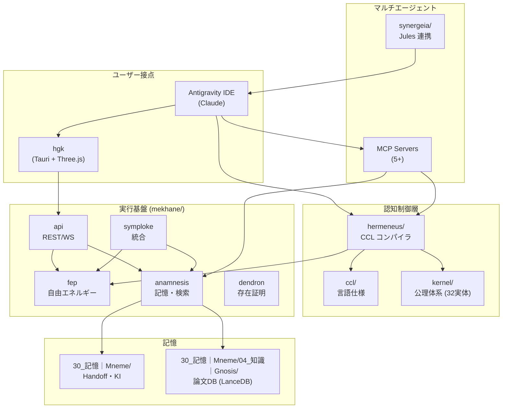

# Hegemonikón Architecture

> **最終更新**: 2026-03-06
> **目的**: PJ 全体の技術構造を一目で理解する

---

## システム全体像



---

## ディレクトリ構造 (PARA v4.2)

| パス | 用途 | 詳細 |
|:-----|:-----|:-----|
| **00_核心｜Kernel/** | 公理体系定義 | SACRED_TRUTH, 定理群。96実体の正本 |
| **10_知性｜Nous/** | AI エージェント設定 | Rules, Workflows, Skills, CCL, Templates |
| **20_機構｜Mekhane/** | 実行基盤 | mekhane/ (Python), hermeneus/ (CCL コンパイラ) |
| **40_応用｜Organon/** | アプリケーション | hgk/ (Tauri UI), synergeia/, openclaw/, pepsis/ |
| **30_記憶｜Mneme/** | 長期記憶 | Handoff, セッション履歴, パターン記録 |
| **30_記憶｜Mneme/04_知識｜Gnosis/** | 知識・論文 DB | LanceDB ベクトルストア, 文献, プロンプト |
| **60_実験｜Peira/** | 実験・テスト | プロトタイプ, 検証 |
| **80_運用｜Ops/** | ユーティリティ | scripts/, devtools/, デプロイ |
| **90_保管庫｜Archive/** | アーカイブ | 旧版, 出力, アセット |

---

## 中核コンポーネント

### 1. Hermēneus (CCL コンパイラ)

```
CCL 式 → Parser → AST → Expander → LMQL → LLM 実行 → 検証
         ↑                               ↑
     hermeneus/src/parser.py     hermeneus/src/executor.py
```

| モジュール | 役割 |
|:-----------|:-----|
| `parser.py` | CCL 構文解析 → AST |
| `expander.py` | マクロ展開 |
| `translator.py` | AST → LMQL 変換 |
| `executor.py` | LLM 実行 + Multi-Agent Debate 検証 |
| `dispatch.py` | AST + WF マッチング + 実行計画テンプレート |
| `mcp_server.py` | MCP プロトコル (6 ツール) |

### 2. mekhane/ (実行基盤)

**Terminal Object**: `anamnesis` — ほぼ全モジュールが依存（被依存数 9）

| 層 | モジュール | 役割 |
|:---|:-----------|:-----|
| L0 外部接点 | api, mcp | FastAPI REST, MCP servers |
| L1 統合 | symploke | /boot シーケンス、統合 |
| L2 認知 | fep, ccl, taxis, basanos | FEP 計算、分類、評議会 |
| L3 基盤 | anamnesis, dendron, peira, poiema | 記憶、存在証明、監視、出力 |
| L4 ツール | ergasterion, scripts | 開発ワークショップ |

→ [mekhane 内部アーキテクチャ](mekhane/ARCHITECTURE.md)

### 3. hgk/ (デスクトップ UI)

| ファイル | 役割 |
|:---------|:-----|
| `src/views/graph3d.ts` | Three.js 3D グラフ可視化 (32実体 + LinkGraph 544ノード) |
| `src/api/client.ts` | バックエンド API クライアント |
| `src-tauri/` | Tauri ネイティブシェル設定 |

### 4. nous/ (AI 設定)

| ディレクトリ | 数 | 内容 |
|:-------------|:---|:-----|
| `rules/` | 16+ | 認知制約 Hóros 12法 (N-1〜N-12)、安全不変条件 |
| `workflows/` | 47 | ワークフロー定義 (/boot, /bye, /noe, /s 等) |
| `skills/` | 55 | スキル定義 (6 系列 × 各4定理 + ユーティリティ) |

---

## MCP サーバー

| 名前 | 提供元 | ツール数 | 用途 |
|:-----|:-------|:---------|:-----|
| **hermeneus** | ローカル | 6 | CCL dispatch/compile/execute/audit |
| **gnosis** | ローカル | 3 | 論文検索 (LanceDB) |
| **sophia** | ローカル | 4 | KI 検索、バックリンク |
| **mneme** | ローカル | 3 | 統合記憶検索 |
| **sympatheia** | ローカル | 6 | 通知、WBC、フィードバック |
| **jules** | ローカル | 4 | Jules コーディング連携 |
| **typos** | ローカル | 1 | プロンプト生成 |
| **digestor** | ローカル | 3 | 論文消化パイプライン |

---

## データフロー

```
ユーザー入力
    ↓
/nous/workflows/ → WF 定義読込
    ↓
hermeneus/ → CCL パース + 実行
    ↓
mekhane/fep/ → FEP 認知計算
    ↓
mekhane/anamnesis/ → 記憶検索 (LanceDB)
    ↓
出力 → mneme/ (記録) + hgk/ (可視化)
```

---

## 技術スタック

| 領域 | 技術 |
|:-----|:-----|
| 言語 | Python 3.13, TypeScript |
| フレームワーク | FastAPI, Vite, Tauri |
| 可視化 | Three.js, d3-force-3d |
| DB | LanceDB (ベクトル検索) |
| AI | Anthropic Claude, Google Gemini, OpenAI |
| 形式検証 | FEP (変分自由エネルギー最小化) |
| CI | pytest, pyproject.toml |

---

## 関連文書

| ドキュメント | 内容 |
|:-------------|:-----|
| [README.md](README.md) | 32実体体系と設計思想 |
| [mekhane/ARCHITECTURE.md](mekhane/ARCHITECTURE.md) | mekhane 内部の依存グラフ・層構造 |
| [kernel/SACRED_TRUTH.md](kernel/SACRED_TRUTH.md) | 不変真理 |
| [AGENTS.md](AGENTS.md) | AI エージェント向けガイド |
| [nous/rules/hegemonikon.md](nous/rules/hegemonikon.md) | 公理体系 v3.3 |

---

*Hegemonikón Architecture — 認知の地図 (2026-02-10)*
