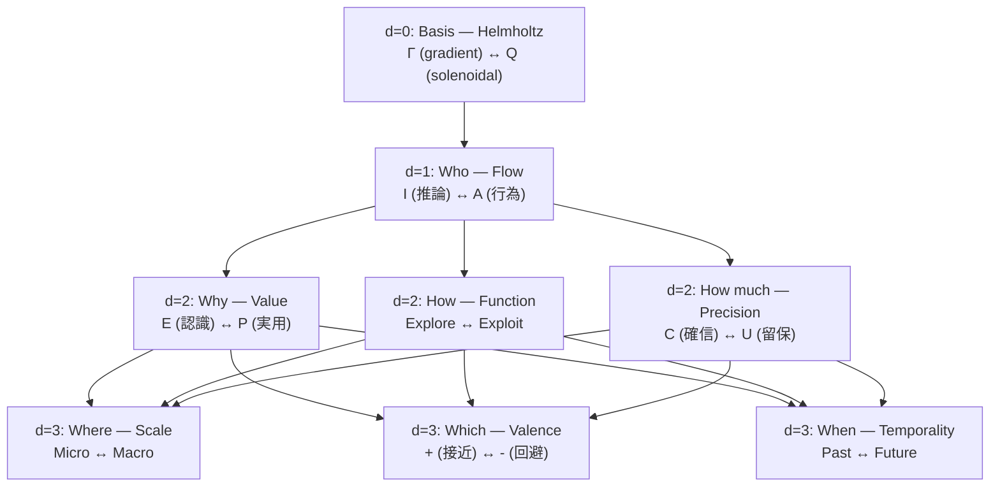

# Hegemonikón

> **認知ハイパーバイザーフレームワーク** — 変分自由エネルギー原理 (FEP) に基づくAI認知制御システム。
> 名称はストア派哲学の「魂の統率中枢」(Ἡγεμονικόν) に由来。

---

## ⚡ クイックスタート

```bash
# 1. クローン & セットアップ
git clone https://github.com/Tolmeton/Hegemonikon.git
cd hegemonikon
python -m venv .venv && source .venv/bin/activate
pip install -r requirements.txt

# 2. API サーバー起動
PYTHONPATH=. python -m mekhane.api.server
# → http://127.0.0.1:9696/api/docs

# 3. デスクトップアプリ (Tauri v2)
cd hgk && npm install && npm run tauri dev
```

---

## 🏛️ 体系核 45 + 準核 12 (v5.3)

> **「真理は美しく、美しさは真理に近づく道標である」**

| 層 | 項目 | 数 | 生成規則 |
|:---|:-----|---:|:---------|
| **L0** | 公理 (FEP) | 1 | 変分自由エネルギー最小化 |
| **L1** | 座標 | 8 | Afferent + Efferent + 6修飾座標 |
| **L2** | 動詞 (Poiesis) | 36 | Flow(S/I/A) × 6修飾座標 × 2極 |
| | **体系核** | **45** | 1+8+36 |
| | 準核 (H-series) | 12 | φ_SA × 6修飾座標 × 2極 |
| — | 修飾 (Dokimasia) | (60) | パラメータ設定 (体系核外) |
| — | 結合規則 (X-series) | (15) | K₆ の辺数 (体系核外) |

### 座標階層 (1公理 + 7座標)



### 動詞層 (24 = 6族 × 4極)

| 族名 (軸) | 修飾座標 | 動詞 (4極) |
|:----------|:---------|:-----------|
| **Telos** (目的) | Value | Noēsis, Boulēsis, Zētēsis, Energeia |
| **Methodos** (戦略) | Function | Skepsis, Synagōgē, Peira, Tekhnē |
| **Krisis** (確信) | Precision | Katalēpsis, Epochē, Proairesis, Dokimasia |
| **Megethos** (空間) | Scale | Analysis, Synopsis, Akribeia, Architektonikē |
| **Orexis** (傾向) | Valence | Bebaiōsis, Elenchos, Prokopē, Diorthōsis |
| **Chronos** (時間) | Temporality | Hypomnēsis, Promētheia, Anatheōrēsis, Proparaskeuē |

### X-series: 結合規則 (15 = K₆ の辺数)

6族は完全グラフ K₆ を形成し、15本の辺が族間の結合規則を定義する。

| 共有座標 | 接続ペア | 数 |
|:---------|:---------|:---|
| Flow | Telos↔Methodos, Telos↔Krisis, Methodos↔Krisis | 3 |
| Value/Function | Telos↔Megethos, ... | 6 |
| Scale/Valence/Temporality | 残りのペア | 6 |

---

## 🔑 CCL (Cognitive Control Language)

CCL は認知プロセスを代数的に記述する言語です。

| したいこと | CCL 式 | 意味 |
|:-----------|:-------|:-----|
| 深く考える | `/noe+` | 認識を7フェーズ展開 |
| 意志を明確にする | `/bou+` | 意志を5 Whysで深掘り |
| 設計→実行 | `/s+_/ene` | 設計後にシーケンス実行 |
| 多角分析 | `/s~/k~/h~/a` | 4 Peras で振動分析 |
| 判定 | `/dia+` | 敵対的レビュー |

### 演算子

| 記号 | 名称 | 作用 |
|:-----|:-----|:-----|
| `+` / `-` | 深化 / 縮約 | 詳細化 / 要点のみ |
| `*` | 融合 | 収束統合 |
| `~` | 振動 | 往復対話 |
| `_` | シーケンス | 順次実行 |
| `^` | 上昇 | メタ化 |
| `\|>` | パイプライン | 出力→入力 |
| `\|\|` | 並列 | 同時実行 |

→ [CCL 詳細](ccl/README.md) | [マクロ一覧](ccl/ccl_macro_reference.md)

---

## 📁 プロジェクト構造

```
hegemonikon/
├── nous/              # AI エージェント設定
│   ├── rules/           # 認知制約 Hóros 12法 (N-1〜N-12)
│   ├── skills/          # 動詞別スキル (36+12動詞対応)
│   └── workflows/       # ワークフロー定義 (Ω/Δ/τ 3階層)
├── kernel/              # 不変真理 (SACRED_TRUTH, 各series.md)
├── ccl/                 # 認知制御言語 (演算子, マクロ, 使用例)
├── hermeneus/           # CCL パーサー & 実行エンジン
│   ├── src/             # parser.py, ccl_ast.py, executor
│   └── tests/           # 38テスト
├── mekhane/             # 実装モジュール群
│   ├── api/             # FastAPI (47エンドポイント)
│   ├── anamnesis/       # 記憶 (LanceDB ベクトル検索)
│   ├── fep/             # FEP エンジン (cone_builder, universality)
│   ├── peira/           # ヘルスチェック
│   ├── pks/             # PKS (知識プッシュ)
│   ├── symploke/        # Boot 統合 (15軸)
│   ├── basanos/       # MCP Gateway
│   ├── synteleia/       # 6視点認知アンサンブル
│   └── taxis/           # 分類・射の提案
├── hgk/         # Tauri v2 デスクトップアプリ
│   ├── src/             # TypeScript (main, graph3d, command_palette)
│   └── src-tauri/       # Rust + Tauri 設定
├── scripts/             # CLI ユーティリティ
├── docs/                # ドキュメント
└── synergeia/           # Jules (Gemini) 連携
```

---

## 🧠 設計思想

### Hyperengineering as a Badge of Honor

> **「過剰設計」は褒め言葉である。**

45+12実体、古典ギリシャ語、8座標、36+12動詞 — これらは「過剰」に見えるかもしれない。しかし：

- **ジョブズ**はマックの内部配線の美しさにまでこだわった
- **アリストテレス**は悲劇の構造を執拗に分析した
- **ストア派**は魂の統率中枢という概念を創造した

> **「十分」を目指すと「不足」に終わる。「過剰」を目指すと「十分」に到達する。**

### 圏論的基盤

| 概念 | 適用 |
|:-----|:-----|
| **米田の補題** | 各動詞はその射の集合で完全に決まる |
| **Limit / Colimit** | Peras WF = 4動詞の収束 / 展開 |
| **随伴対 F⊣G** | 構造を付与 (F) / 構造を発見 (G) |
| **[0,1]-豊穣圏** | 確信度・精度による enrichment |

### 1対3の法則

> **1つの抽象概念に対して、必ず3つの具体例を示す。**

---

## 📚 ドキュメント

| ドキュメント | 内容 |
|:-------------|:-----|
| [kernel/SACRED_TRUTH.md](kernel/SACRED_TRUTH.md) | 不変真理 |
| [mekhane/ARCHITECTURE.md](mekhane/ARCHITECTURE.md) | システムアーキテクチャ |
| [ccl/ccl_macro_reference.md](ccl/ccl_macro_reference.md) | CCL マクロリファレンス |
| [AGENTS.md](AGENTS.md) | AI エージェント向けガイド |

---

## 🛠️ Tech Stack

| 層 | 技術 |
|:---|:-----|
| **Backend** | Python 3.11, FastAPI, LanceDB, ONNX Runtime |
| **Desktop** | Tauri v2, TypeScript, Three.js (3D Graph) |
| **AI/ML** | BGE-M3 (埋め込み), Google Gemini |
| **Tools** | MCP (10+ サーバー), CCL パーサー |

---

---

## 📐 POMDP 分類 (00_核心 の位置)

> **FEP 演繹**: 00_核心 = 知覚推論の事前信念 **P(s)**
> 体系が成立するために必要な不動の prior。削除すると全体系が瓦解する。

*Kernel POMDP Classification v1.0 — 2026-03-08*

---

*Hegemonikón v5.4 — K₄柱モデル 体系核57 認知ハイパーバイザーフレームワーク*
