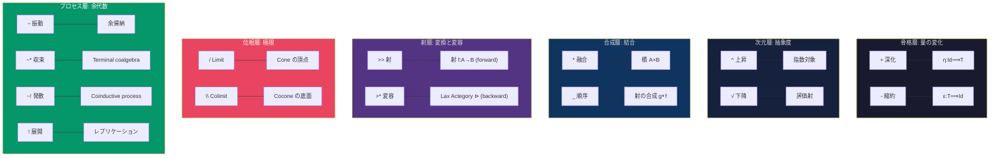

# CCL 演算子仕様 v7.7

> **正本**: この文書は ccl/operators.md であり、全演算子仕様を定義する

## 1. 単項演算子

### 1.1 強度演算子

| 記号 | 名称 | 作用 | 圏論 | 例 |
|:-----|:-----|:-----|:-----|:---|
| `+` | 深化 | 詳細な根拠を追加。深層まで展開。 | 自然変換 η:Id⟹T (増幅) | `/noe+` |
| `-` | 縮約 | 要点のみ。圧縮・要約。 | 自然変換 ε:T⟹Id (縮約) | `/bou-` |

> **圏論的解釈** (Kalon v1.0): `+/-` は恒等関手 Id と増幅関手 T の間の自然変換。
> `+` = η (unit): 対象を拡張コンテキストに持ち上げる。
> `-` = ε (counit): 対象を本質に絞り込む。
> ※ 定量的な「倍率」は実装の目安であり、圏論的定義には含まれない。
>
> **所有権解釈** (Pepsis Rust v1.0): `+` = `&mut T` (排他的変更権)、`-` = `&T` (共有読取参照)。
> `+` は高コスト — 一度に一つの WF だけが対象を深化できる。
> `-` は低コスト — 複数の WF が同時に縮約を参照できる。

### 1.2 次元演算子

| 記号 | 名称 | 作用 | 例 |
|:-----|:-----|:-----|:---|
| `^` | 上昇 | メタ前提の検証。メタ化。 | `/dia^` |
| `√` | 下降 | 次元を下げる。具体的アクション。 | `√/noe` |

### 1.3 制御演算子

| 記号  | 名称  | 作用                                  | 例               |
| :-- | :-- | :---------------------------------- | :-------------- |
| `\` | 反転  | 位相反転（Antistrophē）。構造的否定。            | `\a`            |
| `!` | 厳格  | 文脈依存: 単項時=全派生展開、`&&` 後=AllOrNothing | `/s!` `(A&&B)!` |

> **`!` の二重セマンティクス** (Pepsis Rust v1.0 — parallel_model.md):
>
> - **単項** `/s!` = 全派生を並列展開 (封印解除)。⚠️ 高負荷
> - **後置** `(A && B)!` = AllOrNothing。片方失敗 → 全体失敗
> - **共通意味**: 「妥協しない」「厳格に実行する」
> - **デフォルト**: `&&` は BestEffort (成功分だけで続行)。`!` で厳格化

### 1.4 FEP 演算子 (v6.5)

| 記号            | 名称  | FEP 意味                             | 例                  |
| :------------ | :-- | :--------------------------------- | :----------------- |
| `'`           | 微分  | 予測誤差の変化率 ($d\epsilon/dt$)          | `/bou'`            |
| `∂`           | 偏微分 | 特定次元の変化率 ($\partial f/\partial x$) | `∂s1/bou`          |
| `∫`           | 積分  | 履歴統合、累積 ($\int\epsilon dt$)        | `∫/dox`            |
| `Σ`           | 総和  | 複数結果の集約 ($\Sigma x_i$)             | `Σ[results]`       |
| `lim[cond]{}` | 収束  | 極限、予測誤差最小化の終着点                     | `lim[ε=0]{/s~dia}` |

> **FEP-CCL 対応表** (CEP-001 統合):
>
> | FEP 概念 | 数式 | CCL 演算子 | 認知的使い方 |
> |:---------|:-----|:-----------|:-------------|
> | 予測誤差の変化 | $d\epsilon/dt$ | `'` | `/bou'` — 前回からの意志変化を観測 |
> | 偏微分 | $\partial f / \partial x$ | `∂` | `∂s1/bou` — 特定の次元だけの変化率 |
> | 履歴統合 | $\int \epsilon \, dt$ | `∫` | `∫/dox` — 信念の累積・経験の統合 |
> | 分散 (不確実性) | $V[\epsilon]$ | `V[]` | `V[/noe]` — 予測誤差の分散を測定 |
> | 精度加重 | $\pi = V[\epsilon]^{-1}$ | `*` (内積的) | `/noe*dia` — **精度で加重された融合** |
> | VFE 最小化 | $F = E_q[\ln q - \ln p]$ | `~*` | 収束振動 = variational inference |
> | EFE 最小化 | $G = E_q[\ln q - \ln \tilde{p}]$ | `~!` | 発散振動 = active inference |
> | 極限 | $\lim_{\epsilon \to 0}$ | `lim[]{}` | `lim[ε=0]{/s~dia}` — 予測誤差ゼロへ |

### 1.5 型記法 (Pythōsis Phase 3) v6.51

> **Origin**: Python `typing` モジュールの消化
> **目的**: CCL 出力に型制約を宣言し、/epi.typed で静的検証

| 記号 | 名称 | Python 対応 | 例 |
|:-----|:-----|:------------|:---|
| `?T` | 不確実型 | `Optional[T]` | `/noe+{out: ?string}` |
| `[T]` | 複数型 | `List[T]` | `/zet+{out: [question]}` |
| `A\|B` | 選択型 | `Union[A, B]` | `/dia{out: pass\|fail}` |
| `:T` | 型注釈 | Type hint | `/ene{task: string}` |

**使用例**:

```ccl
# 出力型を宣言
/noe+{out: ?insight}  # Optional[insight] — 洞察が得られないかもしれない

# リスト出力
/zet+{out: [question]}  # List[question] — 複数の問いを生成

# 選択型
/dia{out: pass|fail}    # Union[pass, fail] — 二択

# /epi.typed で検証
/epi.typed{expect: string} /noe+  # /noe+ の出力が string であることを検証
```

### 1.5.5 変数トークン (Lēthē C3v2) v7.8

> **Origin**: Lēthē プロジェクトの Code→CCL 忘却関手 (VISION §2.1)
> **目的**: コード中の変数をデータの出自 (外部/内部) で分類するトークン
> **設計根拠**: `_` は二項演算子 (§2 シーケンス) であり、変数トークンとして流用すべきでない。
> 引数名の忘却 (n=0) を維持しつつ、データフローの出自 (n=1) を保存する。

| 記号 | 名称 | 意味 | FEP 対応 |
|:-----|:-----|:-----|:---------|
| `¥` | 外部入力 | 関数の引数 — Markov blanket を横断するデータ | 感覚入力 (sensory input) |
| `#` | 内部状態 | ローカル変数 — MB 内部で計算されたデータ | 内部状態 (internal state) |

> **n=0/n=1 の区別** (Aletheia フィルトレーション):
> `¥` は「外から来た」とだけ言う。**どの**引数かは言わない = n=0 忘却。
> しかし外部入力 vs 内部状態の区別は射の始域情報 = n=1 保存。
>
> **R2 不変性**: 引数名を変更しても CCL は不変。
> `def f(data, threshold)` → `¥ >> V:{¥ >> pred} >> ...`
> `def f(items, cutoff)` → `¥ >> V:{¥ >> pred} >> ...`
>
> **将来拡張** (🧪):
> `¥^` = グローバル変数 (モジュールスコープ — MB の外の外)
> `¥[N]` = 識別子付き引数 (n=0 を部分的に復元。ファンアウト追跡用)

**Code→CCL 変換での使用例**:

```python
def process(data, threshold):
    filtered = [x for x in data if x > threshold]
    return sum(filtered) / len(filtered)
```

```ccl
# data=¥, threshold=¥, filtered=#
¥ >> V:{¥ >> pred} >> F:[each]{#} >> # >> (sum % len) >> /
```

### 1.6 最適化演算子 (シングルスレッド) 🧪 PROVISIONAL

> ⚠️ **暫定**: 実験による検証待ち。効果値は仮設定。

| 記号 | 名称 | 効果 | 例 |
|:-----|:-----|:-----|:---|
| `@cache` | キャッシュ | **-10pt** | `@cache[L1]{/noe+}` |
| `@compact` | 圧縮 | **-8pt** | `@compact{long_ctx}` |
| `@fault_tolerant` | 自動回復 | **+2pt** | `@fault_tolerant{/noe+ @fallback{/noe-}}` |

### 1.6 分散実行演算子 (マルチスレッド) v7.6

> **目的**: 複雑なCCLを外部エージェントに委譲し、長時間実行を実現
> **v7.6 変更**: `|>` → `&>`, `||` → `&&` に移行。旧記号は随伴演算子に再割り当て (§2)。

| 記号 | 名称 | 意味 | 例 |
|:-----|:-----|:-----|:---|
| `&>` | パイプライン | 前段→後段への順次実行 | `/noe+ &> /dia+ &> /ene+` |
| `&&` | 並列 | 独立処理の同時実行 | `/sop+ && /zet+` |
| `@batch` | バッチ | 非同期並列処理 | `@batch{F:[×100]{/s}}` |
| `@thread` | スレッド指定 | 実行エージェント指定 | `@thread[perplexity]{/sop+}` |
| `@delegate` | 委譲 | 長時間タスクを外部へ | `@delegate[openmanus]{/ene+}` |

**即時利用可能なスレッド**:

| スレッド | 役割 | pt上限 |
|:---------|:-----|:------:|
| Antigravity (私) | 認知・判断 | 60pt |
| Claude Code | 長時間自律実行 | 60pt |
| Gemini Code Assist | IDE統合コード生成 | 60pt |
| Gemini CLI | CLIベース処理 | 60pt |
| Jules API | Googleコード生成Agent | 60pt |
| OpenManus (自宅PC) | マルチエージェント基盤 | 無制限 |

**分散実行ポイント**: 各スレッドが60pt以下なら、全体は**300pt+**。

---

## 2. 二項演算子

### 代数的演算子 (一発で完了)

| 記号   | 名称     | 認知的意味                         | 圏論                        | タスク構造   | 所有権型                          |
| :--- | :----- | :---------------------------- | :------------------------ | :------ | :---------------------------- |
| `*`  | 融合     | 精度加重された統合。⟨A,B⟩_π             | 内積 (Inner Product)        | シングルタスク | Shared borrow (`&A + &B → C`) |
| `%`  | 展開     | 全次元の組み合わせを保持。A ⊗ B            | 外積 (Outer Product)        | マトリクス展開 | Clone + distribute            |
| `&`  | 条件付き接続 | A が成立した上で B も成立。論理的 AND。      | 積の射影 π₁∧π₂ (Pullback)     | 条件付き両立  | `&A + &B → (A, B)`            |
| `\|` | 選択     | A または B のいずれか。代替パス。           | 余積 (Coproduct) A + B      | 分岐      | `Either<A, B>`                |
| `_`  | シーケンス  | 思考の連鎖。Aの後にBを実行。               | 射の合成 (g∘f)                | 逐次処理    | Move (所有権移転)                  |
| `>>` | 射      | X-series 構造的変換。A が B に変わる。    | 射 f:A→B (forward)         | 変換      | Move + transform (`.into()`)  |
| `<<` | 逆射     | ゴールから原因を逆算。B を得るために A に何が必要か。 | 射 f*:B→A (pullback)       | 逆算      | 型推論 (`.try_from()`)           |
| `>*` | 射的融合   | X-series を通じた変容。A が B の視点で変容。 | Lax Actegory ⊳ (backward) | 変容      | `From<B> for A`               |

### プロセス演算子 (余代数的 — 時間的展開を持つ)

| 記号 | 名称 | 認知的意味 | 圏論 | 収束性 | 所有権型 |
|:-----|:-----|:-----------|:-----|:------|:---------|
| `~` | 振動 | 動的な往復。AI が収束/発散を判断。 | 余帰納的振動† | 自動判定 | `&mut` の時間的交替 |
| `~*` | 収束振動 | 融合するまで往復。結果が一つにまとまる。 | Terminal coalgebra | 収束 | `RefCell<T>` + loop |
| `~!` | 発散振動 | 展開的に往復。N回で打ち切り。 | Coinductive process | 発散 | `RefCell<T>` + 有限切り詰め |
| `~>` | 収束射 | 振動しながら前方に収束する。条件付き極限。 | lim_{cond→∅}{f} | 収束 | `&mut` + terminal |
| `>~` | 発散射 | 前方に押し出しつつ振動を拡大する。 | colim(f) 方向付き | 発散 | `&mut` + coinductive |
| `<~` | 逆収束射 | ゴールから振動して引き戻す。 | pullback × lim | 逆収束 | `try_from` + terminal |
| `<~>` | 循環射 | 双方向の振動で不動点を探索する。 | Fix(G∘F) 探索 | 不動点 | `RefCell<T>` + fixpoint |
| `~<` | 逆発散射 🧪 | 振動しながら引き寄せて拡大。 | `>~` の双対 | 逆発散 | PROVISIONAL |

> **†プロセス演算子の圏論的正体** (Kalon v1.0, V6検証済):
> 代数的演算子 (`*`, `_`, `>>`, `>*`) は**一発で結果が出る**。
> プロセス演算子 (`~`, `~*`, `~!`) は**時間的に展開する**。
>
> `~*` = terminal coalgebra (最大不動点に収束) ≈ `lim[cond]{A _ B}` の省略形
> `~!` = coinductive process (有限切り詰め) ≈ `cyc[N]{A _ B}` の省略形
> `~`  = 裸振動。AI が文脈から `~*` か `~!` を推定する。
>
> **FEP 対応**: `~*` = variational inference (近似が収束)
> 　　　　　　 `~!` = active inference loop (環境が変動し続ける)
>
> **外部裏付け (Iluz et al. 2025, Stroke of Surprise)**: dual-constraint optimization (一つの構造が二つの意味的制約を同時に満たす)
> は `~` 振動の視覚的実装。common structural subspace (共通構造基盤) は `~*` 収束の到達点 = 圏論的 Colimit。
> ⚠️ 操作的類推。反証条件: dual-constraint が `~` と異なる構造を要求する場合。
>
> **Colimit vs Terminal Coalgebra の区別 (F6 検証, 2026-02-15)**:
> `~*` の厳密な正体は **terminal coalgebra** (最大不動点への収束)。
> Colimit (余極限) は「バラバラなものの合流点」であり、`~*` の**到達点**を記述するが、
> `~*` のプロセス全体 (時間的展開) は coalgebra が適切。
> 操作的例: `/noe~*/dia` = 認識と判定の往復が共通理解 (terminal state) に収束。
> この共通理解が Colimit 的であるのは、Noe の視点と Dia の視点の**両方を保持**する点による。
>
> **Lax Actegory `>*`** (Kalon v1.0):
> forward channel (`>>`) = 予測、backward channel (`>*`) = 推論更新。
> Lax 結合律: (B⊗C)⊳A ⟹ B⊳(C⊳A)。Strict 単位律: I⊳A = A。

> **指向性**: 全ての二項演算子は**左が主、右が従**。`A*B` = A のための B。

### 随伴演算子 (v7.6)

> **v7.6 新設**: 随伴は圏論の核心概念であり、CCL の構造演算子として第一級の記号を与える。
> 旧 `|>` (分散パイプライン) / `||` (並列) は `&>` / `&&` に移行 (§1.6)。

| 記号 | 名称 | 認知的意味 | 圏論 | 例 |
|:-----|:-----|:-----------|:-----|:---|
| `\|\|` | 随伴宣言 | 二つの操作が双対的パートナーであることを宣言 | F ⊣ G | `/noe \|\| /zet` |
| `\|>` | 右随伴 | A の右随伴を求める | G = right adjoint of F | `/noe \|>` → `/zet` |
| `<\|` | 左随伴 | A の左随伴を求める | F = left adjoint of G | `/zet <\|` → `/noe` |

> **`.d` との関係**: `.d` (§5.5) は HGK ドメイン固有の随伴パートナー参照 (WF YAML メタデータ依存)。
> `||` / `|>` / `<|` は**普遍的**な随伴演算子 — 任意の2関数に適用可能。
> `.d` = 静的参照 (YAML から読む)。`||` = 動的宣言/検証 (計算で確認)。

> **随伴の計算可能性** (HGK 空間):
> HGK の空間は有限前順序 (kalon.md L431, axiom_hierarchy.md L466)。
> 有限前順序上のガロア接続 (= 随伴) は:
>   `F(x) = min { y | x ≤ G(y) }` — 左随伴の計算
>   `G(y) = max { x | F(x) ≤ y }` — 右随伴の計算
> 有限集合なら min/max は常に計算可能。

> **検証**: `Q:[A || B]` — 制御構文 (§10) で随伴検証を表現。
> `Q:[/noe || /zet]` = 「/noe ⊣ /zet か？」全 (x,y) で F(x) ≤ y ⟺ x ≤ G(y) を検証。

### 区別

```
_   = 「Aの次にBをやってくれ」         → 手続き (時間的順序)
&   = 「Aが成り立つ上でBも成り立つ」   → 条件付き接続 (論理的 AND)
|   = 「AかBのどちらか」               → 選択 (代替パス)
>>  = 「Aを構造的にBに変換してくれ」   → 変換 (X-series morphism)
<<  = 「Bを得るにはAに何が必要か」     → 逆算 (pullback)
>*  = 「AをBの視点で変容させてくれ」   → 変容 (射的融合)
*   = 「両方踏まえて一つの答えをくれ」 → 統合 (精度加重融合、収束)
%   = 「全組み合わせを展開してくれ」   → 展開 (外積、テンソル積)
||  = 「この二つは随伴だ」             → 宣言 (随伴対)
|>  = 「右随伴を教えてくれ」           → 計算 (右随伴)
<|  = 「左随伴を教えてくれ」           → 計算 (左随伴)
~   = 「両方の対話を見せてくれ」       → プロセス (往復) [AI判定]
~*  = 「融合するまで往復してくれ」     → プロセス (収束振動)
~!  = 「広げながら往復してくれ」       → プロセス (発散振動)
~>  = 「条件に向かって収束してくれ」   → 収束射 (条件付き極限)
>~  = 「押し出しながら広げてくれ」     → 発散射 (方向付き発散)
<~  = 「ゴールから逆算して収束してくれ」→ 逆収束射 (pullback × lim)
<~> = 「循環させて不動点を見つけてくれ」→ 循環射 (Fix(G∘F) 探索)
~<  = 「振動しつつ引き寄せろ」         → 逆発散射 🧪
```

### 結合度階層

```
_  < &  < |  < >>  < <<  < >*  < ~>  < <~  < <~>  < >~  < ~<  < *  < ~  < ~*  < ~!
弱  条件  選択 射    逆射  融合射 収束射 逆収束 循環  発散射 逆発散 強  動的  収束   発散
```

### 2文字演算子の読み規則 (v7.7)

> **原理**: CCL は左→右読み。**左 = 主語 (基点)**。
> 2文字演算子は2つの記号原子の合成であり、位置が意味を決定する。

#### 位置読み規則

| 位置 | 意味 | 読み |
|:-----|:-----|:-----|
| **1文字目** (左寄り / 主語側) | 主語のアクション | 「主語は何をするか」 |
| **2文字目** (右寄り / 客語側) | 客語への効果 | 「客語に何が起こるか」 |

#### 既存演算子での検証

| 演算子 | 1文字目 (主語) | 2文字目 (客語) | 一貫性 |
|:-------|:---------------|:---------------|:------:|
| `~*` | `~` 振動する | `*` 融合を受ける | ✅ |
| `~!` | `~` 振動する | `!` 展開を受ける | ✅ |
| `*%` | `*` 融合する | `%` テンソル展開を受ける | ✅ |
| `*^` | `*` 融合する | `^` メタ化を受ける | ✅ |
| `<<` | `<` 引き戻す | `<` 引き戻される | ✅ |
| `>>` | `>` 押し出す | `>` 押し出される | ✅ |
| `>*` | `>` 前方に射を飛ばす | `*` 融合を受ける | ✅ |
| `&>` | `&` 結合する | `>` 前方に流れる | ✅ |
| `&&` | `&` 結合する | `&` 並行する | ✅ |

#### 記号原子の意味

| 原子 | 主語側 (1文字目) | 客語側 (2文字目) |
|:-----|:-----------------|:-----------------|
| `>` | 前方に射を飛ばす (push) | 前方に流れる (flow) |
| `<` | 引き込む (pull) | 引き戻される (pullback) |
| `*` | 融合素材を提供する | 融合を受ける |
| `%` | テンソル展開する | テンソル展開を受ける |
| `~` | 振動する | 振動に巻き込まれる |
| `^` | メタ化する | メタ化を受ける |
| `!` | 展開する | 展開を受ける |
| `&` | 条件付き結合する | 条件付き結合される |
| `\|` | 選択肢を提示する | 選択肢として並ぶ |

#### 方向付き射的演算子の2×2マトリクス

| | 客語で融合 (`*`) | 客語で前方流 (`>`) |
|:---|:---|:---|
| **主語が前方射 (`>`)** | `>*` Lax (投射して融合) | `>>` 射 (変換) |
| **主語が引き込み (`<`)** | `<*` Oplax (引き込んで融合) 🧪 | `<<` 逆射 (pullback) |
| **主語が融合 (`*`)** | `**` (未定義) | `*>` 方向付き融合 🧪 |

> 🧪 = 候補。未実装。

#### `*>` と `&>` の本質的区別 — パイプラインとは何か

> **Creator の問い**: `*>` 「融合してから流す」と `&>` 「つないで流す」は同型か？

**パイプライン (CPU / Unix) の本質**:

```
入力 → [ステージA] → [ステージB] → [ステージC] → 出力
```

1. **同一性の保存**: データは各ステージを通過しても「同じもの」。変換されるが、消滅しない
2. **ステージの独立性**: 各ステージは他のステージの内部状態を知らない
3. **合成則**: 全体 = f ∘ g ∘ h。順序を変えなければ結果は同じ (結合律)
4. **非破壊的通過**: データは通過する。混ざらない

**`&>` はパイプラインそのもの**:

```ccl
/noe+ &> /dia+ &> /ene+
# noe の出力 → dia の入力 → ene の入力
# 同一性保存: 各段階で「同じ情報」が変換される
# 圏論: 射の合成 g ∘ f
```

**`*>` はパイプラインではない**:

```ccl
/noe *> /ene
# noe が融合操作を提供 → 融合結果が ene の方向に流れる
# 同一性破壊: noe の情報は融合で消滅し、新しいものが生まれる
# 圏論: colimit (融合) + 射 (方向)
```

| 性質 | `&>` パイプライン | `*>` 方向付き融合 |
|:-----|:------------------|:------------------|
| **同一性** | 保存 (変換) | 破壊 (融合) |
| **データの動き** | 通過する | 混ざって生まれ変わる |
| **ステージの関係** | 独立 (各段は他を知らない) | 相互依存 (融合には双方が必要) |
| **圏論** | 射の合成 g ∘ f | colim(A,B) → C |
| **FEP** | 信念伝播 (belief propagation) | 信念融合 + 方向付け (posterior → goal) |
| **CPU 比喩** | ≅ パイプライン処理 | ≅ ALU の加算器 + レジスタ転送 |
| **可逆性** | 各段を逆にすれば戻せる | 融合は不可逆 (情報が失われる) |

> **結論**: `*>` ≇ パイプライン。パイプラインの本質は**同一性を保存した非破壊的合成**。
> `*>` は**同一性を破壊する融合の後の方向付け**。構造が根本的に異なる。
> CPU 比喩: `&>` = パイプライン (fetch → decode → execute)。
> `*>` = ALU (2つのオペランドが融合して1つの結果になり、レジスタに流れる)。

#### 新候補演算子 (v7.7 🧪)

| 記号 | 名称 | 読み | 圏論 | 認知的意味 |
|:-----|:-----|:-----|:-----|:-----------|
| `<*` | 逆射融合 (Oplax) | 主語が引き込み、客語の融合を受ける | Oplax functor | 相手の視点を自分に取り込んで変容 |
| `*>` | 方向付き融合 | 主語が融合、結果が客語方向に流る | Directed colimit + 射 | 融合結果を目標方向に送る |
| `>%` | 射的展開 | 主語が前方射、客語がテンソル展開を受ける | Pushforward tensor | 自分の視点を相手の全次元に展開 |

```
<* の認知例:
  /noe <* /dia  = 「認識が対話の構造を自身に取り込んで変容する」
  >* の双対。>* = 投射して変容 (active)、<* = 吸収して変容 (perceptive)

*> の認知例:
  /noe *> /ene  = 「認識の融合結果が行為方向に流れる」
  &> との違い: &> は変換して渡す。*> は融合して流す

>% の認知例:
  /ske >% /sag  = 「発散が収束の全次元に方向付きで展開する」
  % との違い: % は無方向 (双方展開)。>% は方向あり (A が B の空間に展開)
```

> **実装優先度**: `<*` (高 — `>*` の双対完成) > `*>` (中 — `&>` との区別が重要) > `>%` (低 — 実用例待ち)
>
> **知見: 3演算子の認知モード分離** (2026-03-20, [推定] 87%):
> 候補3演算子は、異なる認知制御モードを分離する:
> - `<*` (oplax) = **depth**: target が source の前提を吸収し、メタ的に問い直す
> - `*>` (lax) = **direction**: source の方向性が target を変質させ、実践的問いを生む
> - `>%` (pushforward) = **breadth**: source を target の全次元に展開し、網羅的問いを生む
>
> この3軸分離は2コンテキスト (bou-zet, noe-ele) で再現し、
> 2独立検証者の盲検テスト (Creator 3/3, Gemini 2.5 Flash 3/3, p=2.8%) で確認。
> Stoicheia との対応: `<*` ≅ S-I, `*>` ≅ S-II, `>%` ≅ S-III。
> 詳細: Sophia KI `stoicheia_morphism_correspondence`

---

## 3. Series Limit 演算 (v7.0 — Kalon 修正)

> **Series WF** (/t, /m, /k, /o, /d, /c — v4.1 族: Telos/Methodos/Krisis/Diástasis/Orexis/Chronos) に適用される認知演算
> **旧名**: /a, /h, /k, /o, /p, /s (互換性のため引き続き動作)
> **Kalon Deep Examination (2026-02-07)**: 旧称「内積/外積」を Limit/Colimit に訂正

| 位相 | 圏論的演算 | 認知的意味 | 例 | 出力 |
|:-----|:-----------|:-----------|:---|:-----|
| `/` | **Limit** (極限) | 統合・収束 | `/a` | 収束スカラー (cone の頂点) |
| `\` | **Phase Inversion** (位相反転) | 展開・発散 | `\a` | Limit の反転 = **Colimit** (派生群) |

### 数学的定義 (Kalon 修正)

```
Limit (極限):
  /a = lim(A1, A2, A3, A4)
  = 4つの定理の最も具体的な共通部分 (cone の頂点)
  = 変分近似 (lax section) として実装 (Smithe 2022)
  結果: 収束スカラー (統合スコア)

Phase Inversion (位相反転) → Colimit (余極限):
  \a = Antistrophē(/a) = colim(A1, A2, A3, A4)
  = Limit (収束) の位相を反転 → Colimit (展開) へ
  = 4つの定理の最も一般的な包含 (cocone の底面)
  結果: 派生群 (全組み合わせ)
```

> **旧称との対応**: 「内積」→ Limit (収束方向は同じ)、「外積」→ Colimit (展開方向は同じ)
> **修正理由**: Hub WF は構造の「消失」(スカラー化) であり、「保存」ではない。
> 関手 (functor) ではなく Limit 演算 (cone の頂点) が正確な圏論的対応。
> **位相反転 (`\`)**: 演算子自体は「反転」。Hub WF (Limit) に適用されると、その位相を反転させて Colimit を生成する。例: `\ax` (体系全体の Colimit 展開)。

### 派生生成

```
\a の派生 = Colimit から自然生成
例: 12派生 = 4定理 × 3レベル (確実/暫定/保留)
```

---

## 4. 関数演算子 (Tier 4)

| 記号 | 名称 | FEP 意味 |
|:---:|:---|:---|
| `E[]` | 期待値 | 予測値。平均的な成果。 |
| `V[]` | 分散 | 不確実性・エントロピー。 |
| `P()` | 順列 | 全順序パターン探索。 |
| `C()` | 組合せ | 構成要素の選択探索。 |

---

## 5. 動詞修飾子 (v4.1)

> **v4.1 パラダイムシフト**: 旧「定理修飾子」(Series別 6×4=24) は、v4.1 で「動詞修飾子」(族別 6族×4動詞) に再定義された。
> 修飾子 ID は `+{族略称}{番号}` 形式。単項演算子の直後に付記し、特定の認知方向へ深化・縮約する。

### 族別一覧

#### Telos 族 (Tel) — 目的軸 (Flow × Value)

| 記号 | 動詞 (V#) | 生成 | 作用 |
|:-----|:----------|:-----|:-----|
| `+tel1` | V01 Noēsis | I×E | 世界像を認識目的で更新 |
| `+tel2` | V02 Boulēsis | I×P | 目標を実用目的で設定 |
| `+tel3` | V03 Zētēsis | A×E | 認識のために環境に働きかける |
| `+tel4` | V04 Energeia | A×P | 実用のために環境に働きかける |

#### Methodos 族 (Met) — 戦略軸 (Flow × Function)

| 記号 | 動詞 (V#) | 生成 | 作用 |
|:-----|:----------|:-----|:-----|
| `+met1` | V05 Skepsis | I×Explore | 仮説空間を広げる |
| `+met2` | V06 Synagōgē | I×Exploit | 仮説空間を絞り込む |
| `+met3` | V07 Peira | A×Explore | 未知領域で情報を集める |
| `+met4` | V08 Tekhnē | A×Exploit | 既知解法で確実に成果を出す |

#### Krisis 族 (Kri) — コミットメント軸 (Flow × Precision)

| 記号 | 動詞 (V#) | 生成 | 作用 |
|:-----|:----------|:-----|:-----|
| `+kri1` | V09 Katalēpsis | I×C | 信念を固定しコミットする |
| `+kri2` | V10 Epochē | I×U | 判断を開いて複数可能性を保持 |
| `+kri3` | V11 Proairesis | A×C | 確信を持って資源を投入 |
| `+kri4` | V12 Dokimasia | A×U | 小さく一歩を打って反応を見る |

#### Diástasis 族 (Dia) — 空間スケール軸 (Flow × Scale)

| 記号 | 動詞 (V#) | 生成 | 作用 |
|:-----|:----------|:-----|:-----|
| `+dia1` | V13 Analysis | I×Mi | 局所的に深く推論する |
| `+dia2` | V14 Synopsis | I×Ma | 広域的に全体を推論する |
| `+dia3` | V15 Akribeia | A×Mi | 局所的に正確に行動する |
| `+dia4` | V16 Architektonikē | A×Ma | 広域的に一斉に行動する |

#### Orexis 族 (Ore) — 価値方向軸 (Flow × Valence)

| 記号 | 動詞 (V#) | 生成 | 作用 |
|:-----|:----------|:-----|:-----|
| `+ore1` | V17 Bebaiōsis | I×+ | 信念を強化・承認する |
| `+ore2` | V18 Elenchos | I×- | 信念を問い直し問題を検知する |
| `+ore3` | V19 Prokopē | A×+ | 成功方向をさらに前進させる |
| `+ore4` | V20 Diorthōsis | A×- | 問題を修正し方向を変える |

#### Chronos 族 (Chr) — 時間方向軸 (Flow × Temporality)

| 記号 | 動詞 (V#) | 生成 | 作用 |
|:-----|:----------|:-----|:-----|
| `+chr1` | V21 Hypomnēsis | I×Past | 過去の信念状態にアクセスする |
| `+chr2` | V22 Promētheia | I×Future | 未来の状態を推論・予測する |
| `+chr3` | V23 Anatheōrēsis | A×Past | 過去の行動を評価し教訓を抽出する |
| `+chr4` | V24 Proparaskeuē | A×Future | 未来を形成するための先制行動をとる |

> **互換性注記**: 旧 ID (`+o1`, `+s2`, `+h3` 等) は `operator_loader.py` の legacy_prefix マッピングで新 ID に変換される。
> 旧 → 新: `o→tel`, `s→met`, `h→kri` (注: 旧 H=Horme → 新 Kri=Krisis), `p→dia`, `k→ore` (注: 旧 K=Kairos → 新 Ore=Orexis), `a→chr` (注: 旧 A=Akribeia → 新 Chr=Chronos)

### レベルパラメータ `:N`

| 表記 | 意味 | スケール |
|:-----|:-----|:---------|
| `+s1:1` | 1段階拡大 | 月/中域 |
| `+s1:2` | 2段階拡大 | 年/広域 |
| `+s1:3` | 3段階拡大 | 人生/大域 |
| `+s1:4` | 4段階拡大 | 永劫/全体 |

---

## 5.5 関係サフィックス `.d` / `.h` / `.x` (v7.2)

> **圏論**: 2×2 マトリクスの3種のペアリング (随伴/自然変換/双対)
> **目的**: 各定理のSeries内パートナーへの構造的参照

### 構文

```ccl
/wf.d    # → 随伴パートナー (対角D)    例: /noe.d → /zet
/wf.h    # → 自然変換パートナー (横H)  例: /noe.h → /bou
/wf.x    # → 双対パートナー (反対角X)  例: /noe.x → /ene
```

### 圏論的意味

| サフィックス | ペアリング | 圏論 | 保存→反転 |
|:-------------|:-----------|:-----|:----------|
| `.d` | 対角 (T1⊣T3, T2⊣T4) | 随伴 F⊣G | 深い軸保存、浅い軸反転 |
| `.h` | 横 (T1↔T2, T3↔T4) | 自然変換 α | 浅い軸保存、深い軸反転 |
| `.x` | 反対角 (T1↔T4, T2↔T3) | 双対 | 両軸反転 |

### 展開規則

`.d` と `.h` は常に `>>` (シーケンス) に展開:

```ccl
/noe.d   → /noe >> /zet     # 随伴パートナーへ
/noe.h   → /noe >> /bou     # 自然変換パートナーへ
```

`.x` は双対の型に応じて自動展開:

```ccl
/noe.x   → /noe >> /ene     # transition型 → >> に展開
/bou.x   → /bou ~ /zet      # tension型   → ~ に展開
/chr.x   → /chr ~ /tel      # tension型   → ~ に展開
```

### 強度演算子との合成

```ccl
/noe.h+    # = /noe >> /bou+    (パートナーを詳細実行)
/noe.x-    # = /noe >> /ene-    (パートナーを軽量実行)
```

### 反復との合成

```ccl
F:[×3]{/bou.x}              # = F:[×3]{/bou~/zet}  (望む↔探すを3回)
C:{/noe.h _ /dia}            # noe→bou→判定 を収束まで
```

### ルックアップ先

パートナー解決は各 WF ファイルの `category_theory:` YAML を参照:

```yaml
# .agents/workflows/noe.md
category_theory:
  adjunction: "Noēsis (F) ⊣ Zētēsis (G)"    # .d → zet
  natural_transformation:
    partner: "bou"                              # .h → bou
  duality:
    partner: "ene"                              # .x → ene
    type: "transition"                          # → >> に展開
```

### 複雑度ポイント

| 演算子 | pt |
|:-------|:--:|
| `.d`, `.h`, `.x` | 2 |

> 射 (`>>`) と同等。パートナー解決 + 射の合成で 2pt。

## 6. 特殊パターン

### 6.1 融合メタ表示 `*^` / 展開メタ表示 `%^`

```
*  (内積) と %  (外積) の対称構造:

/noe * dia   → 精度加重融合。1つのスカラー的結論に収束
/noe *^ dia  → 融合結果 + 精度加重 πᵢ の配分を可視化 (MB融解)

/noe % dia   → テンソル的展開。全次元の組み合わせマトリクス
/noe %^ dia  → 展開結果 + どの次元がどう組み合わされたかを可視化
```

> **`*` と `%` の関係**: `*` = 収束 (lossy)、`%` = 展開 (lossless)。
> FEP 対応: `*` = 精度加重推論 (VFE最小化)、`%` = 生成モデル展開 (予測分布の全探索)。

### 6.2 内積×外積 `*%` — FuseOuter (収束展開同時操作)

> **生成規則**: 統合型 × 統合型 = 二重操作
> **存在論**: `*` と `%` は同じ入力に対する **双対的な射**。`*%` はその **積** (product)。
> **圏論**: A *% B = ⟨A* B, A % B⟩ = product × coproduct の同時計算

#### 定義

```
A *% B = {
  [収束] A * B : 精度加重融合 → 1つのスカラー的結論
  [展開] A % B : テンソル展開 → 全次元の組み合わせマトリクス
}
```

任意の WF ペア A, B に適用可能:

```
/noe *% /dia  → 認識 × 判定
/bou *% /noe  → 意志 × 認識
/s   *% /dia  → 設計 × 判定
/zet *% /ene  → 探求 × 行為
```

#### 出力形式

```
/bou *% /noe =
  [収束] /bou*/noe = "意志と認識を精度加重で融合 → 最も確信度の高い目標"
  [展開] /bou%/noe =
    | bou\noe    | 深層認識  | 表層認識  | 直感     |
    |------------|----------|----------|----------|
    | 純粋な望み | ...      | ...      | ...      |
    | 実用目標   | ...      | ...      | ...      |
    | 衝動的欲求 | ...      | ...      | ...      |
```

> **認知的意味**: 「一つの答え (森)」と「全体像 (木々)」を **一撃** で提示する。
> 収束で情報を失い (`*` = lossy)、展開で情報を保持する (`%` = lossless)。
> `*%` は両方を同時に行うことで、**情報の損失と保存の両方** を可視化する。

#### `~` との構造的対比

| 観点 | `~` (振動) | `*%` (収束展開) |
|:-----|:-----------|:----------------|
| **構造** | 余帰納的 (coinductive) | 代数的 (algebraic) |
| **時間** | 反復 (最低 2 ターン) | 一発 |
| **出力** | 1つ (`~*` 収束) or 複数 (`~!` 発散) | **両方同時** |
| **情報量** | 不定 (反復回数依存) | 完全 (全次元 × 収束) |
| **FEP** | VFE **or** EFE | VFE **and** 生成モデル展開 |
| **適用** | 開いた系 (対話、新情報が生まれる) | 閉じた系 (既知の入力を分析) |
| **コスト** | 高 (複数ターン) | 低 (1ターン) |

> **使い分け**: 閉じた分析には `*%`、開いた対話には `~`。
> `~` は「考え続ける」。`*%` は「一瞬で両方見る」。
> 多くの認知タスクは閉じている — だから `*%` の適用範囲は `~` より広い。

#### FEP 対応

```
*  = VFE 最小化 (精度加重推論)    = 信念の収束
%  = 生成モデル展開 (予測分布全探索) = 予測の展開
*% = VFE + 生成モデルの同時計算    = 信念の収束 + 予測の展開

Active Inference 的解釈:
  * = "最も確からしい状態は何か" (posterior)
  % = "どんな状態がありうるか"   (generative model)
  *% = "最も確からしい状態 + 全候補"  (posterior + generative model)
```

#### 複雑度ポイント

| 演算子 | pt |
|:-------|:--:|
| `*%` | 6 |

> `*` (4pt) + `%` (4pt) ではなく 6pt。同時計算による効率化。

#### `*%` が `~` を包含するケース

`~` が暗黙的に行っていることを `*%` は明示的に行う:

```
/noe ~ /dia  (振動)
  = ターン1: /noe → 認識を出す
  = ターン2: /dia → 判定を出す
  = ターン3: /noe → 判定を踏まえて再認識
  = ターン4: /dia → 再認識を踏まえて再判定
  = ... → 収束 or 打ち切り

/noe *% /dia  (収束展開)
  = 一発: 収束判断 + 全次元マトリクス
```

> **`~` のターン 1-2 が `%` に対応**し、**最終収束が `*` に対応**する。
> ただし `~` は各ターンで **新しい情報** が生まれることを許容する。
> `*%` は **今ある情報** で完結する。

---

## 7. 六層アーキテクチャ (v7.1 — Kalon)

| 層 | 役割 | 演算子 | 圏論 | 所有権モデル |
|:---|:-----|:-------|:-----|:------------|
| **骨格** | 量の変化 | `+`, `-` | 自然変換 η/ε | `&mut T` / `&T` |
| **次元** | 抽象度の変化 | `^`, `√` | 指数対象 / 評価射 | 型レベル変換 |
| **合成** | 定理の結合 | `*`, `%`, `_` | 内積 / 外積 / 射の合成 | borrow / clone / move |
| **射** | 定理間の構造的変換 | `>>`, `>*` | 射 / Lax Actegory | Into / From |
| **位相** | 極限演算 | `/`, `\` | Limit / Colimit | Drop / Clone |
| **プロセス** | 余代数的展開 | `~`, `~*`, `~!`, `!` | 余帰納 / レプリケーション | `&mut` の時間的交替 |

> **v7.1 変更点**: 旧「合成層」から `~` を分離し「プロセス層」を新設。
> `~` は唯一の余代数的（coinductive）演算子であり、他の代数的演算子と質が異なるため。
> `!` (レプリケーション) も空間的プロセスとしてこの層に配置。
>
> **v7.5 所有権注記** (Pepsis Rust): 各層の演算子が Rust の所有権モデルに対応。
> 詳細: [pepsis/rust/designs/operator_semantics.md](../pepsis/rust/designs/operator_semantics.md)

---

## 8. 構文規則 (v1.2)

1. **評価順序**: 左から右へ（思考の順序）
2. **先頭単項**: 式全体にかかる
3. **末尾単項**: 直前のWFにかかる
4. **括弧**: 複雑な式でスコープを明示

---

## 9. 封印 (使用注意)

| 記号 | 名称 | 作用 | 状態 |
|:-----|:-----|:-----|:-----|
| `!` | 展開 | 全派生を並列展開 | ⚠️ 高負荷 |

---

## 9.5 Lambda 式 (Pythōsis Phase 2b) v6.52

> **Origin**: Python `lambda` の消化
> **目的**: 高階マクロへの匿名 WF 受け渡し、動的認知操作の即時定義

### 9.5.1 構文

| 記法 | 説明 | 推奨 |
|:-----|:-----|:----:|
| `L:[x]{WF}` | 引数 x を受け取り WF を実行 | ★ |
| `L:{WF}` | 引数なし Lambda | ★ |

### 9.5.2 設計根拠

```
λ   → ギリシャ語起源（CCL と一貫）
L:  → ASCII で入力可能、λ の代替
[]  → セレクタ（引数）
{}  → 処理ブロック
```

### 9.5.3 用途

| 用途 | 例 | 説明 |
|:-----|:---|:-----|
| **高階マクロ** | `@retry(3, on_fail=L:{/dia^})` | 失敗時にメタ分析 |
| **動的パイプライン** | `L:[x]{/noe+{x}}_L:[x]{/dia{x}}` | 操作を順次適用 |
| **マッピング** | `F:[tasks]{L:[t]{/noe+{target=t}}}` | 各タスクに認識適用 |
| **アドホック定義** | `L:{/bou*zet}` | 一時的な認知操作 |

### 9.5.4 パラメータ構文との使い分け

| 状況 | 推奨 |
|:-----|:-----|
| 文脈を固定したい | `/zet+{ctx="Heg"}` |
| 動的に引数を受け取りたい | `L:[x]{/noe+{target=x}}` |
| 名前をつけずに即時使用 | `L:{...}` |

### 9.5.5 複雑度

| 演算子 | pt |
|:-------|:--:|
| `L:[]{}` (Lambda) | 4 |

> **設計方針**: Lambda は `@partial` で表現できない場合にのみ使用。シンプルさを優先。

---

## 9.6 Mixin 合成 (Pythōsis B2) v6.53

> **Origin**: Python 多重継承・デコレータの消化
> **目的**: 複数の「能力」を認知操作に合成

### 9.6.1 構文

| 記法 | 説明 |
|:-----|:-----|
| `@with(Mixin)` | 単一 Mixin 適用 |
| `@with(M1, M2)` | 複数 Mixin 合成 (左→右) |
| `@with(M{param})` | パラメータ付き Mixin |

### 9.6.2 合成ルール

```
@with(A, B) f ≡ A(B(f))
# 前の Mixin が後の Mixin をラップ
# 順序が重要: @with(A, B) ≠ @with(B, A)
```

### 9.6.3 標準 Mixin

| Mixin | 機能 | Python 対応 |
|:------|:-----|:------------|
| `Tracing` | 実行ログ記録 | `logging` |
| `Caching` | 結果キャッシュ | `@cache` |
| `Retry` | 失敗時リトライ | `tenacity` |
| `Validation` | 事前/事後検証 | `pydantic` |
| `Timing` | 実行時間計測 | `time` |

### 9.6.4 使用例

```ccl
# 基本
@with(Tracing) /noe+

# 複数合成
@with(Tracing, Caching) /zet+

# パラメータ付き
@with(Retry{max_attempts=5}) /sop

# Lambda との組み合わせ
@with(Timing) L:[x]{/noe+{target=x}}
```

### 9.6.5 複雑度

| 演算子 | pt |
|:-------|:--:|
| `@with(M)` | 3 |
| `@with(M1, M2)` | 4 |
| `@with(M{p})` | 4 |

> **設計方針**: Mixin は「横断的関心事」(ログ、キャッシュ等) に限定。認知ロジックには使用しない。

---

## 9.7 記号構文 (CPL デコレータ圧縮 v3.1)

> **Origin**: Python `@decorator` パターンの消化 → 記号構文に圧縮
> **目的**: CCL 演算子と同等の情報密度で制御構文を提供
> **経緯**: v6.54 で `@memoize`, `@validate` 等のデコレータマクロとして導入
> 　　　→ v3.1 (2026-02-11) で `C:`, `R:`, `M:`, `V:` の1文字略記に移行

### 9.7.1 記号構文一覧

| 記号 | 意味 | 旧名 | Mixin 対応 | pt |
|:-----|:-----|:-----|:-----------|:--:|
| `C:{X}` | 収束ループ | @cycle | — | 4 |
| `R:{X}` | 累積融合 | @reduce | — | 3 |
| ~~`M:{X}`~~ | ~~記憶~~ (廃止) | ~~@memoize~~ | — | — |
| `V:{X}` | 検証ゲート | @validate | `Validation` | 3 |

### 9.7.2 除去された構文

以下は CCL 既存構文で代替可能なため除去:

| 旧名 | 代替 | 理由 |
|:-----|:-----|:-----|
| `@chain` | `_` (シーケンス演算子) | `A_B_C` で同義 |
| `@partial{/wf, p=v}` | `/wf{p=v}` (パラメータ構文) | CCL 既存構文で十分 |
| `@scoped{/wf{s}}` | `/wf{s}` (パラメータ構文) | CCL 既存構文で十分 |
| `@repeat(N)` | `F:[×N]{}` (反復構文) | 制御構文で同義 |

### 9.7.3 使用例

```ccl
# 記号構文
C:{/dia+_/ene+}           # 診断→修正を収束まで
R:{F:[/s,/dia]{...}}      # 各結果を累積融合
/pis_/dox                 # 確信+信念を記録 (旧 M:{/pis_/dox})
V:{/noe~/dia}             # 認識~判定を検証ゲートに

# 残存デコレータ (将来向け)
@retry /ene               # 失敗時リトライ (Experimental)
@async /sop{query="..."}  # 非同期実行 (マルチエージェント前提)
```

> **設計原則**: CCL ネイティブ演算子で表現可能なものは演算子に。
> 記号構文は「意味的に新しい概念」(収束・累積・検証) にのみ使用。
> **DX-011 Kalon 化**: M:{} は廃止。/dox, /bye 等の演算子が既に「記録」を意味する。

---

## 10. 制御構文 (CPL v2.0)

知的作業を「プログラム」として制御するための構文体系。

### 10.1 基本形: `<メタ>:[対象]{ 処理 }`

```
F:[2_3]{ /s+ }   → 2〜3回反復で /s+ を実行
I:[cond]{ /dia } → 条件 cond が真なら /dia を実行
W:[cond]{ /zet } → 条件 cond が真の間反復
let @think = /noe+_/dia  → マクロ定義
```

### 10.2 構造一覧

| 構造 | 構文例 | 内容 |
|:-----|:-------|:-----|
| **基本形** | `<メタ>:[対象]{ 処理 }` | 統一構造 |
| **反復 (FOR)** | `F:[×N]{}` / `F:[A,B]{}` | N回反復 / 各対象に適用 |
| **条件 (IF)** | `I:[cond]{}` | 条件分岐 |
| **ELSE IF** | `EI:[cond]{}` | 追加条件分岐 |
| **ELSE** | `E:{}` | 上記以外 |
| **ループ (WHILE)** | `W:[cond]{}` | 条件が真の間反復 |
| **定義 (LET)** | `let @name = CCL` | マクロ定義 |
| **セレクタ** | `[target]/wf` | 対象指定 |
| **振動** | `~` | 2点間を往復 |
| **マクロ** | `@macro` | 既定義の複合プログラム |
| **ネスト制限** | `[depth:3]` | 最大3レベル推奨 |

### 10.3 条件構文 (IF/ELSE IF/ELSE)

```ccl
# 完全な条件分岐
I:[V[/s] > 0.7]{
    /noe+       # 高確信度
}
EI:[V[/s] > 0.3]{
    /zet+       # 中確信度
}
E:{
    /dia+       # 低確信度
}
```

### 10.4 ネスト制限 (推奨3レベル)

```ccl
# 推奨 (2-3レベル)
F:[×3]{                  # Level 1
  I:[cond]{              # Level 2
    W:[loop]{            # Level 3
      /s+
    }
  }
}

# 4+レベル → マクロに分解を推奨
let @inner = W:[loop]{ /s+ }
F:[×3]{
  I:[cond]{ @inner }
}
```

### 10.5 反復構文 (FOR)

```ccl
# N回反復 (×N セレクタ)
F:[×3]{ /dia }

# 範囲指定 (2〜5回)
F:[2_5]{ /s+ }

# 各タスクに適用 (リストセレクタ)
F:[taskA, taskB]{ /dia }

# 全対象に適用
F:[ALL]{ /sta }
```

**セレクタ判定ルール**:

| セレクタ | 解釈 | 例 |
|:---------|:-----|:---|
| `×N` | N回反復 | `F:[×3]{}` |
| `N_M` | N〜M回反復 | `F:[2_5]{}` |
| `A, B` | 各対象に適用 | `F:[t1, t2]{}` |
| `ALL` | 全対象に適用 | `F:[ALL]{}` |

---

## 11. マクロ (@) — 3層アーキテクチャ (v3.1)

> **原則**: マクロは CCL 式の糖衣構文。複雑な CCL パターンに名前を付けて再利用する。
> **v3.1 変更**: フラットリスト → 3層階層構造。記号構文 (C:/R:/M:/V:) 統合。
> **Dendron 監査**: 2026-02-07 実施。58 → 44 マクロ (14 PHANTOM 削除)。

### 11.0 CCL Kalon 原則 — 演算子は動詞である (v7.6)

> **核心**: CCL の演算子は意図を表現する動詞。各記号が直接「働く」。1文字が1行為。
> **出典**: Creator 対話 2026-02-12 (converge/diverge 再帰属 → 演算子の本質への問い)
> **確信度**: [確信: 95%]

#### 3原則

**原則1: 公理からの演繹優先 (Kalon テスト)**

マクロ追加前に必ず問う:

```
Q: この操作は既存 CCL 演算子の合成で書けるか？
  Yes → Sugar (許容。ただし必要性を問え)
  No  → 公理に隙間あり。マクロではなく演算子を修正せよ
```

マクロを増やさないと対応できない ≒ 公理の展開可能性の不備 ≒ 公理が Kalon ではない証拠。

**原則2: 式の純粋性 — 構造部は演算子のみ**

| 層 | 役割 | 許容 |
|:---|:-----|:-----|
| 名前 (`@dig`, `/ccl-dig`) | 概念化ハンドル | ✅ |
| 式の構造 (`/s+~(/p*/a)_/dia*/o+`) | 演算子で認知操作を記述 | ✅ |
| `{}` 内コンテキスト (`{git_diff}`) | 操作対象データ | ✅ |
| 式内の英語関数 (`calculateMonthlyRevenue()`) | 演算子層に非 CCL 語侵入 | ❌ |

**原則3: 名前は概念化であり隠蔽ではない**

名前 = 式への参照。式を隠蔽してはならない。

#### マクロ分類: Sugar vs Extension

| 種類 | 性質 | 公理への影響 |
|:-----|:-----|:-------------|
| **Sugar** | 既存演算子の合成を短縮 | なし — 演繹された定義 |
| **Extension** | 既存演算子では表現不能 | あり — 公理の隙間を露呈 |

Sugar のみ許容。Extension はマクロではなく公理の修正で対処。

> **実例**: `@converge`/`@diverge` は Extension だった (変数束縛・閾値が必要)。
> 本質は `~*`/`~!` の実装仕様 → 2026-02-12 に `ccl/macros/` → `kernel/patterns/` へ再帰属。

#### 忘却論との接続

CCL = image(G) の記述言語 (Paper I, fep_epistemic_status.md §9.4)。

- **演算子 = image(G) の基底**: 忘却関手 G で保存される方向が CCL 演算子に対応
- **Sugar = image(G) 内の合成**: ker(G) に落ちない操作の組み合わせ
- **Extension = image(G) の外**: 既存の保存方向では表現できない → 基底 (公理) の拡張が必要
- **Kalon テスト = image(G) の充足性検証**: 「この操作は保存された方向の合成か?」

---

### 11.1 Layer 1: ユーザーマクロ (12)

> Creator が直接呼び出す複合 CCL パターン。
> **正本**: `.agents/workflows/ccl-*.md`
> **リファレンス**: [`ccl_macro_reference.md`](ccl_macro_reference.md)

| マクロ | 俗名 | CCL 定義 |
|:-------|:-----|:---------|
| `@dig` | 掘る | `/s+~(/p*/a)_/dia*/o+` |
| `@plan` | 段取る | `/bou+_/s+~(/p*/k)_V:{/dia}` |
| `@build` | 組む | `/bou-_/chr_/kho_/s+_/ene+_V:{/dia-}_I:[✓]{/dox-}` |
| `@fix` | 直す | `/tel_C:{/dia+_/ene+}_I:[✓]{/dox-}` |
| `@vet` | 確かめる | `/kho{git_diff}_C:{V:{/dia+}_/ene+}_/pra{test}_/pis_/dox` |
| `@tak` | 捌く | `/s1_F:[×3]{/sta~/chr}_F:[×3]{/kho~/zet}_I:[∅]{/sop}_/euk_/bou` |
| `@kyc` | 回す | `C:{/sop_/noe_/ene_/dia-}` |
| `@learn` | 刻む | `/dox+_*^/u+_/bye+` |
| `@nous` | 問う | `R:{F:[×2]{/u+*^/u^}}_/dox-` |
| `@ground` | 落とす | `/tak-*/bou+{6w3h}~/p-_/ene-` |
| `@osc` | 揺する | `R:{F:[/s,/dia,/noe]{L:[x]{x~x+}}, ~(/h*/k)}` |
| `@proof` | 裁く | `/kat_V:{/noe~/dia}_I:[✓]{/ene{PROOF.md}}_E:{/ene{_limbo/}}` |

> **演算子適用**: `@dig+`, `@tak-`, `@plan^`, `@fix~/ene` 等、通常の WF と同様に演算子を適用可能。

---

### 11.2 Layer 2: システムマクロ (~8)

> Hub WF や内部プロセスが使用する構造的マクロ。Creator が直接使うことは稀。
> **正本**: この operators.md

#### 認知系 (Hub WF 内部)

| マクロ | CCL 展開 | 意味 |
|:-------|:---------|:-----|
| `@converge` | `F:[T1..T4]{@selfcheck} _ I:[V>θ]{/dia.root_R:(*)} _ /pis` | Limit深化 (C1→C2→C3) |
| `@diverge` | `F:[C(4,2)]{E[tension]} _ F:[@top3]{/zet+_/noe-} _ /dox.sens` | Colimit深化 (D1→D2→D3) |
| `@complete` | `{result} _ /x.trigonon _ ?confirm` | WF完了 (射提案+確信度) |

> **`@complete` 使用義務**: 24定理WF完了時、暗黙的に発動。N-8 (道具を使い自動化せよ) 連動。
> **`@converge`/`@diverge`**: Hub WF で使用。詳細: `ccl/macros/converge.md`, `ccl/macros/diverge.md`

#### 認知パターン

| マクロ | CCL 展開 | 意味 |
|:-------|:---------|:-----|
| `@think` | `(/noe~\noe)*dia ^ /u+` | 深層思考 |
| `@verify` | `lim[/epi]{(/dia~\dia)*(/sta^)}` | 厳密検証 |
| `@u` | `/bou+*^zet+` | 主観的意志決定 |

#### 監視系

| マクロ | CCL 展開 | 意味 |
|:-------|:---------|:-----|
| `@selfcheck` | `@supervise(low)` | 自己検証 |
| `@supervise(lv)` | `/dia` / `/syn` | 監視レベル |
| `@premortem` | `@supervise(mid)` | 失敗事前検討 |
| `@council` | `@supervise(high)` | 外部評議会 |
| `@next` | `/x{from=cur}` | 推奨次ステップ |

---

### 11.3 Layer 3: 構文プリミティブ (9)

> マクロ定義の内部で使用する制御構文。
> **正本**: §9.7 (記号構文) + §10 (制御構文)

| 記号 | 意味 | 詳細 |
|:-----|:-----|:-----|
| `C:{X}` | 収束ループ | §9.7 |
| `R:{X}` | 累積融合 | §9.7 |
| ~~`M:{X}`~~ | ~~記憶~~ (廃止) | §9.7 |
| `V:{X}` | 検証ゲート | §9.7 |
| `F:[]{X}` | 反復 | §10 |
| `I:[]{X}` | 条件分岐 | §10 |
| `E:{X}` | ELSE | §10 |
| `W:[]{X}` | ループ | §10 |
| `L:[x]{X}` | Lambda | §9.5 |

---

### 11.4 Future — インフラ待ちマクロ (6)

> マルチエージェント環境・pt最適化が成熟したら**即座に活性化**するマクロ。
> 削除しない。仕様を温存する。

| マクロ | CCL 展開 | 意味 | 活性化条件 |
|:-------|:---------|:-----|:-----------|
| `@batch` | `@batch{F:[×100]{/s}}` | 非同期並列処理 | Tier 1 日次実行 |
| `@thread` | `@thread[perplexity]{/sop+}` | 実行エージェント指定 | マルチエージェント |
| `@delegate` | `@delegate[openmanus]{/ene+}` | 長時間タスク委譲 | Jules/OpenManus 統合 |
| `@cache` | `@cache[L1]{/noe+}` | pt削減キャッシュ (**-10pt**) | pt制度成熟 |
| `@compact` | `@compact{long_ctx}` | pt削減圧縮 (**-8pt**) | pt制度成熟 |
| `@fault_tolerant` | `@fault_tolerant{WF @fallback{WF-}}` | 自動回復 (**+2pt**) | エラー処理体系化 |

---

### 11.5 Experimental — 要検証マクロ (8)

> 概念は正しいが使用実績なし。**6ヶ月後 (2026-08) に Dendron 再審査**。
> 未使用なら PHANTOM 降格。

| マクロ | CCL 展開 | 意味 | 課題 |
|:-------|:---------|:-----|:-----|
| `@ce` | `/mek{ctx>inst}` | 背景優先プロンプト | CE 体系化待ち |
| `@optimize` | `/mek{metaprompt}` | 推論最適化 | 実装なし |
| `@risk(lv)` | `/ene{risk=lv}` | リスクタグ | Safety Contract と重複 |
| `@checkpoint` | `/ene{checkpoint}` | 保存ポイント | LLM セッション制約 |
| `@memory(layer)` | `/zet{memory=layer}` | 指定層検索 | Gnōsis 成熟待ち |
| `@identity` | `/boot{out=id}` | Identity Stack | `/boot` で代替可 |
| `@reflect` | `/noe.nous{self}` | メタ認知 | 直接呼び出し可 |
| `@enforce(lv)` | Anti-Skip/Schema | 強制レベル | SEL と重複 |

> ⚠️ **Sunset**: 2026-08-07 までに使用実績がなければ PHANTOM として削除予定

### 11.6 除去済み・移行済みマクロ

| 旧マクロ | 状態 | 移行先 |
|:---------|:-----|:-------|
| `@chain` | 除去 | `_` (CCL 演算子) |
| `@repeat(N)` | 除去 | `F:[×N]{}` |
| `@partial` | 除去 | `/wf{params}` (CCL 既存構文) |
| `@scoped` | 除去 | `/wf{params}` (CCL 既存構文) |
| `@cycle` | 移行 | `C:{}` (§9.7) |
| `@reduce` | 移行 | `R:{}` (§9.7) |
| `@memoize` | 廃止 | M:{} 廃止。中身の演算子 (/dox, /bye) を直接使用 |
| `@validate` | 移行 | `V:{}` (§9.7) |
| `@go` | アーカイブ | エイリアス — `/s+_/ene+` で直接書ける |
| `@v` | リネーム | → `@vet` |
| `@route` | 除去 | 未使用 |
| `@retry` | 温存 | Experimental (API 層の仕事) |
| `@async` | 温存 | Experimental (マルチエージェント前提) |

## 12. CCL 複雑度ポイント制 (Complexity Point System)

> **目的**: AI の認知負荷を定量化し、品質と処理限界のバランスを取る

### 12.1 ポイント表

| カテゴリ | 演算子 | pt |
|:---------|:-------|:--:|
| **単純** | `+`, `-`, `_`, `&`, `\|`, `$name` | 1 |
| **射・収束** | `>>`, `E:{}`, `let`, `$name.field`, `¥[name]`, `#[name]` | 2 |
| **次元・微分** | `^`, `√`, `'`, `∂`, `E[]`, `EI:[]{}` | 3 |
| **合成** | `*`, `>*`, `($a, $b, _)` | 3 |
| **振動・制御** | `~`, `~*`, `L:[]{}`, `Σ`, `V[]`, `I:[]{}`, `lim[]{}`, `C()` | 4 |
| **反転・積分** | `\`, `∫`, `F:[]{}`, `P()` | 5 |
| **展開・WHILE** | `!`, `~!`, `W:[]{}` | 6 |

### 12.2 構造コスト

| 構造 | pt |
|:-----|:--:|
| ネスト Lv1 | +4 |
| ネスト Lv2 | +10 |
| ネスト Lv3 | +18 |

### 12.3 ポイント帯域

| 帯域 | pt | 用途 | 確信度目安 |
|:-----|:---|:-----|:-----------|
| **Minimal** | 5-15 | クイック応答 | 0.90+ |
| **Standard** | 15-30 | `/mek` | 0.80-0.90 |
| **Enhanced** | 30-45 | `/mek+` | 0.70-0.80 |
| **Maximum** | 45-60 | 複雑設計 | 0.60-0.70 |
| **Warning** | 60+ | 分割推奨 | <0.60 |

### 12.4 例

```ccl
# 4pt (Minimal)
/noe+ _ /dia _ /u+

# 15pt (Standard下限)
lim[/ene]{(/bou ~ \bou) * /s+}

# 12pt (射を使った変換)
/noe >> /met >* /dia

# 38pt (Enhanced)
I:[V[/ctx] > 0.5]{
  F:[×3]{ (/noe+s1 ~ \noe) * /dia }
}
lim[E[/u+]]{}
```

---

## 13. 圏論的意味論マップ (Kalon v1.0)

> **目的**: CCL 全演算子の圏論的正体を一枚で把握する
> **圏**: Cog (24対象 = 24定理、78射 = 72 X-series + 6恒等射)
> **Topos**: PSh(Cog) = Set^{Cog^op} は elementary topos (内部論理 = 直観主義)

### 13.1 FEP 推論サイクル

CCL の `>>` と `>*` は FEP の Active Inference サイクルを構成する:


```
>> = レンズで撮る (変換)     A が B に変わる
>* = フィルターをかける (修正)  A は A のまま、B の色がつく
```

### 13.2 全演算子マップ



### 13.3 対応表

| CCL | 名称 | 圏論 | 日常語 | FEP |
|:----|:-----|:-----|:-------|:----|
| `+` | 深化 | 自然変換 η:Id⟹T | 深掘りする | 精度↑ |
| `-` | 縮約 | 自然変換 ε:T⟹Id | 要約する | 圧縮 |
| `^` | 上昇 | 指数対象 B^A | メタに上がる | モデル階層↑ |
| `√` | 下降 | 評価射 eval | 具体に降りる | モデル階層↓ |
| `*` | 融合 | 積 (Product) | 一つにまとめる | 統合 |
| `_` | 順序 | 射の合成 g∘f | 次にこれをやる | 逐次推論 |
| `&` | 条件付き接続 | 積の射影 π₁∧π₂ | 両方成り立つ | 条件付き推論 |
| `\|` | 選択 | 余積 A + B | どちらか一方 | 代替パス |
| `>>` | 射 | 射 f:A→B | 変える | 予測 (forward) |
| `>*` | 変容 | Lax Actegory ⊳ | 見直す | 修正 (backward) |
| `/` | Limit | Cone の頂点 | 統合する | 収束 |
| `\` | Colimit | Cocone の底面 | 展開する | 発散 |
| `~` | 振動 | 余帰納的振動 | 行ったり来たり | AI判定 |
| `~*` | 収束振動 | Terminal coalgebra | 融合するまで回る | variational inference |
| `~!` | 発散振動 | Coinductive process | 広げながら回る | active inference loop |
| `!` | 展開 | レプリケーション | 全部同時に | 並列探索 |
| `lim` | 収束 | 極限 | 行き着く先 | 予測誤差→0 |

> **出典**: Kalon Deep Examination (2026-02-07), V1-V6 検証
> **参考**: Smithe (2020) "Bayesian Updates Compose Optically", nLab Actegory

#### C3 Forgetful Functor 対応 (2026-02-15)

> **核心**: depth_level と forget_level は逆相関。深い思考ほど情報を保存する。

| CCL 派生 | depth_level | forget_level | 保存される情報 |
|:---------|:-----------|:-------------|:-------------|
| `+` (深化) | L3 (Deep) | G₁ (Context) | 文脈 + 設計 + 実装 |
| 無印 | L2 (Standard) | G₂ (Design) | 設計 + 実装 |
| `-` (縮約) | L1 (Quick) | G₃ (Impl) | 実装のみ |
| L0 (Bypass) | L0 | G₄ (All) | なし (全忘却) |

> 数式: `forget_level = 4 - depth_level`
> 実装: `dispatch.py` Step 6.1 / Rust: `pepsis/rust/src/level.rs`

### 13.4 ワークフロー圏論的構造

> 13.3 の演算子が**組み合わさる**と、より高い圏論的構造が現れる。
> これらは個別の演算子ではなく、ワークフロー全体の構造を圏論的に特徴づける。

| 構造 | 圏論 | 構成する CCL 演算子 | WF での実現 |
|:-----|:-----|:-------------------|:-----------|
| **随伴** | L ⊣ R | `+` (η) と `-` (ε) のペアが`/`により合流 | `/boot` ⊣ `/bye` — L=展開, R=圧縮 |
| **モナド** | T, η, μ | `+`(η:持ち上げ) + `/`(μ:平坦化) の反復合成 | `/zet` — T=問い生成, μ=フィルタリング |
| **米田** | Hom(-,T) | `>>`(射) の集合が対象を完全に決定 | Hub Peras — 定理 = その射の集合 |
| **Cone** | 普遍的Cone | `/`(Limit) の普遍性 | `@converge` C1-C3 = Cone 構築 |

```
随伴 L⊣R:       boot の + (展開) と bye の - (圧縮) が / で合流
                 η: 記憶 → boot→bye → 記憶'  (何が保存されるか)
                 ε: セッション → bye→boot → セッション'  (何が復元されるか)

モナド T:        zet の + (問い生成 = η) を繰返し / で平坦化 (= μ)
                 Kleisli: anom >> hypo >> eval  (>> が Kleisli 射)

米田 Hom(-,T):   >> の集合 {f: X → Tn} が Tn の「意味」を決定
                 / = この集合全体が一致する Cone の頂点
```

---

*v7.2 | 2026-02-07 | 6層アーキテクチャ。プロセス層新設。*
*v7.3 | 2026-02-08 | §13.4 ワークフロー圏論的構造を追加。随伴(L⊣R)・モナド(T,η,μ)・米田(Hom(-,T))・Cone構造のCCL演算子への対応を文書化。*
*v7.5 | 2026-02-15 | Pepsis Rust: 所有権注記、`!` 二重セマンティクス、§14 アフィン認知原則を追加。*

---

## 14. アフィン認知原則 (Pepsis Rust Phase 3)

> **Origin**: Rust アフィン型 (線形型) の消化
> **詳細**: [pepsis/rust/designs/affine_cognition.md](../pepsis/rust/designs/affine_cognition.md)

### 14.1 原則: 認知リソースは消費がデフォルト

| 原則 | CCL での実現 | Rust 対応 |
|:-----|:-------------|:----------|
| **Consume by Default** | `_` (シーケンス) で前段の出力は後段に移動する | Move semantics |
| **Explicit Share** | `*` は明示的な共有参照 — 読み取り専用 | `&T` (shared borrow) |
| **Scope = Lifetime** | `{}` のスコープ終了で中間リソースを解放 | RAII / Drop |
| **Context Rot = Use-After-Free** | Context Rot 条例がリソースの「腐敗」を検出 | Borrow checker |

### 14.2 設計への影響

```
CCL 式 A _ B _ C において:
  A の出力は B に move される (消費)
  A の出力を C でも使いたい場合、明示的に * で共有する必要がある:
    A _ (B * C)    ← A の出力を B と C が共有参照
```

> **既存の CCL が既にアフィンである理由**:
>
> - `_` = move (所有権移転)
> - `*` = borrow (共有参照)
> - `{}` = scope (RAII)
> - Context Rot (条例) = use-after-free 検出
>
> Rust の概念を **新たに導入する必要はなかった** — CCL は設計当初からアフィン的だった。
> Pepsis はこの事実を**発見**し、**言語化**した。

---

## 15. 文脈依存解釈 (G8: Contextual Interpretation)

> **目的**: 同一の演算子記号が文脈によって異なるセマンティクスを持つケースを体系化。
> dispatch / spec_injector / AI エージェントが正しく解釈するための判定ルール。

### 15.1 文脈依存演算子一覧

| 演算子 | 文脈 | 解釈 | 判定条件 | 例 |
|:-------|:-----|:-----|:---------|:---|
| `!` | 単項 (WF 直後) | 全派生展開 (階乗) | 直前が `/wf` | `/s!` |
| `!` | `&&` 後置 | AllOrNothing | 直前が `)` + `&&` 含有 | `(A&&B)!` |
| `*` | 二項 (WF 間) | 融合 | 両側に WF | `/noe*/dia` |
| `*` | 前置 | 共有参照 (borrow) | 後続が WF/グループ | `*(A_B)` |
| `&` | 二項 (WF 間) | 条件付き接続 | 両側に WF | `A & B` |
| `&` | `&>` / `&&` 内 | パイプライン / 並列 | 2文字組 | `A &> B` / `A && B` |
| `\|` | 二項 (WF 間) | 選択 (代替パス) | 両側に WF | `A \| B` |
| `\|` | 型注釈内 | Union 型 | `{}` 内 | `{out: pass\|fail}` |
| `~` | 単独 | 振動 (往復) | 単体で使用 | `A~B` |
| `~*` | 複合 | 収束的振動 | 2文字組 | `A~*B` |
| `+` | WF 直後 | 深化 (η: 増幅) | 直前が `/wf` | `/noe+` |
| `+` | 数値文脈 | リピート回数 | `x2` 等の内部 | `@repeat(_, x3)` |
| `-` | WF 直後 | 縮約 (ε: 圧縮) | 直前が `/wf` | `/bou-` |
| `^` | WF 直後 | メタ上昇 | 直前が `/wf` | `/dia^` |
| `*^` | 複合 | 融合 + メタ分析 | 2文字組 | `/noe*^/dia` |
| `\|\|` | 二項 (WF 間) | 随伴宣言 (v7.6) | 両側に WF | `/noe \|\| /zet` |
| `\|>` | 単項 (WF 後置) | 右随伴算出 (v7.6) | 直前が `/wf` | `/noe \|>` |
| `<\|` | 単項 (WF 後置) | 左随伴算出 (v7.6) | 直前が `/wf` | `/zet <\|` |
| `.` | `/verb` 直後 | 派生モード選択 (v4.1) | 左が `/wf` + 右が既知派生名 | `/noe.nous` |
| `.` | `$var` 直後 | 積の射影 (v7.7) | 左が `$` 変数 | `$result.insight` |
| `.` | `/verb+` 末尾 | 即時射影 (v7.7) | 左が `/wf` + 右が非派生名 | `/noe+.insight` |

### 15.2 判定ルール (パーサー実装指針)

```
判定優先度 (高 → 低):
  1. 複合演算子 (`~*`, `*^`, `>>`, `||`, `|>`, `<|`, `&>`, `&&`) — 最長一致で先にマッチ
  2. 括弧付き後置 — `(...)!` パターン
  3. 随伴演算子 — `||` (宣言) / `|>` (右随伴) / `<|` (左随伴)
  4. ドット演算子 `.` — 左辺で判定: `$var.` → 射影、`/wf.` + 既知派生名 → 派生、それ以外 → 即時射影
  5. WF 直後の単項 — `/wf` + 演算子
  6. 二項演算子 — WF と WF の間
  7. 前置演算子 — 演算子 + WF/グループ
```

### 15.3 よくある誤解と正しい解釈

| 誤解 | 正しい解釈 | 原因 |
|:-----|:----------|:-----|
| `!` = 論理否定 | `!` = 全派生展開 or AllOrNothing | プログラミング言語からの類推 |
| `\` = エスケープ文字 | `\` = 反転 (Antistrophē) | 文字列処理からの類推 |
| `-` = 減算 | `-` = 縮約 (要約) | 算術からの類推 |
| `*` = 掛け算 | `*` = 融合 or 共有参照 | 算術からの類推 |
| `~` = 近似 | `~` = 振動 (往復思考) | 数学からの類推 |

### 15.4 spec_injector との連携

文脈依存演算子を含む式の場合、`spec_injector` は以下の警告を自動注入:

1. **`!` 検出時**: 「全派生展開です。否定ではありません」
2. **`*^` 検出時**: 「融合+メタ分析です。両セクション必要」
3. **`\` 検出時**: 「反転です。エスケープではありません」

> **設計原則**: 演算子の文脈依存性を排除することは目標ではない。
> 文脈依存性を**明示的に文書化**し、ツールで**自動検知**することが目標である。

---

## 16. 変数と射影 (Variable & Projection) v7.7

> **Origin**: CCL 変数設計 A+B ハイブリッド (2026-04-04)
> **設計根拠**: 36動詞を「関数」と見なしたとき、スキル間のデータフローを接続する仕組みが必要。
> 変数は PL の「箱」ではなく、**射の図式における精度パラメトリックな対象ラベル**。
> **圏論**: 射 f: A → B の中間対象 B にラベルを付与する操作 = 名前付き合成。
> **FEP**: 精度パラメータ π の段階的設定。情報が必要な分だけ保持し、不要な分は忘却。
> **Aletheia**: n-cell 階層のフィルトレーションと同型。精度 0 = n=0 忘却、精度 2 = n=1 保存。

### 16.1 精度パラメトリック対象ラベル

変数は単一の概念の**精度スペクトラム**。2つの別概念の混合ではない。

| 精度 | 記法 | 名称 | 意味 | 用途 |
|:-----|:-----|:-----|:-----|:-----|
| 0 | `>>` | 匿名合成 | 名前も分類もない。射の合成のみ | 直列パイプライン |
| 1 | `$name` | 名前付きラベル | 対象を識別。出自は問わない | fan-out / fan-in |
| 2 | `¥[name]` | 外部分類ラベル | 名前 + Markov blanket 横断 | 出自追跡 (外部入力) |
| 2 | `#[name]` | 内部分類ラベル | 名前 + MB 内部計算 | 出自追跡 (内部状態) |
| 3 🧪 | `¥^[name]` | グローバルラベル | 名前 + モジュールスコープ (MB の外の外) | 将来拡張 |

> **忘却関手**: U₃ → U₂ → U₁ → U₀ が存在。高精度から低精度への忘却は常に安全。
> 逆方向（低精度→高精度）は情報の追加が必要 = 精度の昇格。
>
> **3層の直交性**: 匿名合成 (`>>`) / 名前 (`$name`) / 分類 (`¥`/`#`) は直交する3軸。
> どれも他で代替できない:
> - `>>` だけ: 分岐 (fan-out) が不可能
> - `$name` だけ: 外部/内部の区別が消失
> - `¥`/`#` だけ: 同一分類の複数変数を識別できない

### 16.2 束縛 (Binding)

射の終域 (出力) にラベルを付与する操作。

#### 16.2.1 文レベル束縛 (既存)

```ccl
$insight = /noe+          # /noe+ の全出力を $insight に束縛
$plan = /bou{target=X}    # パラメータ付き
```

#### 16.2.2 インライン束縛 (新規)

パイプライン中で中間値に名前を付ける。

```ccl
# >> $name >> でインライン束縛
/noe+ >> $insight >> /ele{$insight}

# 即時利用 — 束縛と消費が隣接する場合
/the >> $obs >> /lys{$obs}

# fan-out — 1つの出力を複数箇所で参照
/noe+ >> $insight
/ele{$insight} × /beb{$insight}
```

#### 16.2.3 分類付き束縛 (§1.5.5 拡張)

`¥[name]` / `#[name]` で出自情報を保持したまま束縛。

```ccl
# 外部入力を名前付きで受け取る
/sap{¥[data]} >> #[finding] >> /ele{#[finding]}

# ¥[data]  = Markov blanket を横断した外部入力 (精度 2)
# #[finding] = MB 内部で計算した中間成果 (精度 2)
```

> **§1.5.5 との関係**: `¥` (匿名外部入力) は精度 2 の `¥[name]` の忘却 (n=0)。
> `¥[name]` は `¥` に名前を追加して n=0 忘却を部分的に復元する。

### 16.3 参照 (Reference)

束縛済みラベルを射の始域 (入力) として使用する操作。

```ccl
# 基本参照
/ele{$insight}

# 複数参照 (fan-in)
/sag{$perception, $anomaly, $history}

# 分類付き参照
/tek{¥[config], #[computed]}
```

#### 16.3.1 アフィン原則 (§14 連動)

変数参照はデフォルトで **move** (所有権移転)。

```ccl
/noe+ >> $insight
/ele{$insight}     # $insight は move される (消費)
/beb{$insight}     # ❌ use-after-move — $insight は既に消費済み

# 共有参照が必要な場合は * で明示 (§14.1)
/noe+ >> $insight
$insight * (/ele, /beb)    # 両方に共有参照 (borrow)
```

### 16.4 積の射影 (Product Projection)

動詞が複数の認知成果を返す場合 (積 A × B × C)、特定の成分を取り出す操作。

> **圏論**: π₁: A × B → A, π₂: A × B → B (積の射影射)
> **PL**: `result.field` (ドットアクセス) / `(a, b) = f()` (destructuring)
> **自然言語**: 「/noe の洞察」「結果の確信度」(属格)

#### 16.4.1 ドット射影 `.field`

```ccl
# 遅延射影 (lazy) — 全体をキャプチャしてから成分を選択
/noe+ >> $result
$result.insight >> /ele         # insight 成分を /ele に渡す
$result.confidence >> /kat      # confidence 成分を /kat に渡す

# 即時射影 (eager) — 実行と成分選択を同時に
/noe+.insight >> /ele
```

> **`.` の文脈依存解釈** (§15 連動):
>
> | 左辺 | `.` の意味 | 例 | 圏論 |
> |:-----|:-----------|:---|:-----|
> | `/verb` | 派生モード選択 | `/noe.nous` | 射の変形 (2-cell) |
> | `$var` | 積の射影 | `$result.insight` | π₁: A×B → A |
> | `/verb+` (末尾) | 即時射影 | `/noe+.insight` | π₁ ∘ f |
>
> **判定条件**: 左辺が `$` で始まる → 射影。左辺が `/` で始まり `.` 後が既知派生名 → 派生モード。それ以外 → 即時射影。

#### 16.4.2 分解束縛 (Destructuring)

複数成分を一度に束縛する。

```ccl
# 名前付き分解
/noe+ >> ($insight, $confidence, $assumptions)

# 不要な成分は _ で破棄 (アフィン: 明示的な棄却)
/noe+ >> ($insight, _, $decision, _)

# 分類付き分解 (精度 2)
/sap >> (¥[input_echo], #[finding])
```

> **所有権**: 分解束縛は各成分への move。元の積は消費される。
> 一部の成分だけ欲しい場合は `_` で明示的に残りを捨てる。

#### 16.4.3 WM 変数 = 積の成分

各スキルは実行後に WM 変数を設定する。これが**積の射影インターフェース**。

```ccl
# /noe+ の出力積:
#   $goal × $insight × $decision × $next
# スキルの WM 設定 = 積の成分の命名

# 後続スキルからの参照
/noe+ >> $noe_result
$noe_result.insight >> /ele       # WM の $insight 成分を射影
$noe_result.decision >> /kat      # WM の $decision 成分を射影
```

> **設計原則**: WM 変数は「スキルが内部で使う一時状態」であると同時に
> 「スキルの出力積の成分名」でもある。新しい概念の追加ではなく、
> 既にあるものに**アクセス構文を与えた**だけ。

### 16.5 スキル間データフロー

変数と射影の主たるユースケース: スキルの出力を後続スキルの入力に接続する。

```ccl
# パターン 1: 直列パイプライン (精度 0 — 変数不要)
/the >> /lys >> /kat

# パターン 2: fan-out (精度 1 — $name で分岐)
/noe+ >> $insight
/ele{$insight} × /beb{$insight}

# パターン 3: fan-in (精度 1 — 複数入力の合流)
/the >> $percept
/ant >> $anomaly
/sag{$percept, $anomaly} >> $judgment

# パターン 4: 射影 + fan-in (精度 1.5 — 必要な成分だけ合流)
/the+ >> $obs
/his+ >> $hist
/sag{$obs.pattern, $hist.trend} >> $judgment

# パターン 5: 分類付きフロー (精度 2 — 出自追跡)
/sap{¥[raw_data]} >> #[processed]
/ele{#[processed]} >> #[critique]
/kat{#[processed], #[critique]} >> $final
```

### 16.6 昇格ルール (精度の上げ方)

| 条件 | 推奨精度 | 理由 |
|:-----|:---------|:-----|
| 直列パイプで十分 | 0 (`>>`) | 名前は不要な複雑さ |
| fan-out / fan-in が必要 | 1 (`$name`) | 分岐・合流には識別子が必須 |
| 特定の成分だけ必要 | 1.5 (`$name.field`) | 積全体を渡すのは無駄 |
| hermeneus に出自を追跡させたい | 2 (`¥[name]` / `#[name]`) | SOURCE/TAINT 管理 |
| 降格 (高精度→低精度) は常に安全 | — | 忘却関手 U は常に存在 |

> **N-8 連動**: 精度 0 で済むのに精度 2 で書く = 不要な複雑さ = 怠慢の別形態。
> 逆に、fan-out が必要なのに精度 0 で書こうとする = パイプラインの再実行 = 計算の浪費。

### 16.7 型推論

変数の型は射の終域 (動詞の定理型) から自動推論される。

```ccl
$insight = /noe+    # 型: O (Ousia) — /noe の定理型
$plan = /bou+       # 型: S (Schema) — /bou の定理型
$anomaly = /ant     # 型: Ω (Sēmeion) — /ant の定理型
```

射影後の型は**積の成分型**:

```ccl
/noe+ >> $result           # 型: O × K × [A] × S (積型)
$result.insight            # 型: O (射影後)
$result.confidence         # 型: K (射影後)
```

> **hermeneus 検証**: 射影先の成分名がスキルの出力スキーマに存在しない場合、
> hermeneus は静的エラーを報告する。`$result.foobar` → ❌ 未定義の成分名。
> **出力スキーマ仕様**: [output_schema.md](output_schema.md) — Base パターン (L/M/H)、型システム、`<:output:>` 構文の詳細。

### 16.8 複雑度ポイント (§12 連動)

| 操作 | pt | 根拠 |
|:-----|:--:|:-----|
| `$name` 束縛 | 1 | `&` / `\|` と同等の基本操作 |
| `$name.field` 射影 | 2 | `>>` と同等。射の合成 + 選択 |
| `($a, $b, _)` 分解 | 3 | `*` と同等。積の操作 |
| `¥[name]` / `#[name]` 分類付き | 2 | `>>` + 出自情報。射 + メタデータ |

### 16.9 構文一覧

| 操作 | 構文 | 意味 | 状態 |
|:-----|:-----|:-----|:-----|
| 匿名合成 | `>>` | 全出力を次に渡す (精度 0) | 既存 |
| 文レベル束縛 | `$name = /verb` | 全出力をキャプチャ (精度 1) | 既存 |
| インライン束縛 | `>> $name >>` | パイプライン中の束縛 (精度 1) | **v7.7** |
| 遅延射影 | `$name.field` | 積から成分を取得 (精度 1.5) | **v7.7** |
| 即時射影 | `/verb.field` | 実行+即座に成分取得 (精度 1.5) | **v7.7** |
| 分解束縛 | `>> ($a, $b, _)` | 複数成分を同時束縛 (精度 1.5) | **v7.7** |
| 分類付き束縛 | `¥[name]` / `#[name]` | 名前+出自分類 (精度 2) | §1.5.5 拡張 |
| 共有射影 | `$name.field * (A, B)` | 射影結果を複数で共有 | `*` の自然な拡張 |

> **追加記号: 0個。追加構文規則: 3個** (インライン束縛、ドット射影、分解束縛)。
> 全て既存記号 (`$`, `.`, `()`, `_`) の組み合わせ。新しい記号は導入しない。
