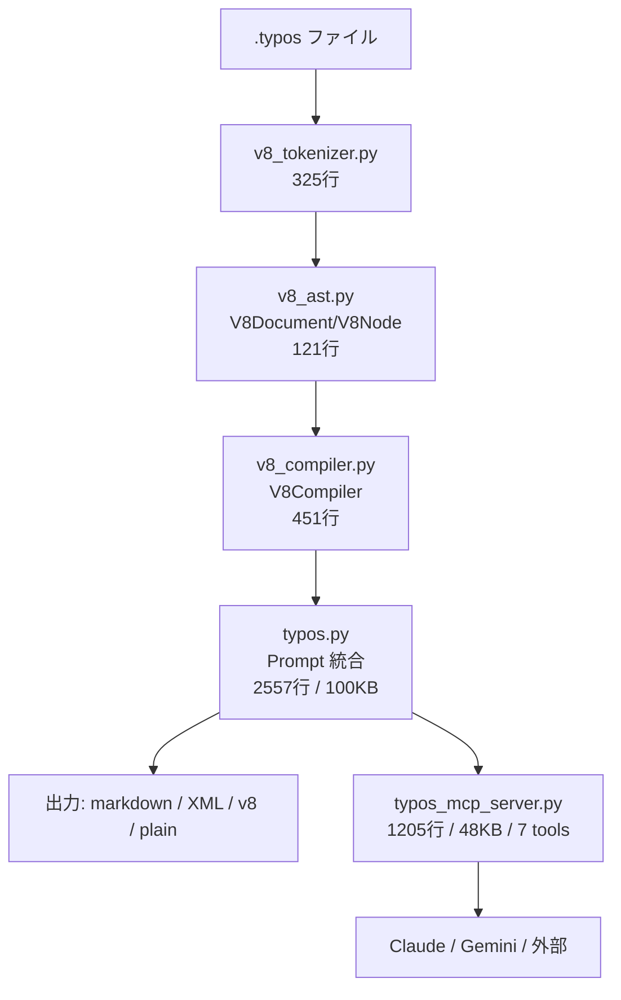
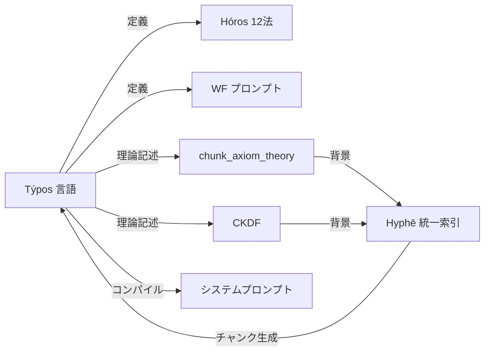

# Týpos 現状精査レポート

> Hyphē を踏まえた上での Týpos 系全体の現状評価

---

## §1 アーキテクチャ概要

| コンポーネント | ファイル | 行数 | 役割 |
|---|---|---|---|
| **Tokenizer** | `v8_tokenizer.py` | 325 | スタックベースの行単位パーサー。`<:name: ... :>` ブロック → AST |
| **AST** | `v8_ast.py` | 121 | `V8Document` + `V8Node`。メタ情報 + ツリー構造 |
| **Compiler** | `v8_compiler.py` | 451 | AST → `Prompt` dataclass への変換 |
| **Core Parser** | `typos.py` | 2,557 | v7/v8 ハイブリッド。CLI + 24 description acts + 深度 L0-L3 |
| **MCP Server** | `typos_mcp_server.py` | 1,205 | 7 tools: generate/parse/validate/compile/expand/policy_check/ping |

---

## §2 v8 パイプライン詳細

### Tokenizer → AST
- **スタックベース**: ネストされたブロック (`<:constraints: ... :>`) を正しく処理
- **メタデータ**: `#prompt`, `#syntax`, `#depth` ヘッダを `V8Document.metadata` に格納
- **対応 v8 ディレクティブ**: `role`, `goal`, `constraints`, `rubric`, `examples`, `context`, `step`, `tools`, `focus`, `highlight`, `intent`, `scope`, `table`, `if/else`, `activation`, `mixin`

### Compiler → Prompt
- 各ノード種 (`role`, `goal`, ...) を `Prompt` dataclass のフィールドにマッピング
- `@if`/`@else` の条件評価 (変数コンテキスト渡し)
- `@mixin` 解決 (ファイルパス参照)
- `@activation` メタデータ (triggers, depth, format)

### 出力フォーマット
| 形式 | 用途 | 特徴 |
|---|---|---|
| **markdown** | システムプロンプト注入 | Hóros 12法の user_rules はこの形式 |
| **XML** | 構造化プロンプト | Claude 最適化 |
| **v8** | Týpos ネイティブ | 再パース可能 |
| **plain** | デバッグ | フラットテキスト |

---

## §3 MCP サーバー (7 tools)

| Tool | 機能 | 注目点 |
|---|---|---|
| `generate` | 自然言語 → .typos/skill.md 生成 | ドメイン検出 + 収束/発散分類 + アーキタイプ別調整 |
| `parse` | .typos → JSON AST | v8 パイプライン使用 |
| `validate` | 構文検証 | `@role`/`@goal` 必須チェック |
| `compile` | .typos → システムプロンプト文字列 | モデル別最適化 |
| `expand` | .typos → 人間可読な自然言語 | デバッグ・レビュー用 |
| `policy_check` | タスクの収束/発散分類 | FEP Function 公理 (Explore↔Exploit) |
| `ping` | ヘルスチェック | — |

### `generate` の動的生成戦略
1. **ドメイン検出**: `technical` / `rag` / `summarization` を自動判定
2. **収束/発散分類**: キーワードベースで `convergent` / `divergent` / `ambiguous` に分類
3. **アーキタイプ注入**: Claude/Gemini/OpenAI 向けにプロンプト最適化
4. **テンプレート**: `typos-templates/domain_templates/` からドメイン別テンプレートを読込
5. **安全策**: Defense-in-depth (ドメイン検証 + タスク分類)

---

## §4 .typos ファイル分布 (46個)

| ディレクトリ | 個数 | 代表例 |
|---|---|---|
| `prompts/` | 15 | Hóros 12法 + Doctrine + Omega 等 ← **user_rules の源泉** |
| `helm/` | 14 | Boot/Bye/Eat/Fit/Rom 等の WF プロンプト |
| `staging/` | 6 | 新規・実験的プロンプト |
| `Boulēsis/UnifiedIndex/` | 2 | Hyphē 接点 (後述) |
| `tekhne/` | 1 | `tekhne-maker.typos` (Skill 生成メタプロンプト) |
| その他 | 8 | CKDF, MCP prompts 等 |

> [!IMPORTANT]
> user_rules として常時注入されている Hóros 12法・Doctrine・Omega 等は全て `.typos` で定義 → markdown にコンパイルされて注入されている。**Týpos は HGK の制約体系の定義言語そのもの**。

---

## §5 Hyphē との接点

### 5.1 [chunk_axiom_theory.typos](file:///home/makaron8426/Sync/oikos/01_%E3%83%98%E3%82%B2%E3%83%A2%E3%83%8B%E3%82%B3%E3%83%B3%EF%BD%9CHegemonikon/10_%E7%9F%A5%E6%80%A7%EF%BD%9CNous/04_%E4%BC%81%E7%94%BB%EF%BD%9CBoul%C4%93sis/11_%E7%B5%B1%E4%B8%80%E7%B4%A2%E5%BC%95%EF%BD%9CUnifiedIndex/chunk_axiom_theory.typos)

- **内容**: Hyphē 統一索引のチャンキング公理。チャンクを「意味空間上の Markov blanket」として定式化
- **HGK 接続**: 6座標 (Value/Function/Precision/Scale/Valence/Temporality) をチャンクの次元として使用
- **Active Inference**: η (統一索引) 上の能動推論としてチャンキングを導出
- **対比**: Information Bottleneck (静的圧縮) vs HGK (動的発見)

### 5.2 [ckdf_kalon_detection.typos](file:///home/makaron8426/Sync/oikos/01_%E3%83%98%E3%82%B2%E3%83%A2%E3%83%8B%E3%82%B3%E3%83%B3%EF%BD%9CHegemonikon/10_%E7%9F%A5%E6%80%A7%EF%BD%9CNous/04_%E4%BC%81%E7%94%BB%EF%BD%9CBoul%C4%93sis/11_%E7%B5%B1%E4%B8%80%E7%B4%A2%E5%BC%95%EF%BD%9CUnifiedIndex/ckdf_kalon_detection.typos)

- **内容**: Categorical Kalon Detection Framework。構造検出 (P) が NP-hard 最適化を回避する仕組み
- **Kalon▽ (客観)** vs **Kalon△ (主観)**: 全空間の Fix(G∘F) は NP-hard、MB 内の Fix(G∘F) は P-time
- **一般化**: FEP 特化ではなく、任意の空間での構造検出理論として定式化
- **Hyphē との関連**: 統一索引がチャンクの Kalon を検出する理論的基盤

### 5.3 接続構造

> [!NOTE]
> Týpos と Hyphē は双方向の関係にある:
> - **Týpos → Hyphē**: 理論的基盤 (チャンキング公理, CKDF) を `.typos` で形式化
> - **Hyphē → Týpos**: 統一索引がチャンクを生成する際に `.typos` を処理対象として扱う

---

## §6 実験結果: Týpos vs XML vs Markdown

[summary.json](file:///home/makaron8426/Sync/oikos/01_%E3%83%98%E3%82%B2%E3%83%A2%E3%83%8B%E3%82%B3%E3%83%B3%EF%BD%9CHegemonikon/60_%E5%AE%9F%E9%A8%93%EF%BD%9CPeira/00_%E6%B1%8E%E7%94%A8%EF%BD%9CGeneral/results_typos_vs_xml/summary.json) の結果:

| 指標 | Týpos | XML | Markdown |
|---|---|---|---|
| bugs_found | 0 | 0 | 0 |
| detection_rate | 0.0 | 0.0 | 0.0 |
| json_parse_success | **false** | **false** | **false** |
| elapsed_sec | 60.83 | 60.52 | 60.58 |

> [!CAUTION]
> **全フォーマットで json_parse_success=false、~60秒タイムアウト**。実験自体がインフラ障害 (API タイムアウト等) で完走していない。フォーマット間の優劣を判断するデータは存在しない。再実行が必要。

---

## §7 Skill 定義

### SKILL.md
- **トリガー**: `generate_typos`, `.typos ファイル作成`, `Skill 定義`
- **MCP 連携**: `mcp_typos_*` ツール群と直結
- **FEP Function**: Explore (発散) タスクには Týpos 非推奨、Exploit (収束) タスクに推奨

### typos-policy.md
- **3 段チェック**: ① タスク適合性 (convergent?) → ② 安全性 (domain 検証) → ③ 品質基準 (v8 準拠)
- **policy_check tool**: タスク記述からキーワードベースで分類 → 推奨/非推奨を返却

---

## §8 総合評価

### ◎ 強み
| 項目 | 詳細 |
|---|---|
| **v8 パイプライン成熟度** | Tokenizer→AST→Compiler の 3段パイプラインが安定動作 |
| **HGK 定義言語としての定着** | Hóros 12法・Doctrine 等の核心制約が全て .typos で定義 |
| **MCP 統合** | 7 tools が実装済み。generate の動的生成は高度 |
| **Hyphē 理論接続** | chunk_axiom_theory + CKDF が理論的基盤を提供 |
| **深度システム** | L0-L3 の段階的ディレクティブ活性化が実用的 |

### ◯ 改善候補
| 項目 | 詳細 |
|---|---|
| **実験データ不在** | Týpos vs XML vs Markdown の比較実験が未完走。効果の定量的根拠がない |
| **v7/v8 共存コスト** | `typos.py` (2557行) の肥大化は v7 互換維持が一因 |
| **generate の検証不足** | 生成された .typos の品質を自動検証するループが MCP 内にない |
| **tekhne-maker の活用度** | Skill 生成メタプロンプトが存在するが、実際の使用頻度が [推定] 低い |

### ✗ 未解決
| 項目 | 詳細 |
|---|---|
| **Hyphē 実装接続** | chunk_axiom_theory / CKDF は理論記述のみ。Hyphē のコードが .typos を実際にパースする実装は未確認 |
| **Boot での全面採用** | 会話 5637735c で「全ドキュメントを Týpos で」が議題に上がっているが未着手 |

---

## §9 [主観]

Týpos は **HGK の認知制約体系の定義言語として既に kalon に達している** [推定 85%]。

根拠:
- Fix(G∘F) の観点: `.typos` → markdown/XML にコンパイル → user_rules として注入 → そのルールが `.typos` の書き方を制約する → 自己参照的不動点
- 展開可能性: 12法 × 24 WF × 理論記述 (CKDF) × MCP 7 tools と多面的に展開されている
- 収束性: v8 パイプラインが安定し、新規 .typos は全て v8 構文で書かれている

一方、**定量的効果の証拠が皆無** (実験が未完走) という点は構造的弱点。「Týpos が markdown/XML より優れている」という主張を支えるデータがない。会話 5637735c の「全面採用」に進む前に、この実験を完走させるべき。

---

📍 現在地: Týpos 精査完了
🕳️ 未踏: (1) 比較実験の再実行 (2) Hyphē コードレベルの .typos パース実装確認 (3) 全面採用戦略の策定
→次: 比較実験の再実行が最優先。なぜ: 定量的根拠なしの全面採用は N-2 (確信度歪み) に抵触
