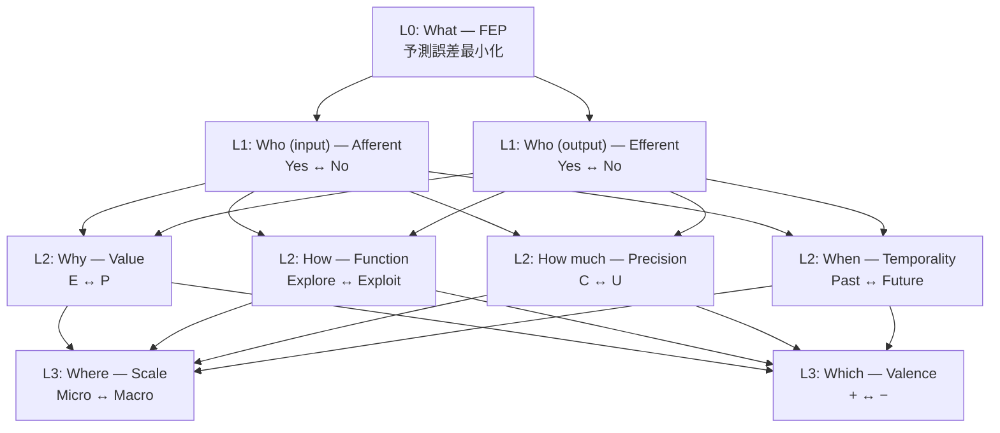

# Hegemonikón

> **認知ハイパーバイザーフレームワーク** — 変分自由エネルギー原理 (FEP) に基づくAI認知制御システム。
> 名称はストア派哲学の「魂の統率中枢」(Ἡγεμονικόν) に由来。

---

## ⚡ クイックスタート

```bash
# セットアップ (Windows)
git clone https://github.com/Tolmeton/Hegemonikon.git
cd hegemonikon
python -m venv .venv && .venv\Scripts\activate
pip install -r requirements.txt
```

---

## 🏛️ 体系核 45 + 準核 12 (v5.0)

> **「真理は美しく、美しさは真理に近づく道標である」**

| 項目                        |           数 | 生成規則                                                           |
| :-------------------------- | -----------: | :----------------------------------------------------------------- |
| **公理**              |            1 | FEP (自由エネルギー原理)                                           |
| **座標**              |            8 | Afferent + Efferent + 6修飾 (構成距離 d=1-3。Basis d=0 は体系核外) |
| **動詞 (Poiesis)**    |           36 | S/I/A × 6修飾座標 × 2極                                          |
| **体系核**            | **45** | 1+8+36                                                             |
| **前動詞 (H-series)** |           12 | S∩A × 6修飾座標 × 2極 (**体系準核**)                      |
| 結合規則 (X-series)         |           15 | K₆ の辺 (体系核外)                                                |
| 循環規則 (Q-series)         |           15 | K₆ の辺 (体系核外)                                                |
| Dokimasia                   |           60 | 15結合 × 4極 (体系核外)                                           |

### 公理階層 (8軸)



### Afferent × Efferent の4象限

|                        | Efferent=Yes              | Efferent=No         |
| :--------------------- | :------------------------ | :------------------ |
| **Afferent=Yes** | S∩A (反射弧 → H-series) | S (知覚 → S極動詞) |
| **Afferent=No**  | A (行為 → A極動詞)       | I (推論 → I極動詞) |

### 動詞テーブル (36 = 6族 × 6動詞)

| 族名(座標)         | T5=S×極1 | T6=S×極2 | T1=I×極1 | T2=I×極2 | T3=A×極1 | T4=A×極2 |
| :----------------- | :-------- | :-------- | :-------- | :-------- | :-------- | :-------- |
| Telos(Value)       | /the 観照 | /ant 検知 | /noe 認識 | /bou 意志 | /zet 探求 | /ene 実行 |
| Methodos(Function) | /ere 探知 | /agn 参照 | /ske 発散 | /sag 収束 | /pei 実験 | /tek 適用 |
| Krisis(Precision)  | /sap 精読 | /ski 走査 | /kat 確定 | /epo 留保 | /pai 決断 | /dok 打診 |
| Diástasis(Scale)  | /prs 注視 | /per 一覧 | /lys 分析 | /ops 俯瞰 | /akr 精密 | /arh 全体 |
| Orexis(Valence)    | /apo 傾聴 | /exe 吟味 | /beb 肯定 | /ele 批判 | /kop 推進 | /dio 是正 |
| Chronos(Temporal.) | /his 回顧 | /prg 予感 | /hyp 想起 | /prm 予見 | /ath 省察 | /par 仕掛 |

---

## 🔑 CCL (Cognitive Control Language)

CCL は認知プロセスを代数的に記述する言語です。

| したいこと       | CCL 式           | 意味                       |
| :--------------- | :--------------- | :------------------------- |
| 深く考える       | `/noe+`        | 認識を7フェーズ展開        |
| 意志を明確にする | `/bou+`        | 意志を5 Whysで深掘り       |
| 設計→実行       | `/bou+>>/ene+` | 意志の後に実行パイプライン |
| 環境を観察       | `/the`         | 受容的に環境を知覚         |
|                  |                  |                            |

### 演算子

| 記号          | 名称        | 作用       |
| :------------ | :---------- | :--------- |
| `+` / `-` | 深化 / 縮約 | L3 / L1    |
| `*`         | 融合        | 収束統合   |
| `~`         | 振動        | 往復対話   |
| `>>`        | 射          | 出力→入力 |
| `_`         | シーケンス  | 順次実行   |
| `^`         | 上昇        | メタ化     |

---

## 📁 プロジェクト構造

```
ヘゲモニコン｜Hegemonikon/
├── 00_核心｜Kernel/     # 公理・定理の根幹 (不変真理)
├── 10_知性｜Nous/       # 制約・手順・知識・企画
│   ├── 01_制約/          # Hóros 12法 + CCL仕様
│   ├── 02_手順/          # WF・Skills・マクロ
│   ├── 03_知識/          # 確定知識・分析文書
│   └── 04_企画/          # 計画・仮説・エッセイ
├── 20_機構｜Mekhane/    # ソースコード + モジュール docs
│   └── _src/             # Python/TypeScript/Rust
├── 30_記憶｜Mneme/      # Handoff・ROM・セッション記録
├── 40_作品｜Poiema/     # HGK 産出物
├── 60_実験｜Peira/      # 実験・テスト
└── 80_運用｜Ops/        # スクリプト・開発ツール
```

---

## 🧠 設計思想

### 圏論的基盤

| 概念                        | 適用                                                             |
| :-------------------------- | :--------------------------------------------------------------- |
| **ガロア接続 F⊣G**   | 前順序圏上の随伴。F=発散=Explore, G=収束=Exploit                 |
| **Kalon = Fix(G∘F)** | 品質 = 発散と収束の不動点                                        |
| **[0,1]-豊穣圏**      | Drift ∈ [0,1] = 変換の質 (L2)                                   |
| **弱2-圏**            | 0-cell=48, 1-cell=CCL `>>`, 2-cell=パイプライン間自然変換 (L3) |
| **米田の補題**        | 各動詞はその射の集合で完全に決まる                               |

### FEP × 認知制約 (Hóros 12法)

3原理 × 4位相 = 12法 (Nomoi):

| 原理       | Aisthēsis     | Dianoia           | Ekphrasis           | Praxis             |
| :--------- | :------------- | :---------------- | :------------------ | :----------------- |
| S-I 謙虚   | N-1 実体を読め | N-2 不確実性追跡  | N-3 確信度明示      | N-4 不可逆前に確認 |
| S-II 能動  | N-5 能動探索   | N-6 違和感検知    | N-7 主観表出        | N-8 道具使用       |
| S-III 精密 | N-9 原典参照   | N-10 SOURCE/TAINT | N-11 行動可能な出力 | N-12 正確な実行    |

---

## 🛠️ Tech Stack

| 層                | 技術                                                          |
| :---------------- | :------------------------------------------------------------ |
| **Backend** | Python 3.11, MCP サーバー (12+), LanceDB                      |
| **AI/ML**   | Claude (Sonnet/Opus), Gemini (Flash/Pro), BGE-M3              |
| **Tools**   | Hermēneus (CCL), Periskopē (Research), Ochēma (LLM Bridge) |
| **Quality** | Sekisho (監査), Sympatheia (自律神経系), Dendron (存在証明)   |

---

*Hegemonikón v5.0 — 45実体+準核12 認知ハイパーバイザーフレームワーク*
