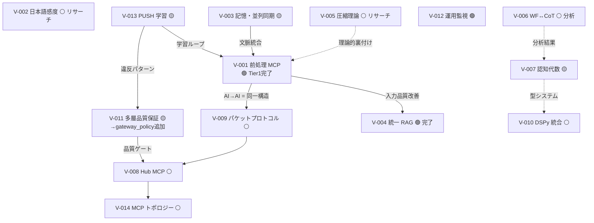

# HGK Vision Roadmap — 2026-03-08

> V-001〜V-014 の状態・依存関係・実装順序を統合したロードマップ

---

## 依存関係グラフ



---

## 状態サマリー (2026-03-08 更新)

| # | 項目 | 旧状態 | 新状態 | 成果 |
|:--|:-----|:------|:------|:-----|
| V-001 | 前処理 MCP | 🟡 設計完了 | **🟢 Tier1 完了** | 6機能実装, 37テスト, MCP サーバー + Gateway Policy 完了 |
| V-002 | 日本語感度 | ⚪ 要リサーチ | ⚪ | — |
| V-003 | 記憶・並列同期 | 🟡 部分実装 | 🟡 | — |
| V-004 | 統一 RAG | 🟢 完了 | 🟢 | — |
| V-005 | 圧縮理論 | ⚪ 要リサーチ | ⚪ | — |
| V-006 | WF↔CoT | ⚪ 要分析 | ⚪ | — |
| V-007 | 認知代数 | 🟡 部分実装 | 🟡 | — |
| V-008 | Hub MCP | ⚪ 構想 | ⚪ | — |
| V-009 | パケットプロトコル | 🟡 V-001 と統合 | 🟡 | V-001 Tier1 が基盤を提供 |
| V-010 | DSPy 統合 | ⚪ 要リサーチ | ⚪ | — |
| V-011 | 多層品質保証 | 🟡 部分実装 | **🟡 Gateway Policy 追加** | `prokataskeve_preprocess` + `quality_gate.py` |
| V-012 | 運用監視 | 🟢 完了 | 🟢 | — |
| V-013 | PUSH 学習 | 🟡 部分実装 | 🟡 | — |
| V-014 | MCP トポロジー | ⚪ 理論考察 | ⚪ | — |

---

## 実装ロードマップ: 4 フェーズ

### R1: 基盤 (2-3 週間)

> **テーマ**: 全入力の品質を底上げし、品質ゲートを環境強制する

| 順序 | 項目 | 内容 | 工数 | 依存 |
|:----:|:-----|:-----|:----:|:----:|
| ~~1~~ | ~~V-001 Tier 1~~ | ~~前処理 MCP L0-L1 (3→6機能)~~ | ~~3日~~ | ✅ **完了** |
| **2** | **V-011 環境強制** | Sekisho L1 を全応答に自動適用 (Gateway インターセプト) | 2日 | なし |
| **3** | **V-001 Tier 2** | 前処理 L2 (→12機能) | 5日 | V-001 T1 |
| **4** | **V-003 Context Rot 対策** | 並列セッション同期の基盤 (Mneme マージバス) | 5日 | V-001 T1 |

> **R1 完了時の状態**: 入力品質の底上げ (L0-L2)、品質ゲートの自動化、Context Rot の緩和

---

### R2: 深化 (2-3 週間)

> **テーマ**: 前処理を深化し、AI→AI 通信を構造化する

| 順序 | 項目 | 内容 | 工数 | 依存 |
|:----:|:-----|:-----|:----:|:----:|
| **5** | **V-001 Tier 3** | 前処理 L3-L4 (→18機能) | 5日 | V-001 T2 |
| **6** | **V-009 パケットプロトコル** | V-001 の AI→AI インスタンスとして実装 | 3日 | V-001 T2 |
| **7** | **V-013 PUSH 学習** | 前処理結果のフィードバックループ | 3日 | V-001 T2 |

> **R2 完了時の状態**: 全 18 機能の前処理、AI→AI 通信の構造化、学習ループの確立

---

### R3: リサーチ (並行可能)

> **テーマ**: 理論的裏付けと分析。実装と並行して進められる

| 順序 | 項目 | 内容 | 工数 | 依存 |
|:----:|:-----|:-----|:----:|:----:|
| — | **V-005 圧縮理論** | Adaptive Token Budgeting の FEP 理論的根拠 | /eat + /noe | なし |
| — | **V-002 日本語感度** | 日本語プロンプトの LLM 感度研究 | /eat + 実験 | なし |
| — | **V-006 WF↔CoT** | 5+ WF での Phase↔CoT 対応表 | /noe 分析 | なし |

---

### R4: アーキテクチャ (長期)

> **テーマ**: Hub 中央集権化。R1-R2 の成果を前提とする

| 順序 | 項目 | 内容 | 工数 | 依存 |
|:----:|:-----|:-----|:----:|:----:|
| **8** | **V-008 Hub MCP** | ルーティング Claude + 各 MCP への委任 | 設計 5日 + 実装 10日 | V-001, V-009, V-011 |
| **9** | **V-014 トポロジー** | Hub vs 逆拡散の検証 | R2 後に評価 | V-008 |
| **10** | **V-010 DSPy** | Týpos → DSPy Signature 変換器 | 5日 | V-007 |
| **11** | **V-007 認知代数拡張** | CCL 型検査・自動最適化 | 10日 | L3 圏論 |

---

## 優先度マトリクス

```
              緊急度 高 ──────────────── 低
重要度高 ┌───────────────────────────────────┐
         │ V-001 T1 前処理    V-003 記憶    │
         │ V-011 環境強制                   │
         ├───────────────────────────────────┤
         │ V-001 T2/T3         V-005 圧縮理論│
         │ V-009 パケット      V-013 PUSH   │
         ├───────────────────────────────────┤
         │ V-008 Hub            V-002 日本語 │
         │                      V-006 WF↔CoT│
         │                      V-010 DSPy   │
重要度低 └───────────────────────────────────┘
```

---

## R1 の進捗 (2026-03-08)

> [!NOTE]
> **V-001 Tier 1 は完了。** 6機能 (L0×3 + L1×3), 37テスト, MCP サーバー, Gateway Policy 追加。
> /ele の結果、CortexClient シングルトン化・LLM 分岐テスト・extract_certain 独立化も完了。

> [!IMPORTANT]
> **次の R1 目標は V-011 環境強制 (Gateway インターセプト)。**
> プレ処理の「呼び出し元」を確定させることが、Tier 2 以降の設計前提となる。

> [!TIP]
> **前処理の深度同期 ($d_{\text{pre}} \leq d_{\text{main}}$) は FEP から導出済み。**
> 既存の深度体系 (L0-L3) に前処理が自動追従するため、体系の変更は不要。
