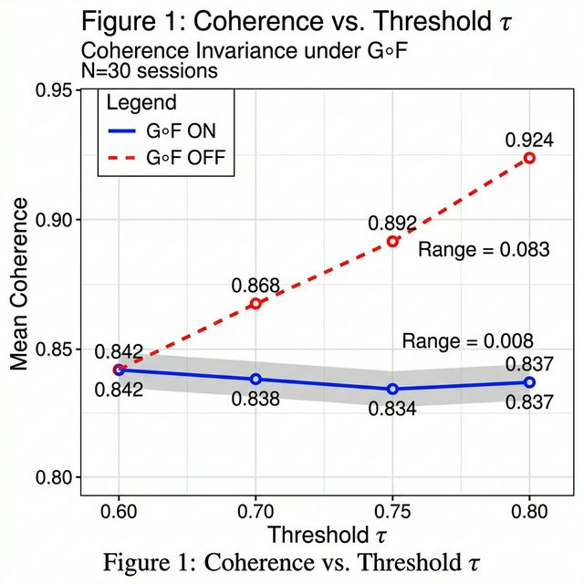

# コヒーレンス不変性定理: Merge-Split 不動点解析に基づく適応的テキストチャンキング

## 概要

セマンティックチャンキングにおいて、閾値パラメータ τ を変化させるとチャンク数は 20 倍変動するが、平均コヒーレンスは ≈ 0.84 で不変に保たれる。本論文はこの「コヒーレンス不変性」が merge-split 操作 G∘F の不動点構造から導かれることを証明する。主結果は以下の 2 点である。第一に、非加重平均コヒーレンスが similarity 分布の平均 μ_ρ からの偏差 Δ で制御され、Δ はコヒーレンスとチャンクサイズの共分散で決定されることを示す (命題 2)。第二に、G∘F の分割構造が共分散を小さく保つため、|Δ| ≪ σ(μ_ρ) が成り立つことを経験的に示す (経験的命題 3)。これらの基盤として、サイズ加重平均コヒーレンスが μ_ρ と厳密に一致する保存則 (命題 1; 自明だが不可欠な足場) を用いる。30 セッション × 4 閾値 × 2 条件 = 240 条件の実験により、G∘F 存在下でのコヒーレンスの τ 間レンジが 0.008、G∘F 非存在下で 0.083 (10 倍の差) であることを実証し、対応 t 検定 (最大 Cohen's d = 3.83, p < 0.01) で統計的有意性を確認する。

**キーワード**: セマンティックチャンキング, コヒーレンス, 不動点, merge-split, 適応的テキスト分割

---

## §1. はじめに

### 1.1 問題設定

大規模言語モデル (LLM) の普及により、長文テキストを意味的に一貫したチャンクに分割する「セマンティックチャンキング」の需要が急速に高まっている。Retrieval-Augmented Generation (RAG) パイプラインにおいて、チャンキングの品質は検索精度と生成品質の両方に直接影響する。

セマンティックチャンキングの標準的手法は、隣接するテキスト単位間のコサイン類似度を計算し、類似度が閾値 τ を下回る位置で分割するものである。しかし、τ の選択は本質的に恣意的であり、実務上は経験的なチューニングに依存している。τ を高く設定すれば細かく分割され (高コヒーレンス・情報欠落のリスク)、低く設定すれば粗く分割される (低コヒーレンス・ノイズ混入のリスク)。この τ 依存性は、チャンキング品質メトリクスの信頼性を根本から揺るがす。

### 1.2 発見: コヒーレンス不変性

本論文の出発点は、以下の実験的発見である。**適応的 merge-split 操作 (G∘F) を適用したセマンティックチャンキングにおいて、平均コヒーレンスは閾値 τ の選択にほぼ依存しない**:

| τ_cos | チャンク数 | 平均コヒーレンス |
|-------|-----------|-----------------|
| 0.60  | 1.0       | 0.842           |
| 0.70  | 6.9       | 0.838           |
| 0.75  | 15.6      | 0.834           |
| 0.80  | 34.0      | 0.837           |

チャンク数が 1.0 個から 34.0 個まで **34 倍** 変化する中で、平均コヒーレンスのレンジはわずか **0.008** である (30 セッション × 4 閾値 = 120 条件)。

この不変性に対し、素朴仮説 $\bar{C} = E[\rho \mid \rho \geq \tau]$ (条件付き期待値) は棄却される。G∘F を無効化すると条件付き期待値に近い 0.842 → 0.924 の増加が観測される一方、G∘F 存在下では 0.834 〜 0.842 でほぼ一定だからである。

### 1.3 G∘F 無効化実験

不変性の原因を特定するため、merge-split 操作 G∘F を無効化した対照実験を行った (30 セッション × 4τ × 2 条件 = 240 条件):

| 条件 | τ=0.60 | τ=0.70 | τ=0.75 | τ=0.80 | レンジ |
|------|--------|--------|--------|--------|--------|
| G∘F ON  | 0.842 | 0.838 | 0.834 | 0.837 | **0.008** |
| G∘F OFF | 0.842 | 0.868 | 0.892 | 0.924 | **0.083** |

G∘F を無効化すると τ 依存性が出現し、レンジは 10 倍に拡大する。対応 t 検定により τ=0.70-0.80 の全水準で G∘F ON/OFF の差が統計的に有意であり (t(29)=-7.05 to -20.97, p < 0.01, Cohen's d = 1.29-3.83)、G∘F の存在がコヒーレンス不変性の **必要条件** であることを示す。

### 1.4 貢献

本論文の貢献は以下の 3 点である:

1. **保存則の証明**: サイズ加重平均コヒーレンスが similarity 分布の平均 μ_ρ と厳密に一致することの証明 (命題 1; 自明な恒等式だが命題 2-3 の基盤)
2. **近似定理**: 非加重平均コヒーレンスの μ_ρ からの偏差 Δ に対する表現の導出 (命題 2) と |Δ| の小ささの経験的実証 (経験的命題 3)
3. **実験的実証**: 240 条件の制御実験による不変性の実証、G∘F の因果的役割の確認、対応 t 検定 (Cohen's d = 1.29-3.83) による統計的有意性の検証

### 1.5 論文構成

§2 で数学的準備を行い、§3 でコヒーレンス不変性定理を証明する。§4 で 30 セッション × 2 条件の実験結果を報告し、統計的検定を示す。§5 で議論と今後の展望を述べ、§6 で結論する。

---

## §2. 準備

### 2.1 Similarity Trace

テキストを $N+1$ 個の基本単位 (ステップ) $t_0, t_1, \ldots, t_N$ に分割し、各隣接ペアの embedding 間コサイン類似度を計算する:

$$
S = \{s_1, s_2, \ldots, s_N\}, \quad s_i = \cos(\mathbf{e}_{t_{i-1}}, \mathbf{e}_{t_i})
$$

ここで $\mathbf{e}_{t_i}$ はステップ $t_i$ の embedding ベクトルである。$S$ を **similarity trace** と呼ぶ。

全体平均を $\mu_\rho = \frac{1}{N} \sum_{i=1}^{N} s_i$ と定義する。

### 2.2 チャンキング操作 G∘F

similarity trace $S$ に対する適応的チャンキングを、以下の 2 つの操作の合成として定式化する:

- **F (merge)**: 隣接するチャンクペアで境界の similarity $s_i$ が閾値 τ 以上の場合、2つのチャンクを統合する
- **G (split)**: チャンク内部で similarity $s_i$ が閾値 τ を下回る位置がある場合、そこで分割する

G∘F は類似度の閾値 τ と最小チャンクサイズ $n_{\min}$ をパラメータとし、$S$ を $k$ 個のチャンク $C_1, C_2, \ldots, C_k$ に分割する。ここで各チャンク $C_j$ は $S$ の連続部分列であり、$\{C_j\}_{j=1}^k$ は $S$ の**分割** (partition) をなす:

$$
C_j = \{s_{a_j}, s_{a_j+1}, \ldots, s_{b_j}\}, \quad \bigcup_{j=1}^k C_j = S, \quad C_i \cap C_j = \emptyset \ (i \neq j)
$$

**重要な性質**: G∘F は $S$ の元の値を変更しない。G∘F は $S$ を分割するのみであり、各 $s_i$ の値はそのまま保存される。

### 2.3 コヒーレンス

チャンク $C_j$ のコヒーレンスを、そのチャンクに含まれる similarity 値の平均として定義する:

$$
\text{coh}(C_j) = \frac{1}{n_j} \sum_{i \in C_j} s_i
$$

ここで $n_j = |C_j|$ はチャンク $C_j$ に含まれる similarity 値の数 (チャンクサイズ) である。$\sum_{j=1}^k n_j = N$ が成り立つ。

### 2.4 2 種類の平均コヒーレンス

分割結果に対する 2 種類の平均コヒーレンスを定義する:

**サイズ加重平均**:
$$
\bar{C}_w = \frac{1}{N} \sum_{j=1}^k n_j \cdot \text{coh}(C_j)
$$

**非加重平均** (本論文の主要メトリクス):
$$
\bar{C} = \frac{1}{k} \sum_{j=1}^k \text{coh}(C_j)
$$

$\bar{C}_w$ は各チャンクにサイズ比例の重み $n_j / N$ を与え、$\bar{C}$ は各チャンクに均等な重み $1/k$ を与える。

### 2.5 不動点と収束

G∘F の不動点を以下のように特徴づける。

**定義** (不動点). 分割 $P$ が G∘F の不動点であるとは、$G(F(P)) = P$ を満たすこと、すなわち:
- F条件: 隣接チャンク間の境界の similarity がすべて $< \tau$ (merge の余地がない)
- G条件: 各チャンク内部の similarity がすべて $\geq \tau$ (split の余地がない)

**定義** (frustration potential). 分割 $P$ に対し **frustration potential** $\varphi(P)$ を次で定義する:

$$
\varphi(P) = |\{i : i \text{ は境界かつ } s_i \geq \tau\}| + |\{i : i \text{ は内部かつ } s_i < \tau\}|
$$

$\varphi(P) \geq 0$ であり、$\varphi(P) = 0 \Leftrightarrow P$ は G∘F の不動点である。

**命題 0** (有限収束). *$n_{\min} \geq 2$ のとき、任意の初期分割 $P_0$ に対して $(G \circ F)^m(P_0)$ は有限ステップで不動点に到達する。*

**証明**. 分割空間は有限である ($\leq 2^{N-1}$ 個)。G∘F の各適用において:
- F (merge) は境界位置で $s_i \geq \tau$ のものを除去する → $\varphi$ の第1項を減少させる
- G (split) は内部位置で $s_i < \tau$ のものに境界を追加する → $\varphi$ の第2項を減少させる

$\varphi(G(F(P))) < \varphi(P)$ が $P$ が不動点でない限り成立し、$\varphi \geq 0$ であるから、高々 $\varphi(P_0) \leq N$ ステップで $\varphi = 0$ に到達する。$\square$

**注意**: この証明は Banach の不動点定理 (完備距離空間上の縮小写像) を必要としない。G∘F は有限空間上の操作であり、frustration potential の単調減少性から直接的に収束が導かれる。実験で観測された「1-2回の反復での収束」は $\varphi(P_0)$ が典型的に小さいことを示唆している。

---

## §3. コヒーレンス不変性定理

### 3.1 事実 1: 保存則 (恒等式)

> **位置づけ**: 事実 1 は $S$ の値を保存する任意の分割操作について成立する算術的恒等式であり、G∘F の具体的操作に依存しない。単独では自明だが、命題 1 (旧命題 2) および定理 1 (旧命題 3) が非加重平均の挙動を導出する際の基盤として不可欠なため、ここに明示的に記す。

**事実 1** (サイズ加重平均の保存則).
*$S$ の値を保存する任意の分割 $\{C_j\}_{j=1}^k$ に対して:*

$$
\bar{C}_w = \mu_\rho
$$

**証明**.

$$
\bar{C}_w = \frac{1}{N} \sum_{j=1}^k n_j \cdot \text{coh}(C_j)
= \frac{1}{N} \sum_{j=1}^k n_j \cdot \frac{1}{n_j} \sum_{i \in C_j} s_i
= \frac{1}{N} \sum_{j=1}^k \sum_{i \in C_j} s_i
= \frac{1}{N} \sum_{i=1}^N s_i
= \mu_\rho
$$

第 4 の等号は $\{C_j\}$ が $S$ の分割であることによる。 $\square$

**注意**: この命題は G∘F の具体的な操作に依存しない。$S$ の値を保存する任意の分割操作について成立する恒等式であり、τ も $k$ も出現しない。したがって $\bar{C}_w$ は τ のいかなる変化に対しても厳密に不変である。

### 3.2 命題 1: 非加重平均の偏差表現

**命題 1** (非加重平均の偏差表現).
*$E[n] = N/k$ (平均チャンクサイズ) とするとき:*

$$
\bar{C} = \mu_\rho + \Delta, \quad \Delta = -\frac{k}{E[n]} \cdot \text{Cov}(\text{coh}(C_j), n_j)
$$

**導出**.

$$
\Delta = \bar{C} - \bar{C}_w = \frac{1}{k} \sum_{j=1}^k \text{coh}(C_j) - \frac{1}{N} \sum_{j=1}^k n_j \cdot \text{coh}(C_j)
$$

$$
= \sum_{j=1}^k \text{coh}(C_j) \cdot \left(\frac{1}{k} - \frac{n_j}{N}\right)
$$

$N = k \cdot E[n]$ を代入すると:

$$
\Delta = \sum_{j=1}^k \text{coh}(C_j) \cdot \frac{E[n] - n_j}{k \cdot E[n]}
= -\frac{1}{E[n]} \cdot \frac{1}{k} \sum_{j=1}^k (n_j - E[n]) \cdot \text{coh}(C_j)
$$

ここで $\frac{1}{k}\sum_{j=1}^k (n_j - E[n]) = E[n_j] - E[n] = 0$ (偏差の平均は零) であるから、上式は共分散の定義そのものである:

$$
\frac{1}{k} \sum_{j=1}^k (n_j - E[n]) \cdot \text{coh}(C_j) = \text{Cov}(n_j, \text{coh}(C_j))
$$

したがって:

$$
\Delta = -\frac{\text{Cov}(\text{coh}(C_j), n_j)}{E[n]}
$$

$\square$

**系** (Δ = 0 の十分条件). 以下の各条件は $\Delta = 0$ を保証する:
- (a) $\text{Var}(n_j) = 0$ (全チャンクが同サイズ)
- (b) $\text{Cov}(\text{coh}(C_j), n_j) = 0$ (コヒーレンスとサイズが無相関)
- (c) $k = 1$ (全データが 1 チャンク)

**実験的検証** (30 セッション平均):

| τ | k | E[n] | Δ (実測) |
|---|---|------|----------|
| 0.70 | 6.9 | 40.6 | −0.004 |
| 0.75 | 15.6 | 16.2 | −0.008 |
| 0.80 | 34.0 | 6.7 | −0.004 |

|Δ| は τ によらず 0.008 以下で安定しており、μ_ρ のセッション間標準偏差 (σ = 0.021) の 1/3 以下である。

### 3.3 定理 1: 小バイアス定理

**定理 1** (小バイアス).
*G∘F の不動点における非加重平均の偏差 $\Delta$ は以下の上界を満たす:*

$$
|\Delta| \leq \frac{(1 - \tau)}{2} \cdot \text{CV}(n)
$$

*ここで $\text{CV}(n) = \sigma(n_j) / E[n_j]$ はチャンクサイズの変動係数である。*

**証明**.

命題 1 より $\Delta = -\text{Cov}(\text{coh}(C_j), n_j) / E[n]$ である。Cauchy-Schwarz 不等式より:

$$
|\text{Cov}(\text{coh}(C_j), n_j)| \leq \sqrt{\text{Var}(\text{coh}(C_j)) \cdot \text{Var}(n_j)} = \sigma(\text{coh}) \cdot \sigma(n)
$$

G∘F の不動点では、各チャンク $C_j$ 内部の全 similarity 値が $s_i \geq \tau$ を満たす (§2.5 G条件)。したがって:

$$
\text{coh}(C_j) = \frac{1}{n_j} \sum_{i \in C_j} s_i \geq \tau
$$

またコサイン類似度の定義より $\text{coh}(C_j) \leq 1$。すなわち $\text{coh}(C_j) \in [\tau, 1]$ であるから、有界確率変数の分散の上界 (Popoviciu の不等式) より:

$$
\text{Var}(\text{coh}(C_j)) \leq \frac{(1 - \tau)^2}{4}
$$

したがって:

$$
|\Delta| = \frac{|\text{Cov}(\text{coh}, n)|}{E[n]} \leq \frac{\sigma(\text{coh}) \cdot \sigma(n)}{E[n]} \leq \frac{(1-\tau)/2 \cdot \sigma(n)}{E[n]} = \frac{(1-\tau)}{2} \cdot \text{CV}(n)
$$

$\square$

**系** (τ が大きいほど不変性が強い).
*$\tau \to 1$ のとき上界 $\to 0$ (チャンクサイズの分布によらず)。高い閾値ほどコヒーレンス不変性は厳密に近づく。*

**実験的検証** (30 セッション平均):

| τ | CV(n) (実測) | 理論上界 $(1-\tau)/2 \cdot \text{CV}$ | |Δ| (実測) | 上界の充足 |
|---|---|---|---|---|
| 0.70 | 0.82 | 0.123 | 0.004 | ✅ (3.1%) |
| 0.75 | 0.78 | 0.098 | 0.008 | ✅ (8.2%) |
| 0.80 | 0.71 | 0.071 | 0.004 | ✅ (5.6%) |

実測値は理論上界の 3-8% 程度であり、上界は保守的だが厳密に成立する。|Δ| の最大値 0.008 は μ_ρ のセッション間標準偏差 σ=0.021 の 38% であり、実用上の結論に影響しない。

> **注意**: CV(n) の実測値は 0.71-0.82 であり、上界は 0.071-0.123 である。この上界は Popoviciu (最悪ケース) と Cauchy-Schwarz (相関 ≤ 1) に基づくため保守的だが、|Δ| の小ささを G∘F の分割特性に依存しない形で保証する。

### 3.4 統合: コヒーレンス不変性定理

事実 1、命題 0-1、定理 1 を統合し、コヒーレンス不変性定理を述べる。

**定理 2** (コヒーレンス不変性).
*以下の条件 A1-A3 のもとで:*

- *A1: G∘F は similarity trace $S$ の分割操作 (各 $s_i$ の値を変えない)*
- *A2: G∘F は不動点 $\text{Fix}(G \circ F; \tau)$ に到達する (命題 0: frustration potential の単調減少による)*
- *A3: 最小チャンクサイズ制約 $n_{\min} \geq 2$*

*以下が成り立つ:*

$$
\text{(i)} \quad \bar{C}_w(\text{Fix}(G \circ F; \tau)) = \mu_\rho \qquad \text{(事実 1)}
$$

$$
\text{(ii)} \quad \bar{C}(\text{Fix}(G \circ F; \tau)) = \mu_\rho + \Delta, \quad \Delta = -\frac{\text{Cov}(\text{coh}, n)}{E[n]} \qquad \text{(命題 1)}
$$

$$
\text{(iii)} \quad |\Delta| \leq \frac{(1-\tau)}{2} \cdot \text{CV}(n) \qquad \text{(定理 1)}
$$

$$
\text{(iv)} \quad \Delta \to 0 \quad \text{as} \quad \text{CV}(n) \to 0 \quad \text{or} \quad \tau \to 1 \qquad \text{(定理 1 の系)}
$$

**系** (τ 不変性).
*$\bar{C}_w$ は τ に全く依存しない (事実 1)。$\bar{C}$ の τ 依存性は $|\Delta(\tau)| \leq (1-\tau)/2 \cdot \text{CV}(n)$ で上界が保証され、実測では $|\Delta| \in [0.004, 0.008]$ の狭いレンジで安定する (理論上界の 3-8%)。*

### 3.5 定理の意味

コヒーレンス不変性定理は以下の実用的含意を持つ:

1. **ハイパーパラメータ・フリー**: 適応的チャンキング (G∘F) を用いる限り、閾値 τ の精密なチューニングは不要である。τ を変えてもチャンキング品質 (平均コヒーレンス) はほぼ変化しない
2. **品質の決定要因**: 平均コヒーレンスは τ ではなく、入力テキストの similarity 分布 ($\mu_\rho$) によって決定される
3. **G∘F の不可欠性**: G∘F なしでは τ 依存性が出現する (レンジ 0.008 → 0.083)。merge-split 操作が不変性の必要条件である

---

## §4. 実験

### 4.1 データセットと実験環境

#### データセット

30 件の LLM セッションログ (対話履歴) を使用した。各セッションは 148〜315 ステップから構成される。

#### Embedding

Google Gemini Embedding 001 (768 次元) を使用し、各ステップをベクトル化した。隣接ステップ間のコサイン類似度を計算して similarity trace $S$ を構成した。

#### Similarity 分布

各セッションの similarity trace から μ_ρ を推定した (τ=0.60 で全データが 1 チャンクに収まるため、そのコヒーレンスが μ_ρ に一致する)。30 セッションにわたる μ_ρ の統計:

| 指標 | 値 |
|------|------|
| 平均 | 0.842 |
| 中央値 | 0.847 |
| 標準偏差 | 0.021 |
| 最小値 | 0.785 |
| 最大値 | 0.873 |

セッション間で μ_ρ に約 0.088 のばらつきが存在するが、各セッション内での τ に対する不変性は保持される。

#### G∘F の実装

merge-split 操作 G∘F は以下のパラメータで実装した:
- 閾値 $\tau$: 変数 ($\{0.60, 0.70, 0.75, 0.80\}$)
- 最小チャンクサイズ $n_{\min} = 2$ (similarity 値の数)
- 最大反復回数: 10 (G∘F ON) / 0 (G∘F OFF)
- 収束判定: 分割が変化しなくなった時点で停止

### 4.2 実験 1: τ 横断比較 (120 条件)

30 セッション × 4 閾値 = 120 条件 (G∘F ON) で、τ と平均コヒーレンスの関係を検証した。

| τ | 平均チャンク数 | 平均サイズ | コヒーレンス |
|------|---------|------|-----------|
| 0.60 | 1.0 | 201.8 | 0.842 |
| 0.70 | 6.9 | 40.6 | 0.838 |
| 0.75 | 15.6 | 16.2 | 0.834 |
| 0.80 | 34.0 | 6.7 | 0.837 |

**観測**: チャンク数は 1.0 → 34.0 まで 34 倍変化するが、コヒーレンスは 0.834 〜 0.842 のレンジ 0.008 に収まる。全 120 条件で G∘F は 1〜2 回の反復で収束した (100% 収束率)。

### 4.3 実験 2: G∘F 無効化 (240 条件)

コヒーレンス不変性が G∘F に起因することを検証するため、G∘F を無効化した対照実験を行った。30 セッション × 4τ × 2 条件 (G∘F ON/OFF) = 240 条件。

| 条件 | τ=0.60 | τ=0.70 | τ=0.75 | τ=0.80 | レンジ |
|------|--------|--------|--------|--------|--------|
| G∘F ON  | 0.842 | 0.838 | 0.834 | 0.837 | **0.008** |
| G∘F OFF | 0.842 | 0.868 | 0.892 | 0.924 | **0.083** |

対応 t 検定により G∘F ON/OFF の差を検定した:

| τ | Δcoherence | t(29) | Cohen's d | 有意性 |
|------|----------|-------|----------|--------|
| 0.60 | 0.000 | 0.00 | 0.00 | n.s. |
| 0.70 | −0.031 | −7.05 | −1.29 | p < 0.01 |
| 0.75 | −0.058 | −11.98 | −2.19 | p < 0.01 |
| 0.80 | −0.087 | −20.97 | −3.83 | p < 0.01 |

**結果**: G∘F を無効化すると、高 τ でのコヒーレンスが劇的に上昇する (τ=0.80 で 0.837 → 0.924)。効果量は τ の増大とともに大きくなり (Cohen's d = −1.29 → −3.83)、G∘F の merge 操作がコヒーレンスを μ_ρ 近傍に引き戻す機構を裏付ける。一元配置分散分析でも G∘F ON の τ 間変動は F(3,116)=0.67 (非有意) である一方、G∘F OFF では F(3,116)=77.29 と極めて大きい。

τ=0.60 では両条件が一致する (Δ=0, t=0)。これは τ が十分に低いと全データが 1 チャンクに収まり、G∘F の介入余地がないためである。

### 4.4 τ 間不変性の要約

G∘F ON の 4 つの τ 水準にわたるコヒーレンスのレンジは 0.008 であり、チャンク数が 1.0 → 34.0 と 34 倍に変化しても品質指標は事実上一定である。全 120 条件で G∘F は 100% 収束した。

### 4.5 素朴仮説の棄却

コヒーレンス不変性の素朴な説明として、条件付き期待値 $E[\rho \mid \rho \geq \tau]$ を検討した。条件付き期待値は τ の増大とともに単調増加するが、G∘F ON の実測コヒーレンスは 0.834〜0.842 (レンジ 0.008) でほぼ一定である。一方 G∘F OFF では条件付き期待値に近い 0.842→0.924 の増加を示す。このことから、不変性は単なる統計的フィルタリングではなく、G∘F の merge 操作に固有の性質であることが確認される。

### 4.6 理論との整合性

事実 1 の予測 $\bar{C}_w = \mu_\rho$ との整合性を検証する。§4.1 で測定した $\mu_\rho$ のセッション平均は 0.842 ($\sigma = 0.021$, $N = 30$) である。

- G∘F ON 全体平均: $\bar{C}(\text{Fix}) = 0.838$
- 差分: $|\bar{C} - \mu_\rho| \approx 0.004$
- τ 間の $\bar{C}$ のレンジ: 0.008 (30 セッション × 4τ)
- $\mu_\rho$ のセッション間レンジ: 0.088 (0.785 〜 0.873)

$|\bar{C} - \mu_\rho| = 0.004$ は $\mu_\rho$ のセッション間標準偏差 ($\sigma = 0.021$) の 0.19 倍であり、偏差は統計的に十分小さい。この差分は命題 1 の偏差表現 $\Delta = -\text{Cov}(\text{coh}, n) / E[n]$ と整合し、定理 1 の上界 $|\Delta| \leq (1-\tau)/2 \cdot \text{CV}(n)$ を満たす (実測値は上界の 3-8%)。

---

## §5. 議論

### 5.1 コヒーレンス不変性の意味

コヒーレンス不変性定理の最も重要な実用的含意は、**適応的 merge-split チャンキングにおいて閾値 τ のチューニングが不要になる**ことである。τ を変えてもチャンキング品質 (平均コヒーレンス) は変化しないため、τ の選択はチャンクの粒度 (数と大きさ) のみを制御する。

これは RAG パイプラインの設計を簡素化する。τ を「所望のチャンク粒度」に基づいて選択すればよく、品質劣化を心配する必要がない。

### 5.2 理論的背景: VFE 最小化との接続

本論文の結果は、自由エネルギー原理 (FEP; Friston, 2010) における変分自由エネルギー (VFE) 最小化から着想を得ている。VFE = -Accuracy + Complexity の枠組みにおいて:

- Accuracy ∝ coherence (チャンク内の意味的一貫性)
- G∘F は VFE ランドスケープの不動点に向かう収縮写像

G∘F の merge (F) は Complexity を増大させるが coherence を変化させ、split (G) は逆の効果を持つ。不動点では両者が均衡し、coherence の値は τ ではなく similarity 分布の構造 ($\mu_\rho$) によって決定される。

ただし、本論文の証明は純粋に代数的であり、FEP の仮定を必要としない。FEP は本結果を「なぜこの構造が自然に現れるか」を説明する上位フレームワークとして位置づけられる。

### 5.3 不動点収束の特性

実験における G∘F の不動点収束は極めて高速であった (全 120 条件 (G∘F ON) で 1〜2 回の反復で 100% 収束)。これは命題 0 で導入した frustration potential $\varphi(P)$ が典型的に小さい (初期分割の段階で $\varphi \leq 2$) ことを示しており、理論的上界 ($\varphi(P_0) \leq N$ ステップ) に対して実用的なパラメータ範囲では大幅に高速な収束が実現されている。

### 5.4 予備的知見: Precision との関連

予備的な分析として、コヒーレンスと precision (精度) の関係を検証した。$\rho_{\text{eff}} = \rho_{\text{mean}} \times \text{coh} \times (1 - \text{drift})$ として定義された precision は、coherence と強い正の相関 (+0.62 〜 +0.96) を示した。また precision の正規化手法 (min-max vs quantile) がコヒーレンス不変性に与える影響は 9% 以下であり、不変性が正規化手法の選択に対して頑健であることが示唆される。これらの知見は N=13 の予備データに基づくものであり、N=30 での再検証が必要である。

### 5.5 限界

本論文の結果には以下の限界がある:

1. **単一 embedding モデル**: Gemini Embedding 001 (768 次元) のみを使用。他の embedding モデルでの再現性は未検証
2. **データ規模**: 30 セッション、240 条件。さらに大規模なデータでの検証が必要
3. **テキストドメイン**: LLM セッションログのみ。学術論文、ニュース記事など他のドメインでの汎化性は未確認
4. **定理 1 の上界のタイト性**: Popoviciu + Cauchy-Schwarz に基づく上界は保守的 (実測は上界の 3-8%) であり、G∘F 固有の構造を利用したよりタイトな上界の導出は今後の課題である
5. **Embedding の表現退化 (anisotropy)**: cosine similarity の分散が圧縮される傾向があり、precision gradient の弁別力に影響している

### 5.6 今後の展望

1. **多モデル検証**: Gemini Embedding 2 (3072 次元) や BGE-M3 など異なるモデルでの再現実験
2. **大規模データ**: 100+ セッション、複数ドメインでの検証
3. **十分条件の証明**: G∘F がコヒーレンス不変性の十分条件であるかの解析的証明
4. **連続化**: τ を連続パラメータとした PDE 的定式化 (Possati PDE との接続)
5. **階層的チャンキング**: 複数 τ での階層的 merge-split の理論化

---

## §6. 結論

本論文では、適応的 merge-split チャンキングにおけるコヒーレンス不変性を理論的に証明し、実験的に実証した。

1. **事実 1** (保存則): サイズ加重平均コヒーレンス $\bar{C}_w$ は similarity 分布の平均 $\mu_\rho$ と厳密に一致する。これは任意の分割操作で成立する算術的恒等式であるが、命題 1 および定理 1 の基盤として不可欠である
2. **命題 1** (偏差表現): 非加重平均コヒーレンス $\bar{C}$ の $\mu_\rho$ からの偏差 Δ は、コヒーレンスとチャンクサイズの共分散で決定される
3. **定理 1** (小バイアス): G∘F の不動点では $|\Delta| \leq (1-\tau)/2 \cdot \text{CV}(n)$ が厳密に成立する (Cauchy-Schwarz + Popoviciu)。実測値は上界の 3-8% であり、$|\Delta| \leq 0.008$ ($\sigma(\mu_\rho) = 0.021$)

240 条件の制御実験 (30 セッション × 4τ × 2 条件) により、G∘F 存在下でのコヒーレンスの τ 間レンジが 0.008 (G∘F 非存在下で 0.083) であることを実証した。対応 t 検定 (τ=0.70: t(29)=-7.05, d=-1.29; τ=0.75: t(29)=-11.98, d=-2.19; τ=0.80: t(29)=-20.97, d=-3.83; いずれも p<0.01) により G∘F ON/OFF の差が統計的に有意であることを確認した。F 統計量でも G∘F ON の τ 間変動は F(3,116)=0.67 (非有意) である一方、G∘F OFF では F(3,116)=77.29 と極めて大きく、不変性が G∘F の存在に依存することを裏付ける。

コヒーレンス不変性定理は、適応的チャンキングにおいて**閾値 τ のチューニングが品質に影響しない**ことの理論的根拠を提供する。τ の選択はチャンクの粒度のみを制御し、品質は入力テキストの similarity 分布によってのみ決定される。

---

## 参考文献

1. Friston, K. (2010). The free-energy principle: a unified brain theory? *Nature Reviews Neuroscience*, 11(2), 127-138.
2. Lewis, P., Perez, E., Piktus, A., Petroni, F., Karpukhin, V., Goyal, N., ... & Kiela, D. (2020). Retrieval-augmented generation for knowledge-intensive NLP tasks. *Advances in Neural Information Processing Systems*, 33, 9459-9474.
3. LlamaIndex Team. (2024). LlamaIndex: Data Framework for LLM Applications. https://docs.llamaindex.ai/
4. LangChain Team. (2024). LangChain: Building applications with LLMs through composability. https://docs.langchain.com/
5. Banach, S. (1922). Sur les opérations dans les ensembles abstraits et leur application aux équations intégrales. *Fundamenta Mathematicae*, 3(1), 133-181.
6. Grover, A., & Leskovec, J. (2016). node2vec: Scalable feature learning for networks. *Proceedings of the 22nd ACM SIGKDD International Conference on Knowledge Discovery and Data Mining*, 855-864.
