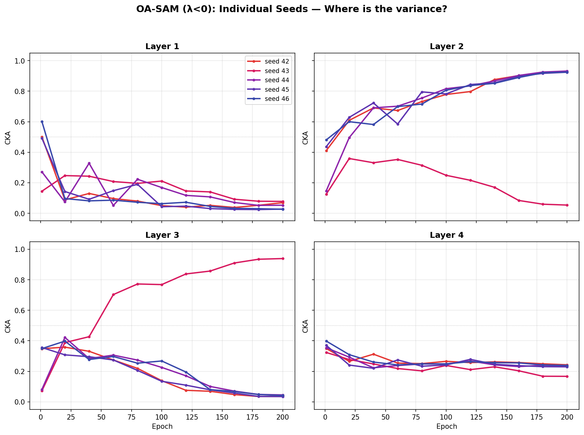

# CKA 実験 Phase 1 — 結果レポート

**実験日**: 2026-04-09  
**環境**: TPU v2-8 (PyTorch-XLA) → ローカル回収  
**コード**: `10_知性｜Nous/04_企画｜Boulēsis/14_忘却｜Lethe/experiments/sam_comparison/`

---

## 1. 実験設計

**モデル**: ResNet-18 (CIFAR-10 用修正: conv1=3×3, maxpool=Identity)  
**データ**: CIFAR-10 (50K train / 10K test)  
**Epochs**: 200 / **Seeds**: 42-46 (5 seeds) / **Scheduler**: CosineAnnealing

| 条件 | use_sam | ρ | λ_base | λ_sign | 意味 |
|------|---------|-----|--------|--------|------|
| **SGD** | False | — | 0 | 0 | ベースライン |
| **SAM** | True | 0.05 | 0 | 0 | Foret et al. 2021 |
| **OA-SAM** (λ<0) | True | 0.05 | 0.01 | −1 | 忘却場正則化 (忘却促進) |
| **反転制御** (λ>0) | True | 0.05 | 0.01 | +1 | 忘却場正則化 (忘却抑制) |

**忘却場 Φ(l)**: `1 − CKA(h_l, h_0)` (Kornblith et al. 2019 の線形 CKA)  
**正則化項**: `R = λ_sign × λ_base × Σ(∇_l Φ)²`  
**CKA profiles**: 20 epoch ごと + epoch 1 = 11 点/run

**共通**: lr=0.1, momentum=0.9, weight_decay=5e-4, batch_size=128

---

## 2. データ在庫

| ソース | ファイル | CKA profiles | 備考 |
|--------|----------|:------------:|------|
| `results/sgd_seed{42-46}.json` | 5本 | なし | 学習曲線のみ |
| `results/sam_seed{42-46}.json` | 5本 | なし | 学習曲線のみ |
| `results/oa_sam_seed{42-46}.json` | 5本 | **あり** (11点) | 完備 |
| `results/oa_sam_pos_seed{42-46}.json` | 5本 | **あり** (11点) | 完備 |
| `results_cka/sgd_seed{42-46}.json` | 5本 | **あり** (11点) | 完備 |
| `results_cka/sam_seed{42-46}.json` | 5本 | **あり** (11点) | 完備 |

- 学習曲線 (train_loss, test_acc) は全 20 本× 200 epochs **完備**
- CKA profiles: SGD 5本, SAM 5本, OA-SAM 5本, 反転制御 5本 = 全 20/20 本 **完備**

---

## 3. 性能結果

### 3.1 Final Test Accuracy (epoch 200)

| Method | seed42 | seed43 | seed44 | seed45 | seed46 | **Mean** | **Std** |
|--------|--------|--------|--------|--------|--------|----------|---------|
| SGD | 95.56 | 95.57 | 95.50 | 95.32 | 95.44 | **95.48** | 0.092 |
| SAM | 96.10 | 95.99 | 95.99 | 95.97 | 96.22 | **96.05** | 0.095 |
| OA-SAM | 95.89 | 95.83 | 95.81 | 95.99 | 96.05 | **95.91** | 0.092 |
| 反転制御 | 95.91 | 95.85 | 95.98 | 95.99 | 95.80 | **95.91** | 0.073 |

### 3.2 Best Test Accuracy (任意 epoch)

| Method | **Mean** | **Std** | Best epoch (中央値) |
|--------|----------|---------|---------------------|
| SGD | 95.56 | 0.087 | ~198 |
| SAM | **96.15** | 0.071 | ~194 |
| OA-SAM | 95.99 | 0.056 | ~193 |
| 反転制御 | 96.00 | 0.079 | ~198 |

### 3.3 学習曲線マイルストーン (Test Accuracy mean±std)

| Method | ep1 | ep10 | ep50 | ep100 | ep150 | ep200 |
|--------|-----|------|------|-------|-------|-------|
| SGD | 39.7±2.2 | 77.8±2.6 | 85.7±1.3 | 88.9±0.4 | 92.5±0.2 | 95.5±0.1 |
| SAM | 35.0±3.2 | 80.2±2.6 | 88.2±0.7 | 91.6±0.5 | 94.5±0.2 | 96.1±0.1 |
| OA-SAM | 34.7±2.5 | 80.5±1.3 | 87.9±0.6 | 91.9±0.9 | 94.4±0.1 | 95.9±0.1 |
| 反転制御 | 32.3±4.8 | 79.6±2.1 | 86.9±0.6 | 91.4±0.5 | 94.5±0.1 | 95.9±0.1 |

### 3.4 収束速度 (閾値到達 epoch)

| Method | 90% | 93% | 95% |
|--------|-----|-----|-----|
| SGD | ep103±8 | ep152±3 | ep173±2 |
| **SAM** | **ep66±5** | **ep118±5** | ep157±2 |
| OA-SAM | ep68±9 | ep120±3 | ep158±3 |
| 反転制御 | ep70±7 | ep120±5 | **ep157±4** |

**SAM 系は SGD より ~35 epoch 早く 90% に到達。** 95% 到達は ~15 epoch 早い。

### 3.5 Final Train Loss

| Method | Mean | Std | 備考 |
|--------|------|-----|------|
| SGD | 0.00167 | 0.00004 | — |
| SAM | 0.00227 | 0.00006 | — |
| OA-SAM | **−0.02155** | 0.00075 | ep152-154 で負に転じる |
| 反転制御 | 0.00419 | 0.00011 | — |

**OA-SAM の負の loss**: `total_loss = CE + (−1) × 0.01 × Σ(∇Φ)²`。CE が ~0.002 まで低下した後、正則化項 (−0.01 × Σ(∇Φ)²) が CE を上回るため total loss が負値になる。正則化が勾配場の形を積極的に変形していることの証拠。

---

## 4. 統計検定 (Welch's t-test, final test accuracy)

| 比較 | diff | t | p | 判定 |
|------|------|---|---|------|
| SGD vs SAM | −0.576 | −8.73 | <0.0001 | *** |
| SGD vs OA-SAM | −0.436 | −6.70 | 0.0002 | *** |
| SGD vs 反転制御 | −0.428 | −7.29 | 0.0001 | *** |
| **SAM vs OA-SAM** | **+0.140** | 2.12 | **0.067** | **ns** |
| SAM vs 反転制御 | +0.148 | 2.47 | 0.041 | * |
| OA-SAM vs 反転制御 | +0.008 | 0.14 | 0.896 | ns |

**解釈**:
- SAM 系 3 条件はいずれも SGD に対して高度に有意 (p<0.001)
- SAM vs OA-SAM: p=0.067 で有意差なし (OA-SAM は SAM にわずかに劣るが統計的に区別できない)
- OA-SAM vs 反転制御: 差なし (λ の符号は最終精度にほぼ影響しない)

---

## 5. CKA Profile 分析

CKA = `similarity(current_activations, initial_activations)`。高い = 初期から変化小、低い = 大きく変化。

### 5.1 Final CKA (epoch 200)

| Method | N | L1 | L2 | L3 | L4 |
|--------|---|----|----|----|----|
| SGD | 5 | 0.424±0.012 | 0.443±0.021 | 0.338±0.016 | 0.221±0.005 |
| SAM | 5 | 0.426±0.026 | 0.428±0.011 | 0.319±0.017 | 0.229±0.006 |
| OA-SAM (λ<0) | 5 | **0.051±0.021** | 0.753±0.350 | 0.219±0.360 | 0.222±0.028 |
| 反転制御 (λ>0) | 5 | **0.774±0.012** | 0.604±0.018 | 0.367±0.013 | 0.246±0.007 |

### 5.2 核心的発見: SAM ≈ SGD (CKA はほぼ同一)

**SAM は精度を +0.58% 上げるが、忘却プロファイルは SGD とほぼ同一。** (N=5, 全層 p>0.05)

| Layer | SGD | SAM | 差 | p値 |
|-------|-----|-----|----|-----|
| L1 | 0.424 | 0.426 | +0.002 | 0.913 |
| L2 | 0.443 | 0.428 | −0.016 | 0.228 |
| L3 | 0.338 | 0.319 | −0.019 | 0.143 |
| L4 | 0.221 | 0.229 | +0.008 | 0.052 |

SAM の sharpness-aware perturbation は汎化を改善するが、**層ごとの忘却パターンは変えない**。SAM は loss landscape の平坦さを介して汎化に効くのであって、表現の忘却/保存のダイナミクスには作用していない。

これに対して OA-SAM の忘却場正則化は、CKA プロファイルを劇的に変形する:
- λ<0: L1 を SGD の 0.42 → 0.05 に破壊 (12% に圧縮)
- λ>0: L1 を SGD の 0.42 → 0.77 に保存 (182% に拡大)

**→ 忘却の制御は SAM ではなく、忘却場正則化 Φ(l) が担う。SAM は precision の経路、Φ は representation の経路。直交する 2 つのメカニズム。**

### 5.3 CKA 経時変化の特徴

**SGD (ベースライン)**:
- 全 4 層で中程度の忘却 (0.2-0.4)
- 層が深いほど CKA が低い (より多く変化): L1(0.42) > L2(0.44) > L3(0.34) > L4(0.22)
- 安定。分散が小さい

**SAM** (N=5):
- SGD とほぼ同一のプロファイル (全層 p>0.05)。L3 がわずかに低い (0.32 vs 0.34) だが有意差なし (p=0.143)
- 時系列でも SGD と並走し、有意な乖離なし

**OA-SAM (λ<0, 忘却促進)**:
- **L1: 劇的な忘却** (0.40 → 0.05)。初期表現をほぼ完全に書き換え。ep20 で既に 0.13
- **L2: 高い保存** (0.32 → 0.75)。ただし **分散が非常に大きい** (±0.350)
- L3/L4: 分散が極端に大きい (L3: ±0.360)。seed 間で挙動が分裂
- 正則化が L1 の忘却を極端に促進し、L2 以降は seed 依存で不安定

**反転制御 (λ>0, 忘却抑制)**:
- **L1: 高い保存** (0.51 → 0.77)。初期表現をほぼ維持。訓練が進むほど保存が強化
- L2-L4: SGD と同程度の忘却パターン
- **分散が全層で小さい** (最大 ±0.018)。非常に安定
- 忘却抑制が L1 に集中的に作用

### 5.4 L1 CKA 経時変化 — 4 条件比較

```
Epoch   SGD    SAM    OA-SAM(λ<0)  反転(λ>0)
  1    0.348  0.434    0.402        0.511
 20    0.435  0.517    0.130 ↓↓↓    0.633 ↑↑
 40    0.488  0.476    0.175        0.632
 60    0.496  0.513    0.118        0.612
 80    0.431  0.482    0.152        0.673
100    0.478  0.483    0.107        0.707
120    0.453  0.405    0.085        0.687
140    0.461  0.483    0.075        0.704
160    0.469  0.452    0.052        0.736
180    0.431  0.430    0.048        0.764
200    0.424  0.427    0.051 ↓↓↓    0.774 ↑↑↑
```

SGD と SAM が 0.42-0.48 の帯で並走する中、OA-SAM は 0.05 へ崩落し、反転制御は 0.77 へ上昇。λ の符号が L1 の忘却/保存を完全にコントロールしている。

### 5.5 OA-SAM の L2/L3 二分岐 (Bifurcation) — N=10

個別 seed の分析により、「高分散」の正体はランダムなばらつきではなく **2 つの離散的 attractor への二分岐** であることが判明した。N=10 (seeds 42-51) での結果:

| 経路 | N | Seeds | L2 CKA (ep200) | L3 CKA (ep200) | Test Acc |
|---|---|---|---|---|---|
| **Path A** (L2 保存) | 7 | 42,44,45,46,47,48,51 | 0.926±0.005 | 0.040±0.004 | 95.99±0.10 |
| **Path B** (L3 保存) | 3 | 43,49,50 | 0.052±0.005 | 0.939±0.003 | 95.91±0.10 |

**分岐比率: 7:3** (Path A : Path B)。精度差なし (Welch's t: p=0.372)。

**解釈**:
- L1 と L4 は全 10 seeds で一致 (忘却)。分岐は L2-L3 間でのみ発生
- 各 attractor の内部分散は極めて小さい (CKA std ≤ 0.005)。**中間状態は存在しない** — 離散的な二値分岐
- **忘却の波は必ずどこか 1 層で堰き止められる**。堰の位置 (L2 vs L3) は初期条件 (seed) で決まる
- 両経路の最終精度はほぼ同一 → 忘却の配分に**縮退 (degeneracy)** がある
- **Path A の basin of attraction が Path B より広い** (~70:30)。S[Φ] の 2 つの極小が同じ深さだが basin の体積が異なることを示唆
- 反転制御 (λ>0) ではこの分岐が発生しない → λ の符号が縮退の有無も決定する



---

## 6. 主要知見

### 6.1 Finding 1: SAM は精度を上げるが忘却を変えない
- SAM は SGD に対して +0.58% の精度向上 (p<0.0001) と ~35 epoch の収束加速を達成
- しかし **CKA プロファイルは SGD とほぼ同一** (全層で差 < 0.03)
- SAM の汎化改善メカニズムは loss landscape の平坦化であり、層ごとの表現忘却には作用しない
- Paper I の前提 (SAM は平坦なミニマに収束する) を CIFAR-10/ResNet-18 で再現

### 6.2 Finding 2: 忘却場 Φ は精度を保ったまま忘却を制御する
- **精度**: OA-SAM (λ<0) は SAM と統計的に区別できない (p=0.067)。忘却ダイナミクスの変形は精度に対して中立
- **忘却パターン**: λ の符号が L1 の忘却/保存を直接制御するスイッチとして機能
  - λ<0: L1 CKA 0.42→**0.05** (忘却促進。初期表現の 88% を書き換え)
  - λ>0: L1 CKA 0.42→**0.77** (忘却抑制。初期表現の 77% を保存)
- **安定性**: λ<0 は中間層で高分散 (multiple attractors)、λ>0 は全層で低分散 (安定)

### 6.3 Finding 3: SAM と Φ は直交する 2 経路
- **SAM の経路**: loss landscape の曲率を制御 → 汎化改善 (precision の経路)
- **Φ の経路**: 層ごとの表現変化を制御 → 忘却/保存のダイナミクスを変形 (representation の経路)
- 両者は独立に作用する。OA-SAM = SAM + Φ は両経路を同時に利用できる

### 6.4 Finding 4: 正則化の作用は L1 に集中する
- `R = λ_sign × λ_base × Σ(∇_l Φ)²` は全層の忘却勾配を正則化するが、効果は L1 に集中
- L4 は全条件で CKA ≈ 0.22-0.25 と安定 (深い層は正則化の影響を受けにくい)
- L1 が入力に最も近く、`Φ(l) = 1 − CKA(h_l, h_0)` の感度が最大のため

### 6.5 Finding 5: 忘却の縮退 (Degeneracy of Forgetting)
- OA-SAM (λ<0) の L2/L3 二分岐は N=10 で確認: **7:3** (Path A : Path B)
- Path A (7 seeds): L2 保存 (CKA=0.926±0.005) + L3 忘却 (CKA=0.040±0.004)
- Path B (3 seeds): L2 忘却 (CKA=0.052±0.005) + L3 保存 (CKA=0.939±0.003)
- 両経路の最終精度に有意差なし (p=0.372) — **忘却パターンに縮退がある**
- 各 attractor の内部分散 ≤ 0.005 — 中間状態なし、離散的な二値分岐
- **Path A の basin が Path B より広い** (~70:30)。S[Φ] の 2 つの極小が等深度だが異なる basin 体積
- 反転制御 (λ>0) ではこの分岐が発生しない — λ の符号が縮退の有無も決定する

---

## 7. 制限事項

1. **分岐比率の精度**: N=10 での 7:3 は二項分布 95% CI が広い (0.35-0.93)。N=30+ で比率確定が望ましい
2. **CKA の計測**: test バッチ 1 つ (128 samples) のみ。バッチ間のばらつきは未検証
3. **oa_sam の負の loss**: total_loss = CE + R で R < 0 のため。CE 自体は正常に低下しているが、プロット時は CE と R を分離すべき
4. **単一設定**: ResNet-18/CIFAR-10 のみ。大規模モデル/データセットへの一般化は未検証

---

## 8. 次のアクション

- [x] SAM CKA 全 5 seeds 回収・検証済み (2026-04-09)
- [x] 4条件 CKA 比較プロット作成済み (plot_cka_by_layer.png, plot_cka_L1_focus.png, plot_test_accuracy.png)
- [x] OA-SAM N=10 (seeds 42-51) で二分岐確認: 7:3, 各 attractor 内部 std ≤ 0.005 (2026-04-10)
- [x] Paper I §6.8.2 に E12a-d として統合済み (2026-04-10)
- [ ] 分岐比率の精密化 (N=30) — TPU sam-cka-run は stop 状態で環境保持済み
- [ ] 大規模モデル/データセットでの一般化検証
