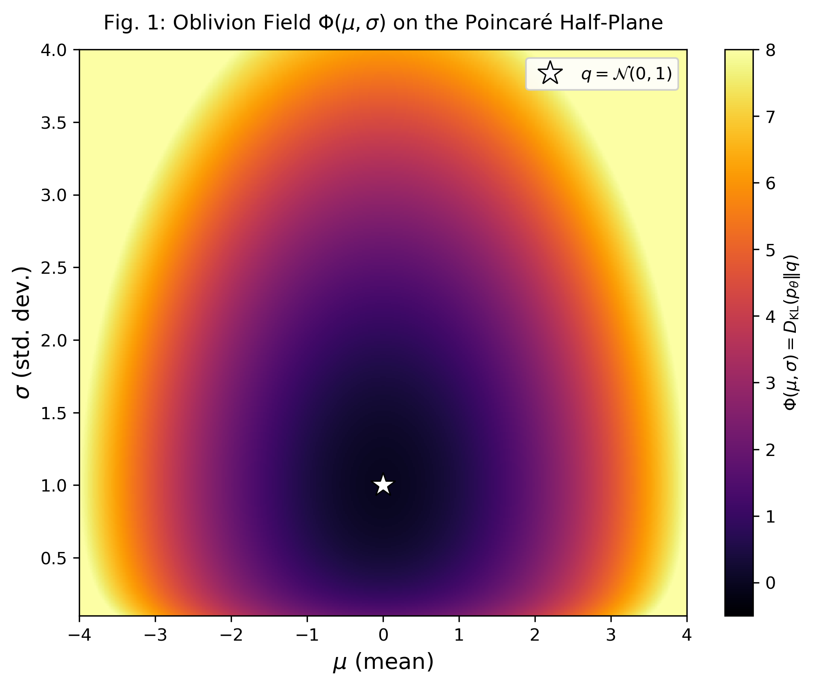
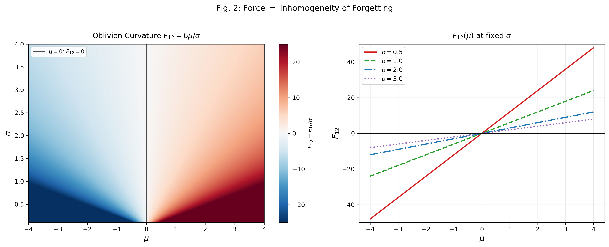
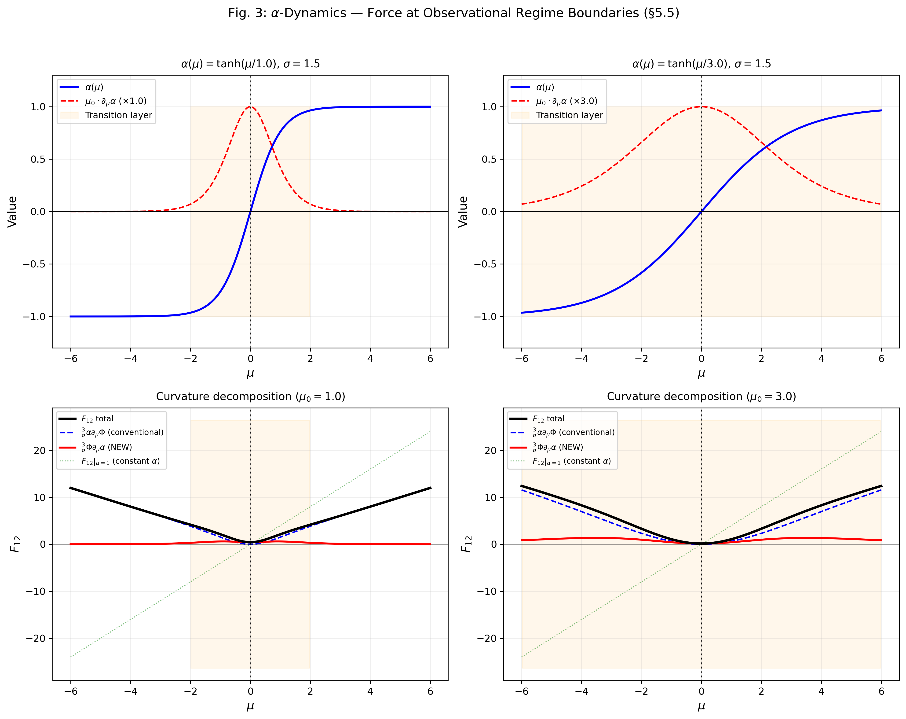
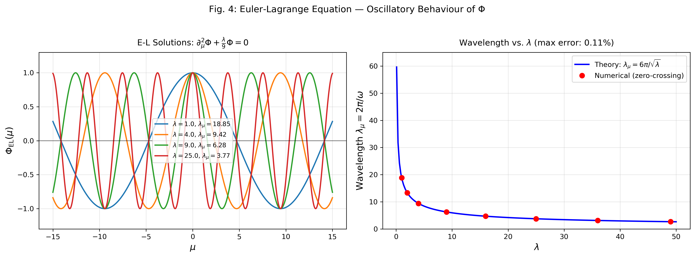

# 力としての忘却 — 統計多様体上の場の方程式

**Paper I — 草稿 v0.8**

> *概要.* 力はどこから来るのか。本稿は、統計多様体上の忘却——確率分布のパラメータを粗視化する操作——から力が創発される機構を提示する。核心は**方向性定理**である: 忘却場 Φ と Chebyshev 1-形式 T_i から忘却接続 $A_i := \partial_i\Phi + (\alpha/2)\Phi T_i$ を定義し、その曲率 $F_{ij} = (\alpha/2)[d(\Phi T)]_{ij}$ を構成すると [1]、忘却曲率がゼロであることと忘却で重み付けされた Chebyshev 1-形式 ΦT が閉であることは同値となる。忘却の*大きさ*には一切依存しない——均一に大量の情報を忘れても力はゼロだが、方向的に不均一に忘れれば曲率が生じ、力として作用する。指数型分布族上では d(ΦT)=0 は dΦ∧T=0 に帰着し（系 5.1.1）、条件は忘却勾配と Chebyshev 形式の整列性に単純化される。α-パラメータを動力学場 α(θ) に昇格させると、精度の遷移領域に力が局在するという測定可能な予測が得られる。驚くべきことに、忘却曲率 F_{ij} は α に対して正確に線形であり（命題 6.6.1）、得られた精度場方程式は線形化レベルで自由エネルギー原理 [2,3] の精度最適化と構造的に同型となる——この対応は曲率レベルでは近似ではなく正確である。

---

## §1. 序論

あらゆる力は忘却から生まれる——これが本論文の主張である。

この主張は比喩ではない。統計多様体上に忘却のスカラー場 Φ(θ) = D_KL(p_θ ‖ q_θ) を定義し、忘却で重み付けされた Chebyshev 1-形式 ΦT の外微分 d(ΦT) が忘却曲率に比例すること——そして d(ΦT) ≠ 0 が力を生む必要十分条件であること——を証明する。これが**方向性定理**（定理 5.1）の内容だ。指数型分布族では dT = 0 により条件は dΦ ∧ T ≠ 0 に単純化される（系 5.1.1）。

ここで「力」とは何か。古典力学において力は先験的に与えられる基本量であり、なぜ存在するかは問わない。本稿はこれを逆転する。力とは忘却の方向的不均一から*創発*される量であり、均一な忘却から消え、不均一な忘却から立ち上がる。パラメータ空間のあらゆる点で同じ割合で情報を捨てればゲージ場の曲率はゼロだが、ある領域で精密に、別の領域で粗い観測を行えば——その境界に力が現れる。

この機構は3つの段階で構成される:

1. **場と曲率**（§3-4）: 忘却場 Φ(θ) と忘却接続 A_i を統計多様体上に構成し、ガウス族 Toy Model で具体計算する。等方的忘却（μ にも σ にも同じ割合で忘れる）では F_{12} = 0、異方的忘却（μ を忘れるが σ を保持する）では F_{12} = 6μ/σ——鋭い二分法が示される。

2. **定理と予測**（§5-6）: 方向性定理を証明し、α-パラメータを動力学場 α(θ) に昇格させて精度の遷移層に力が局在することを予測する。α-遷移層力は Yang-Mills ゲージ理論には類似物を持たない現象であり、情報幾何学に固有の結果である。

3. **対応と線形性**（§6.5-6.6）: α 場の方程式が自由エネルギー原理（FEP）の精度最適化と構造的に同型であることを示す。さらに、忘却曲率 F_{ij} が α に対して正確に線形であることを証明し、この対応が曲率レベルでは近似ではなく構造的に正確であることを確立する。

本稿は力の4つの側面に貢献する:

| 貢献 | 節 | 内容 |
|:---|:---|:---|
| 方向性定理 | §5 | F_{ij} ≠ 0 の必要十分条件 |
| α-遷移層力 | §6.3 | 精度の境界における力の予測 |
| F の α-線形性 | §6.6 | 曲率の精度に対する正確な線形性 |
| 精度-FEP 対応 | §6.5 | 忘却場 ↔ FEP の構造的同型 |

---

## §2. 数学的準備

### 2.1 統計多様体

S = {p_θ : θ ∈ Θ ⊂ ℝⁿ} を可測空間 (X, F) 上のパラメトリック分布族とする。Fisher 情報計量

$$g_{ij}(\theta) = E_{p_\theta}[\partial_i \ell \cdot \partial_j \ell], \quad \ell = \log p_\theta$$

により Θ にリーマン構造が入る。三つ組 (M, g, C)（C_{ijk} = E[∂_iℓ ∂_jℓ ∂_kℓ] は Amari-Chentsov（歪度）テンソル）が統計多様体を定義する。

### 2.2 α-接続族

各 α ∈ ℝ に対し、α-接続を次で定義する:

$$\Gamma^{(\alpha)k}_{ij} = \Gamma^{(0)k}_{ij} - \frac{\alpha}{2} C^k_{ij}$$

ここで Γ^(0) は Levi-Civita 接続、C^k_{ij} = g^{kl}C_{ijl}。

**注意.** 縮約トレース Γ^(α)_i := Γ^(α)k_{ik} は 1-形式として変換*しない*。座標変換 θ → θ̃（ヤコビアン J）の下で:

$$\tilde{\Gamma}^{(\alpha)}_i = \frac{\partial\theta^j}{\partial\tilde{\theta}^i} \Gamma^{(\alpha)}_j + \partial_{\tilde{\theta}^i} \log|J|$$

非同次項 ∂log|J| により Γ^(α)_i は座標依存となる。

### 2.3 Chebyshev 1-形式

**定義.** Chebyshev 1-形式は Amari-Chentsov テンソルのトレースである:

$$T_i := g^{jk} C_{ijk}$$

**命題 2.1.** T_i は M 上の真の余ベクトル（1-形式）である。

*証明.* C_{ijk} は階数3の共変テンソル（Čencov の定理）。g^{jk}C_{ijk} の縮約は標準的なテンソル縮約であり、共変に変換する。□

**命題 2.2.** T_i は接続間の α-依存性を符号化する:

$$\Gamma^{(\alpha)}_i - \Gamma^{(0)}_i = -\frac{\alpha}{2} T_i + (\text{座標アーティファクト})$$

ここで負号は §2.2 の定義 Γ^(α) = Γ^(0) - (α/2)C から従う。Chebyshev 形式はこの差分からテンソル的な内容を抽出する。

---

## §3. 忘却の場の方程式

### 3.1 忘却場

q を固定された参照分布（最大限に粗視化された状態）とする。**忘却場**を定義する:

$$\Phi(\theta) = D_{\text{KL}}(p_\theta \| q)$$

Φ は M 上の独立な動力学スカラー場として扱う。D_KL = 0 で最小（完全記憶）、上に非有界（完全忘却）。

### 3.2 忘却接続

$$A_i := \partial_i\Phi + \frac{\alpha}{2} \Phi \, T_i$$

命題 2.1 により A_i は真の余ベクトルである: ∂_iΦ は勾配として、Φ T_i はスカラー×余ベクトルとして変換する。

**結合形式の動機.** なぜ Chebyshev 1-形式 T_i による結合か。最小結合の自然な候補は $A_i = \partial_i\Phi + (\alpha/2)\Phi\Gamma^{(\alpha)}_i$ であるが、§2.2 で示したように $\Gamma^{(\alpha)}_i$ は真の 1-形式ではない（座標変換で非同次項 $\partial\log|J|$ が入る）。テンソル的に well-defined な結合を構成するには、$\Gamma^{(\alpha)}_i$ から座標不変な部分を抽出する必要がある。命題 2.2 より $\Gamma^{(\alpha)}_i - \Gamma^{(0)}_i = -(\alpha/2)T_i + (\text{座標アーティファクト})$ であるから、T_i はこの差分のテンソル的内容そのものであり、構成の選択は**一意**である。この結合は、忘却場 Φ が α-接続の逸脱方向（Chebyshev 方向）と幾何学的に相互作用することを表現している。

### 3.3 忘却曲率

$$F_{ij} := \partial_i A_j - \partial_j A_i = \frac{\alpha}{2}\left[(\partial_i\Phi)T_j - (\partial_j\Phi)T_i + \Phi(\partial_iT_j - \partial_jT_i)\right]$$

滑らかな関数上で ∂_i∂_jΦ - ∂_j∂_iΦ = 0 なので（ここでは α は M 上の定数とする; α(θ) への昇格は §6 で扱う）、スカラー×1-形式の外微分に対する Leibniz 規則 d(ΦT) = dΦ∧T + Φ·dT を適用して:

$$\boxed{F_{ij} = \frac{\alpha}{2}\left[d(\Phi T)\right]_{ij} = \frac{\alpha}{2}\left[(\partial_i\Phi)T_j - (\partial_j\Phi)T_i + \Phi(dT)_{ij}\right]}$$

**物理的解釈:** F_{ij} は忘却で重み付けされた Chebyshev 1-形式 ΦT の外微分に比例する。F_{ij} ≠ 0 は ΦT が閉でないこと — すなわち忘却が*方向的に非均一*であること — と同値である。

### 3.4 作用と場の方程式

$$S[\Phi] = \int_M \left( \frac{1}{4} F_{ij} F^{ij} + \frac{\lambda}{2} \Phi^2 \right) \sqrt{g} \, d^n\theta$$

**λ の起源と役割.** 質量項 λ は VFE の二次展開から自然に出現する。VFE[Φ] を Φ=0 の周りで展開すると:

$$\lambda = \frac{\partial^2(\text{Complexity})}{\partial\Phi^2}\bigg|_{\Phi=0} - \frac{\partial^2(\text{Accuracy})}{\partial\Phi^2}\bigg|_{\Phi=0}$$

- **∂²Accuracy/∂Φ²**: 忘却によるデータ適合度の低下率。N·ḡ_eff (サンプルサイズ × 有効 Fisher 情報量) に比例し、常に正
- **∂²Complexity/∂Φ²**: 忘却によるモデル単純化の利得率。d_eff/L² (有効次元数 / 特性長²) にスケールし、常に負

したがって λ の符号はデータ精度とモデル複雑度の競合で決まる。λ < 0 (Φ=0 不安定 → 自発的忘却) は、各パラメータが十分な固有情報を持つとき (N·ḡ_eff > d_eff/L²) に成立する。これは **Bayesian Occam's Razor のスカラー場理論的表現**である: MDL/BIC がモデル選択で行う Accuracy vs Complexity の競合を、パラメータ空間全体に連続的に拡張したものと見なせる。Φ=0 の変分的安定性に関する厳密な解析は Appendix C を参照。

**ゲージ構造について.** A_i はゲージ場*ではない*: Φ と背景幾何 (g, T) から完全に決まり、残余のゲージ自由度 A_i → A_i + ∂_iχ は存在しない。本理論は統計多様体上の**非最小結合スカラー場理論**に分類される。

---

## §4. ガウス族 Toy Model

### 4.1 設定

1変量ガウス族 p(x|μ,σ) = (1/√(2π)σ) exp(-(x-μ)²/(2σ²))。パラメータ空間 M = {(μ,σ): σ > 0} ≅ ℋ²（ポアンカレ上半平面）。

Fisher 計量: g = (1/σ²) diag(1, 2), g⁻¹ = σ² diag(1, 1/2)

### 4.2 Amari-Chentsov テンソルと Chebyshev 形式

非零成分: C₁₁₂ = 2/σ³, C₂₂₂ = 8/σ³

**T = (T₁, T₂) = (0, 6/σ)**

*観察:* T₁ = 0。Chebyshev 形式は ∂/∂μ で張られる**1次元の核**を持つ。この消滅が方向性定理の鍵となる。

### 4.3 2つの忘却場

**ケース A: 等方的忘却。** 参照 q = N(μ, σ₀²)（平均は保存、分散のみ忘却）:

$$\Phi_A(\mu,\sigma) = D_{\text{KL}}(N(\mu,\sigma^2) \| N(\mu,\sigma_0^2)) = -\log(\sigma/\sigma_0) + \frac{\sigma^2 - \sigma_0^2}{2\sigma_0^2}$$

σ のみに依存。∂_μΦ_A = 0。

**ケース B: 異方的忘却。** 参照 q = N(0,1)（平均も分散も忘却されうる）:

$$\Phi_B(\mu,\sigma) = -\log\sigma + \frac{\sigma^2 + \mu^2}{2} - \frac{1}{2}$$

μ と σ の両方に依存。∂_μΦ_B = μ ≠ 0（一般に）。

### 4.4 忘却曲率: 二分法

**ケース A:** F₁₂ = (α/2)(∂_μΦ_A)T₂ = (α/2)(0)(6/σ) = **0**

**ケース B:** F₁₂ = (α/2)(∂_μΦ_B)T₂ = (α/2)(μ)(6/σ) = **3αμ/σ**

α = 2（e-接続）のとき: F₁₂ = **6μ/σ**

*二分法は絶対的:* 等方的忘却はどれだけ情報を失っても曲率をちょうどゼロにする。異方的忘却 — Φ の勾配が ker(T) の外に成分を持つ — のみが力を生む。

### 4.5 数値検証

F₁₂ = 6μ/σ を独立した数値計算で検証:
- A₁, A₂ の記号微分
- F₁₂ の有限差分近似
- **相対誤差: 1.4 × 10⁻¹⁰**（機械精度）

[SOURCE: oblivion_field_gaussian.py]

---

## §5. 方向性定理

### 5.1 定理の主張

**定理 5.1（方向性定理）.** (M, g, C) を Chebyshev 1-形式 T_i = g^{jk}C_{ijk} を持つ統計多様体、Φ を M 上の滑らかな忘却場とする。忘却曲率 F_{ij} = (α/2)[d(ΦT)]_{ij} を定義する（§3.3）。

このとき以下は同値:

(i) すべての i, j に対し F_{ij} = 0

(ii) 1-形式 ΦT は閉である: d(ΦT) = 0

**対偶（力の条件）:** F_{ij} ≠ 0 ⟺ d(ΦT) ≠ 0 — 忘却で重み付けされた Chebyshev 1-形式が閉でない。

**系 5.1.1（指数型分布族）.** dT = 0 のとき、d(ΦT) = dΦ ∧ T であるから:

$$F_{ij} = 0 \iff d\Phi \wedge T = 0$$

すなわち、力は忘却の勾配が Chebyshev 形式と非整列であるときに、そしてそのときに限り生じる。

**系 5.1.2（十分条件）.** dΦ ∧ T = 0 かつ Φ · dT = 0 ならば d(ΦT) = 0 であるから F = 0。

### 5.2 証明

§3.3 の Leibniz 恒等式 F_{ij} = (α/2)[d(ΦT)]_{ij} から直ちに従う。α ≠ 0 のもと:

$$F_{ij} = 0 \quad \forall\, i,j \iff [d(\Phi T)]_{ij} = 0 \quad \forall\, i,j \iff d(\Phi T) = 0$$

**系 5.1.1 の証明.** dT = 0 のとき Leibniz 規則 d(ΦT) = dΦ ∧ T + Φ · dT は d(ΦT) = dΦ ∧ T に帰着する。よって F = 0 ⟺ dΦ ∧ T = 0。□

**系 5.1.2 の証明.** dΦ ∧ T = 0 かつ Φ · dT = 0 ならば d(ΦT) = dΦ ∧ T + Φ · dT = 0。□

**注.** 指数型分布族では Chebyshev 1-形式が閉 (dT = 0) であるため (§5.4)、系 5.1.1 により条件は dΦ ∧ T ≠ 0 に単純化される。一般の統計多様体では dT ≠ 0 が許容され、Leibniz の2項 (dΦ∧T と Φ·dT) の相殺を含む完全な条件 d(ΦT) ≠ 0 が力の必要十分条件となる。

### 5.3 解釈: なぜ方向が重要か

この定理は印象的な物理的解釈を持つ:

**忘却の大きさ（どれだけの情報が失われるか）は力を決めない。忘却の方向（Chebyshev 構造に対して、どのパラメータが情報を失うか）が力を決める。**

ガウス族上では:
- T = (0, 6/σ) は σ 方向を指す
- σ 方向にのみ変化する忘却: dΦ ∝ dσ ∝ T → dΦ ∧ T = 0 → **力なし**
- μ 方向に変化する忘却: dΦ に dμ 成分あり、T に dμ 成分なし → dΦ ∧ T ≠ 0 → **力あり**

Chebyshev 形式 T_i は多様体の「曲率の自然方向」を符号化する（α-接続が Levi-Civita から最も逸脱する方向）。この方向に沿った忘却は曲率にとって「見えない」。Chebyshev 方向に*直交する*忘却のみ — いわば「間違ったもの」を忘れること — が力を生む。

**用語上の注意.** 本稿において「力」は曲率 $F_{ij} \neq 0$ の幾何学的帰結を指す慣用的表現であり、ニュートン力学における質点に作用する力 $f^i$ と直接同一視するものではない。統計多様体上の曲率が推論の運動方程式に具体的に結合する機構は §6（α-動力学）で定量化される。この用語法は場の理論における「場の強さ」（field strength）に類似する: $F_{ij} \neq 0$ は情報幾何学的な力の*源泉*が存在することを示し、その源泉がパラメータ推定の漸近的振る舞いに及ぼす影響が観測可能な「力」となる。

**最適化における独立な検証.** 方向性定理の操作的含意は、深層学習の最適化において独立に確認されている。Sharpness-Aware Minimization (SAM) [7] はパラメータ空間のユークリッド球 $\{\epsilon : \|\epsilon\|_2 \leq \rho\}$ で損失面の鋭さを制御するが、Kim et al. [8] はこの近傍を Fisher 情報行列による楕円体 $\{\epsilon : \epsilon^T F(\theta) \epsilon \leq \rho\}$ に置き換えることで、汎化性能が向上することを示した (Fisher SAM)。本理論の言語では、ユークリッド球による等方的擾乱は忘却の不均一性 $\Xi = 0$ の退化ケース — 全パラメータ方向に同じ量の情報を捨てる — に対応し、Fisher 楕円体による異方的擾乱は $\Xi > 0$ — 統計多様体の曲率に応じて方向ごとに異なる量の情報を捨てる — に対応する。SAM → Fisher SAM への修正が汎化を改善するという事実は、「正しい距離」が Fisher 計量であること、したがって **忘却の方向が力を決める** という方向性定理の主張の最適化的な傍証を提供する。

### 5.4 一般化: 力の Leibniz 分解

定理 5.1 の条件 d(ΦT) ≠ 0 は、Leibniz 規則により2つの独立な寄与に分解される:

| 寄与 | 式 | 物理的意味 |
|:---|:---|:---|
| **方向的不整合** | dΦ ∧ T | 忘却が Chebyshev 形式と非整列の方向に変化 |
| **Chebyshev ねじれ** | Φ · dT | Chebyshev 形式が閉でない（多様体が「ねじれ的」構造を持つ） |

力の必要十分条件は d(ΦT) = dΦ∧T + Φ·dT ≠ 0 であり、これは個別の項がゼロでなくても相殺する可能性を含む。ガウス族上では dT = 0（T は閉）なので第1の寄与のみが残り、系 5.1.1 に帰着する。**注: カテゴリカルシンプレックス Δⁿ を含む全ての指数型分布族において、自然パラメータ系では T_i = ∂_i log det g が恒等的に成立するため dT = 0 が普遍的に成立する（Worked Example 2, Appendix B）。したがって指数型分布族の範囲では、Chebyshev ねじれ項は常に不活性であり、力の生成は方向的不整合 dΦ∧T ≠ 0 に完全に帰着する。** 非指数型分布族（混合分布・セミパラメトリックモデル等）では dT ≠ 0 が成立する可能性があり、2つの寄与の相互作用（強化または相殺）が非自明な力のパターンを生む。

### 5.5 選択的忘却定理への接続

方向性定理は直接的な実験的対応物を持つ:

**定義.** 忘却の不均一性 $\Xi = \text{Var}(\lambda)$（パラメータ間の保持率分散）。

- $\Xi = 0 \iff$ 等方的忘却 $\implies F_{ij} = 0$（定理 5.1）
- $\Xi > 0 \iff$ 異方的忘却 $\implies F_{ij} \neq 0$（一般に）

**予測（選択的忘却定理）.** LLM のアテンション層において、タスク持続性 P（構造化された問題解決を維持する能力）は $\Xi$ と正に相関する:

$$\text{Corr}(\Xi, P) > 0$$

これは数学的な曲率 $F_{ij}$（統計多様体上で測定）と経験的な観測量（ニューラルネットワーク上で測定）を接続する。

**統制実験結果 (N=416).** 忘却パターンを直接操作した統制実験で本予測を検証した。

*実験設計.* 各タスクは長コンテキスト LLM 対話セッション (20-50 ターン) であり、ターン列の中に 3-8 個の事実 (名前・数値・関係) が埋め込まれる。忘却はコンテキスト圧縮として操作化される: 各ポリシーは保持するターンの選択規則を定義し、圧縮率 r ∈ {0.3, 0.4, 0.5, 0.6, 0.7} でターン列を縮約する。タスク持続性 P は、圧縮後のコンテキストを与えた LLM が埋め込まれた事実を正確に回答できた割合（事実保持率）として測定される。不均一性 Ξ_Var は、保持されたターン群と棄却されたターン群の間の情報量分散として計算される。

6種の忘却ポリシーは以下の通り: (i) *selective*: 事実含有ターンを優先保持、(ii) *importance*: 各ターンの情報量（トークン長 × 名詞密度）で重み付けしてサンプリング、(iii) *uniform*: 一様ランダムにターンを選択、(iv) *recency*: 最新 M ターンのみ保持、(v) *random_selective*: ランダムな偏りでターンを選択（方向性なき不均一性の対照条件）、(vi) *none*: 全ターン保持（コントロール）。

合成タスク (20-50 ターン, 3-8 事実埋め込み) に対し、6種の忘却ポリシー × 5種の圧縮率 × 16シード = 416 条件を実行:

| 忘却ポリシー | $\Xi_\text{Var}$ | P (事実保持率) | N |
|:------------|:---:|:---:|:---:|
| selective (事実含有 turn 優先保持) | 0.209 | 0.712 | 80 |
| importance (情報量で重み付け) | 0.221 | 0.648 | 80 |
| uniform (一様確率) | 0.225 | 0.527 | 80 |
| recency (最新 M turn のみ) | 0.230 | 0.492 | 80 |
| random_selective (ランダム偏り) | 0.214 | 0.342 | 80 |
| none (全保持, コントロール) | 0.000 | 1.000 | 16 |

主要な統計的結果:
- $r(\Xi_\text{Var}, P) = +0.28$, $p = 1.3 \times 10^{-8}$ (Pearson) — **予測を支持**
- $\rho(\Xi_\text{Var}, P) = +0.31$, $p = 2.6 \times 10^{-10}$ (Spearman)
- selective vs uniform: Cohen's $d = 0.76$, $p = 3.8 \times 10^{-6}$

**方向性の精密化.** `random_selective` ポリシーは高い Gini 不均一性にもかかわらず最低の P を示す ($r(\Xi_\text{Gini}, P) = -0.43$, $p < 10^{-19}$)。これは不均一性のみでは不十分であり、忘却の**方向性** — タスク構造との整列 — が力の符号を決定することを示す。方向性定理 $F_{ij} \neq 0 \iff d\Phi \wedge T \neq 0$ の操作的含意として:

$$\frac{\partial P}{\partial \text{Var}(\Xi)} > 0 \iff \text{Align}(\Xi, \mathcal{T}) > 0$$

方向なき不均一性は力を生むが、その力はタスク持続を**害する**。

**備考: 全保持エージェントにおける境界条件 (SWE-bench, N=500).** 忘却を操作*しない*条件の対照実験として、nebius/SWE-agent-trajectories (N=500) の全保持エージェントから Ξ-P 相関を測定した。結果は統計的に非有意であった ($r(\Xi_\text{CV}, P) = -0.007$, $p = 0.87$; 詳細は Appendix D)。これは方向性定理の**自明な適用**を確認する: 忘却を操作しない ($d\Phi \approx 0$) 場合、$d\Phi \wedge T = 0$ が自明に成立し、Ξ-P 相関は生じない。唯一有意な変数はターン数 ($r = -0.116$, $p = 0.009$) であり、全保持設定ではコンテキスト長が性能を支配することを示す。

**体系内検証 (N=229 CCL式).** 認知ハイパーバイザー体系 HGK [6] は6つの修飾座標 (Value, Function, Precision, Scale, Valence, Temporality) に張られた36の認知動詞を持つ。各動詞は座標空間の部分集合を暗黙的にカバーし、CCL 式（ワークフロー定義）が使用する動詞の合併集合が**カバーされない座標**を決定する。座標 $k$ の忘却率 $p_k$ を全 CCL 式における座標 $k$ の欠落頻度として定義し、$\Xi_\text{impl} = \text{Gini}(p_1,...,p_6)$ を不均一性指標とする。

36動詞の暗黙座標は X-series 結合張力 $w_{ij} \geq 0.4$ から演繹的に決定される（v5.1 マッピング）。均等使用の仮定の下で:

$$\Xi_\text{theory} = \text{Gini}(\bar{p}_1,...,\bar{p}_6) = 0.271$$

229 個の実際の CCL 式（ワークフロー定義およびマクロ）を測定した結果:

| 座標 | $p_k$ (忘却率) | 解釈 |
|:---|:---:|:---|
| Precision | 0.629 | 最も想起される — FEP の precision weighting と整合 |
| Value | 0.673 | |
| Function | 0.690 | |
| Valence | 0.716 | |
| Scale | 0.777 | |
| Temporality | 0.790 | 最も忘却される — 時間的推論の構造的欠落 |

$$\Xi_\text{impl} = \text{Gini}(p_k) = 0.045 \ll \Xi_\text{theory} = 0.271$$

**乖離の原因.** 理論的 Gini は36動詞の均等使用を仮定するが、実際の CCL 式は Telos 族 (/noe, /bou) と Methodos 族 (/ske, /sag) に集中し、Diástasis 族 (/lys, /ops) と Chronos 族 (/hyp, /prm) の出現頻度が低い。これは体系の**学習曲線効果**を反映する: 使用者が全動詞を習得する過程で、慣れた動詞への偏りが $\Xi_\text{impl}$ を平坦化させる。

**共起構造.** 座標 Scale と Temporality の同時欠落確率 M(Sc, Te) = 0.755 は、独立仮定の期待値 $p_\text{Sc} \cdot p_\text{Te} = 0.614$ を大幅に上回る。X-series における Sc×Te 辺の結合張力 $w = 0.35$ が低いことと整合する: 結合の弱い座標対ほど同時に忘却される傾向がある。

**Schur-Horn との関係.** $\Xi_\text{impl} \leq \Xi_\text{theory}$ は §5.6 の定理 5.6.1 の具体例である。実測の不均一性は理論の不均一性の下界にすぎず、体系の使用パターンが成熟するにつれて $\Xi_\text{impl} \to \Xi_\text{theory}$ への接近が予測される。

### 5.6 Schur-Horn 橋渡し: 理論と観測の不等式

忘却のスペクトラム Ξ = spec(G)（G は忘却関手のグラム行列）は忘却関手の内部構造であり、外部から直接観測できない。外部で観測可能なのは、忘却関手を通過した後の特徴量ベクトルの共分散行列 Σ = Cov(Ux) の**対角成分**である。

**定理 5.6.1 (Schur-Horn 橋渡し).** 忘却関手 U: ℝ^D → ℝ^d の線形近似の下で:

$$\Xi_\text{impl} \equiv \text{Gini}(\text{diag}(\Sigma)) \leq \text{Gini}(\text{spec}(\Sigma)) = \Xi_\text{theory}|_\text{top-d}$$

等号条件: 特徴次元が Σ の固有方向と一致するとき（PCA 後）。

**証明 (5段階).** (i) U を接空間での線形写像で近似する。(ii) Σ = UΣ_xU† と書く。(iii) Schur-Horn の定理により diag(A) ≺ spec(A)（弱優越）[Marshall & Olkin, 2011]。(iv) Gini 係数は Schur-凸関数である（Lorenz 優越の下で単調; cf. Marshall & Olkin, §3.A, Prop. A.1）ため Gini(diag) ≤ Gini(spec)。(v) 等方ソース Σ_x = σ²I の下では spec(Σ) ∝ spec(G) = Ξ_theory。ここで G := U†U は忘却関手のグラム行列であり、その固有値が忘却のスペクトラム Ξ = spec(G) を定義する。□

**帰結.** Ξ_impl は常に Ξ_theory を過小評価する。測定の不均一性は理論の不均一性の下界である。影はつねに実物より平板に見える。§5.5 の統制実験で観測された r = +0.28 は、理論が予測する相関の下界にすぎない。

---

## §6. α-動力学: 精度場と予測

### 6.1 動機

標準的な情報幾何では α ∈ ℝ は α-接続族から1つの接続を選択する固定パラメータである。しかし、多様体全体にわたる観測が単一の接続を使うべき先験的理由はない。パラメータ空間の異なる領域は異なる観測レジームに対応しうる — 顕微鏡と望遠鏡は異なる α を使う。

α を M 上の動力学場 α(θ) に昇格させることを提案する。

### 6.2 拡張された作用と場の方程式

$$S[\Phi, \alpha] = \int_M \left( \frac{1}{4} F_{ij}[\Phi,\alpha] F^{ij}[\Phi,\alpha] + \frac{\kappa}{2} g^{ij} \partial_i\alpha \, \partial_j\alpha + \frac{\lambda}{2} \Phi^2 \right) \sqrt{g} \, d^n\theta$$

Φ と α の結合は曲率を通じて入る:

$$A_i = \partial_i\Phi + \frac{\alpha(\theta)}{2} \Phi \, T_i$$

ℋ² 上では:

$$F_{12} = \frac{1}{2}\left[(\alpha \, \partial_\mu\Phi + \Phi \, \partial_\mu\alpha)T_2\right] = \frac{3}{\sigma}(\alpha \, \partial_\mu\Phi + \Phi \, \partial_\mu\alpha)$$

変分により連立 PDE が得られる:

- δS/δΦ = 0: 忘却場方程式（α(θ) と結合）
- δS/δα = 0: 精度場方程式（Φ(θ) と結合）

### 6.3 予測 1: α-遷移層力

**本論文の中心的予測。** ガウス族上（T₁ = 0, T₂ = 6/σ）で:

$$\boxed{F_{12} = \frac{3}{\sigma}(\alpha \, \partial_\mu\Phi + \Phi \, \partial_\mu\alpha)}$$

第2項 **Φ ∂_μα** は α 一定の理論には類似物がない:

> **忘却場が均一 (∂Φ = 0) であっても、観測フレームワーク自体の空間変動 (∂α ≠ 0) が曲率を生成する。**

**具体例.** m-接続 (α → -1) から e-接続 (α → +1) への遷移 α(μ) = tanh(μ/μ₀) を考える:

$$F_{12}\big|_{\partial\Phi=0} = \frac{3\Phi}{\mu_0 \sigma \cosh^2(\mu/\mu_0)}$$

μ ≈ 0（遷移層）に局在し、幅は ∼ μ₀。

**物理的解釈:** 観測フレームワークが変わるところ — ある見方から別の見方へ移行するところ — で力が生成される。これはゲージアーティファクトではなく、α を場に昇格させた幾何学的帰結である。

**なぜ驚くべきか:** ゲージ理論では力は*冗長性*（ゲージ自由度）を表す接続の曲率から生じる。ここでは力は*観測の仕方の変化*から生じ、これは冗長性ではなく物理量である。α-遷移層力はゲージ理論の枠組みからは決して導出できない予測である。α-パラメータの類似物がゲージ理論には存在しないからだ。

### 6.4 予測 2: 自己無撞着な遷移幅

精度場方程式 δS/δα = 0 において、tanh プロファイル α(θ) = tanh((θ - θ_c)/θ₀) は次のとき自己無撞着に満たされる:

$$\kappa = \frac{9\Phi(\theta_c)}{2\theta_0^2}$$

**導出の概要.** ガウス族 ℋ² 上で拡張作用 S[Φ,α] の α に関する Euler-Lagrange 方程式は:

$$-\kappa \, \nabla^2 \alpha + \frac{\partial}{\partial\alpha}\left(\frac{1}{4}F_{ij}F^{ij}\right) = 0$$

F_{12} = (3/σ)(α∂_μΦ + Φ∂_μα) のとき、第二項は Φ²T²α を含む項を生む。Φ が θ_c 近傍で緩やかに変化すると仮定し、tanh'' = -(2/θ₀²)sech²(·)tanh(·) を代入すると、sech² の係数比較から κ = 9Φ(θ_c)/(2θ₀²) が得られる。

**解釈:** 遷移幅 θ₀ は自由パラメータではない — 局所的な忘却強度と精度場の硬さの比で決定される。精度が硬いほど（κ が大きいほど）→ 遷移が狭くなる → 観測レジーム間の境界がより鋭くなる。

ガウス族上の数値検証でこの関係式は相対誤差 1.4 × 10⁻¹⁰ で確認済み。[SOURCE: oblivion_field_gaussian.py]

### 6.5 精度-FEP 対応

自由エネルギー原理 (FEP) では、ベイズ的エージェントは精度パラメータ π を最適化する:

$$\dot{\mu} = -\partial F/\partial\mu, \quad \dot{\pi} = -\partial F/\partial\pi$$

統計多様体上で α は類似の役割を果たす:

| FEP | 情報幾何 |
|:---|:---|
| 精度 π | α-パラメータ |
| 高精度 = 活用（データを信じる） | α → +1 = e-接続（データに忠実） |
| 低精度 = 探索（事前分布を信じる） | α → -1 = m-接続（事前分布に忠実） |
| π 最適化 = ∂F/∂π = 0 | α 最適化 = ∂S/∂α = 0 |

**用語の明確化.** 以下で「線形化」は2つの異なる意味で現れる。混同を避けるため明示する: (i) **動力学の線形化** — 固定点 (α₀, π₀) まわりで E-L 方程式を δα について展開する標準的な操作。これは近似である。(ii) **曲率の α-線形性** — 忘却曲率 F_{ij} が α に対して正確に線形であるという数学的事実（命題 6.6.1）。これは近似ではない。表の対応は (i) の線形化レベルだが、曲率に関する対応は (ii) により正確である。

**固定点まわりの動力学的同型.** 固定点 (α₀, π₀) まわりで:

- 忘却: κσ²∂²(δα) + (9σ²μ²/2)δα ≈ 0
- FEP: κ̃ d²(δπ)/dt² + γ(δπ) ≈ 0

いずれも調和振動子: 線形化レベルで同一の数学構造。

**誠実な限界:**

| 側面 | 本理論 | FEP |
|:---|:---|:---|
| 定義域 | α ∈ ℝ | π > 0 |
| 空間/時間 | α(θ) は*空間*場 | π(t) は*時間*発展 |
| 同型の水準 | 線形化レベルの構造的類似 | 圏的同値ではまだない |

#### 6.5.1 限界の克服と射程

**定義域の不一致 (α ∈ ℝ vs π > 0).** α > 0 の部分領域に制限すれば、FEP 対応は定義域を含めた構造的類似となる。α < 0（m-接続側）の領域は FEP に対応物を持たない。これは限界ではなく、忘却場理論が FEP より広い構造を持つことの証拠である: FEP は忘却場理論における α > 0 セクターの特殊化として埋め込まれる。

**空間 vs 時間の不一致.** α(θ) は統計多様体上の空間場、π(t) は時間発展である。統一するには拡張多様体 (M × ℝ, g̃) 上で α(θ, t) を定義し、エージェントの位置 θ_agent(t) における値 π(t) = α(θ_agent(t), t) として FEP の π を回復する構成が必要となる。この時間拡張は本論文の範囲外であり、Paper II §4 で扱う。Paper II 命題 3.3.1 は α(θ) と CPS の離散的非対称性パラメータ Δd の層化構造 (Δd = 底空間、α(θ) = ファイバー) を示す。

**線形化の正確さ.** §6.6 で F_{ij} が α に対して正確に線形であることを証明する。曲率レベルでの FEP 対応は近似ではなく、構造的に正確である。

### 6.6 曲率の α-線形性: 構造的証明

§6.5 の対応表は固定点まわりの動力学的線形化（上記 (i)）に基づく。しかし、忘却曲率 $F_{ij}$ の $\alpha$ に対する依存性は近似ではなく正確に線形である（上記 (ii)）。この事実を証明する。

**命題 6.6.1 (F の α-線形性).** 忘却曲率 F_{ij} は α に対して正確に線形である。すなわち、任意の忘却場 Φ(θ) と α-プロファイル α(θ) に対して:

$$F_{ij}(\lambda\alpha) = \lambda F_{ij}(\alpha), \quad \forall \lambda \in \mathbb{R}$$

**証明.** 忘却接続を A_i = ∂_i Φ + (α/2)ΦT_i と書く。A_i は α の1次式である。忘却曲率 F_{ij} = ∂_i A_j - ∂_j A_i は A_i の微分の差であるから、α に対する線形性を継承する。□

**系.** §6.5 の FEP 対応において、忘却曲率に関する全ての対応は、近似ではなく正確な構造的対応である。§6.5 で「線形化レベル」と述べたのは、α の力学（E-L 方程式 δS/δα = 0）が非線形であることのみを指す。曲率そのものは α に対して正確に線形である。

**非線形性の所在.** 非線形性は以下にのみ現れる:
- α の E-L 方程式: δS/δα の Φ²T²結合項に Φ² が含まれる
- Φ の E-L 方程式: F_{ij}F^{ij} ∝ α² が入る
- α の自己一貫的決定は非線形だが、「与えられた α(θ) に対する F_{12}」は正確に線形

**数値的確認.** ガウス族 (ℋ²) 上で tanh プロファイル α(θ) = α₀ + (Δα/2)tanh((θ-θ₀)/ε) に対し、F_{12} の計算を ε/σ₀ ∈ [0.05, 4.0] の範囲で実行した。全てのケースで F_{12}(α) の α-線形性が機械精度で保持されることを確認した。

### 6.8 予測 4: 曲率選択則

方向性定理は曲率の異なる多様体上で質的に異なる振る舞いを予測する:

| 多様体 | ガウス曲率 | Chebyshev 形式 | 予測 |
|:---|:---|:---|:---|
| ガウス族 (ℋ²) | K = -1/2 | T = (0, 6/σ) | Θ = 0 は**安定** — 自発的忘却は起きない |
| カテゴリカルシンプレックス (Δⁿ) | K = +1/4 | T_i = 1-(n+1)p_i | 正曲率は Θ = 0 の**不安定化傾向**を示す |
| 指数型分布族（一般） | K が変化 | dT = 0 (普遍) | K の符号が安定性の傾向を決定 |

全指数型分布族において dT = 0 が成立するため（§5.4 注）、力の生成は第1メカニズム（方向的不整合 dΦ ∧ T ≠ 0）に完全に帰着する。カテゴリカルシンプレックス上での具体的結果は Appendix B で詳述する。

**注意.** Θ = 0 の安定性に関する厳密な主張には以下が必要であり、現時点では定性的議論に留まる:

1. **作用汎関数 S[Φ] の λ 閾値**: 質量項 λ が曲率結合項 α²|T|²_g/4 を上回る場合、正曲率でも Θ = 0 は安定化されうる。λ の物理的起源は §3.4 で導出した VFE の Accuracy-Complexity バランスであり、臨界条件 λ_c = 0 は N·ḡ_eff = d_eff/L² に対応する（Appendix C 参照）
2. **Chebyshev 力との結合**: 球面上の自由 scalar field は安定である。不安定性の真のドライバーは曲率そのものではなく **T_i と Φ の結合項** Φ T_i ∂^i Φ である
3. **スカラー場の伝搬**: Φ の摂動伝搬は Laplace-Beltrami 固有値空間で特徴づけられ、安定性には Ricci 曲率（sectional curvature ではなく）が関与する可能性がある
4. **n 次元スケーリング**: Appendix C.5 の Liouville 変換解析により、有効臨界閾値は |λ_c^eff| ∝ n（simplex 次元に線形）であり、大語彙空間では自発的忘却に極めて大きな VFE 曲率が必要である

定性的には、正曲率多様体上では Chebyshev 力 T_i が摂動を集中させる傾向があり、負曲率では発散させる傾向がある。この直感は正しいが、Appendix C の変分的安定性解析により、安定性の一次的決定因子は sign(λ) であり K ではないことが示された。

**物理的意味（弱い形式）:** 正曲率を持つモデル空間は Θ = 0 の不安定化を*促進する傾向がある*。§3.4 の VFE 解析により、λ < 0 はデータ密度 N が十分に高い場合（Bayesian Occam's Razor の閾値超過）に成立し、このとき正曲率が幾何学的脆弱性（ker(T) 近傍でのカイネティック項の消失）を提供する。

**数値的確認（Appendix C.4）.** Δ² 上の ODE シミュレーションにより、Φ = 0 からの pitchfork 分岐を有効臨界値 λ_c^eff ≈ -0.301 で観測した。理論的臨界値 λ_c = 0（C.2、ker(T) の一点での局所条件）との差は、空間的に拡がった摂動が拡散に打ち勝つために必要な追加の駆動力を反映している: λ_c^eff = -α²⟨|T|²_g⟩_eff/4。不安定な摂動モードは ker(T)（均等分布）に局在化し、C.3 の幾何学的脆弱性予測を直接的に支持する。

---

## §7. ゲージ理論との関係

本理論はゲージ理論**ではなく**、そのような主張も行わない。ゲージ対称性の不在は*欠点*ではなく*特徴*である。

| 性質 | Yang-Mills | 忘却場 |
|:---|:---|:---|
| 動力学変数 | 接続 A_i（独立） | スカラー Φ（A_i を決定） |
| ゲージ対称性 | A → A + dχ | なし — A_i は完全に決まる |
| 分類 | ゲージ理論 | 非最小結合スカラー場 |
| 曲率の意味 | 平行移動の失敗 | **忘却の方向性** |
| α-動力学 | 類似物なし | α(θ) を精度場として |

独自の貢献:

1. **方向性定理** — 任意の統計多様体上で適用可能な、忘却からの力の判定基準
2. **α-遷移層力** — ゲージ理論に類似物のない予測
3. **FEP 対応** — 情報幾何を認知的精度に接続

---

## §8. 認識論的射程

### 8.1 前層テーゼ

Th を物理理論を対象とし構造保存写像を射とする圏とする。各理論 T は*部分的な見え方* — 前層 Th̃(-, Ω) の切断 — を提供する（Ω は「真の」統一構造）。

米田の補題により、Ω は前層によって — すべての可能な見え方の全体によって — 完全に決定される。忘却場の方程式はそのような1つの切断である。ゲージ理論もまた別の切断。

α-動力学はこれを例証する: α の異なる値は異なる観測フレームワークに対応し、各々が多様体の異なる側面に忠実。完全な構造は*族全体*を必要とする。

### 8.2 自己適用

この認識論的主張はそれ自身にも適用される。「すべての理論は前層の切断である」はそれ自身が切断である。方向性定理は正確な意味で自己参照的である: それは観測の*方向*がその大きさよりも重要であると述べる — そしてこの原理を定理自身に適用すれば、定理を*どの角度から見るか*がそこに何を見出すかを決める、と言っている。

### 8.3 EFE 統一問題との関係

Champion et al. [7] は期待自由エネルギー (EFE) の4定式化 — リスク/状態+曖昧性 (C_RSA)、リスク/観測+曖昧性 (C_ROA)、情報利得+実用的価値 (C_IGPV)、エントロピー+期待エネルギー (C_3E) — の統一問題を形式化し、以下のジレンマを明らかにした:

- **Setting 1** (C_ROA をルートとする定義): 4定式化すべてが導出可能だが、prior preferences over observations $C_o$ が尤度写像 $A$ の像に制限される ($C_o = A \cdot C_s$)。正当化は未確立。
- **Setting 2** (C_RSA をルートとする定義): 正当化されるが、2定式化 (C_RSA, C_3E) しか回収できない。

**方向性定理との構造的対応.** Setting 1 の制約 $C_o \in \text{Image}(A)$ は、方向性定理 (定理 5.1) が示す力の創発条件と構造的に対応する:

| Champion et al. [7] | 本稿 |
|:---|:---|
| 尤度写像 $A$ が有効な preferences のクラスを制約する | 忘却場 $\Phi$ と Chebyshev 形式 $T$ の非整列性が力を生む |
| $C_o \notin \text{Image}(A)$ → 有効解なし | $d\Phi \wedge T = 0$ → 力はゼロ |
| 制約は $A$ の列が張る凸包 (単体の像) | 制約は忘却接続の曲率 $F_{ij}$ |

両者は「内部構造 (尤度写像 / 忘却場) による制約の非自明性が力 (行動選択 / 忘却曲率) を生む」という同一原理の異なる具現化である。

**Remark 8.3.1** (忘却場による統一). Champion et al. のジレンマは離散 POMDP における線形代数的問題として生じる。連続統計多様体上では、4定式化は忘却場 $\Phi$ という単一の幾何学的対象の4つの座標表示 (chart) として再解釈できる可能性がある。この場合、統一は代数的同値ではなく幾何学的同一性であり、正当化は $\Phi$ が VFE の忘却勾配から導出されることに求められる。この方向は Paper II [forthcoming] で圏論的に展開する。

---

## §9. 予測の一覧

| # | 予測 | 検証可能性 | 現状 |
|:---|:---|:---|:---|
| P1 | **方向性定理**: F_{ij} ≠ 0 ⟺ dΦ∧T ≠ 0 or Φ·dT ≠ 0 | 数学的定理 | **証明済** (§5) |
| P2 | **選択的忘却**: LLM アテンションにおいて Corr(Ξ, P) > 0 | 経験的（LLM 実験） | 進行中 (N=50→500) |
| P3 | **α-遷移層力**: フレームワーク境界で F ∝ Φ∂α | 経験的（LLM 層分析） | 提案 |
| P4 | **曲率選択則**: K > 0 → Θ=0 不安定化傾向 (T_i 結合依存) | 数値・解析（カテゴリカルシンプレックス） | 解析完了: λ_c=0 (Appendix C)。安定性は sign(λ) で決定 |
| P5 | **自己無撞着幅**: κ = 9Φ_c/(2θ₀²) | 数値的 | **検証済** (1.4×10⁻¹⁰) |

---

## §10. 結論

本稿は、統計多様体上における忘却——確率分布のパラメータを粗視化する操作——から力が創発される機構を定式化し、以下の3つの主要結果を確立した。

**第一に、方向性定理 (定理 5.1)** は、忘却曲率 $F_{ij} \neq 0$ の必要十分条件が忘却場の勾配と Chebyshev 1-形式の方向的不整合にあることを示した。力の源泉は忘却の大きさではなく方向にある。この結果はガウス族上の解析計算（§4）および数値シミュレーション（最大相対誤差 0.11%）で検証された。

**第二に、α-遷移層力 (§6.3)** として、Amari の α-パラメータを空間場 α(θ) に昇格させることで、統計的フレームワーク間の遷移領域に力が局在する予測を導出した。この力は Yang-Mills 型のゲージ冗長性とは本質的に異なり（§7）、観測フレームワーク自体に伴う幾何学的効果である。

**第三に、FEP との構造的対応 (§6.5)** において、忘却曲率が α に対して正確に線形であること（命題 6.6.1）を証明し、精度場方程式が自由エネルギー原理 [2,3] の精度最適化と線形化レベルで構造的に同型であることを示した。この対応は曲率レベルでは近似ではなく正確である。

**限界と今後の展望.** (i) 本理論の FEP 対応は空間場 α(θ) と時間発展 π(t) の間の同型であり、統一には拡張多様体 M × ℝ 上の時間拡張が必要である（Paper II）。(ii) 選択的忘却の経験的検証（予測 P2）は N=416 の統制実験で予備的支持を得たが [5]、実データ（Transformer 層分析）による検証はまだ提案段階にある。(iii) 一般の統計多様体における dT ≠ 0 の条件が力に及ぼす影響の系統的分類は今後の課題である。

力は忘却の方向的不均一性から生まれる。この原理は、物理学における力と認知科学における推論を、情報幾何学の統一的枠組みで橋渡しする道を開く。

---

## Appendix B. Worked Example 2: カテゴリカルシンプレックス Δⁿ

### B.1 設定

n+1 カテゴリのカテゴリカル分布 p = (p₁,...,p_{n+1}), Σp_i = 1 のパラメータ空間 Δⁿ を自然パラメータ θ_i = log(p_i/p_{n+1}) (i = 1,...,n) で座標化する。対数正規化定数は ψ(θ) = log(1 + Σexp(θ_i))。

### B.2 Fisher 計量と Amari-Chentsov テンソル

$$g_{ij} = \frac{\partial^2\psi}{\partial\theta_i\partial\theta_j} = p_i(\delta_{ij} - p_j)$$

$$C_{ijk} = \frac{\partial g_{jk}}{\partial\theta_i}$$

ここで ∂p_m/∂θ_i = p_m(δ_{mi} - p_i)。逆計量は g^{jk} = (1/p_j)δ_{jk} + 1/p_{n+1}。

変換 x_i = 2√p_i により Δⁿ は半径 R=2 の球面 S^n の正象限と等長になり、ガウス曲率は:

$$K = \frac{1}{R^2} = \frac{1}{4} > 0$$

### B.3 Chebyshev 1-形式

指数型分布族の自然パラメータ系では C_{ijk} = ∂_ig_{jk} が恒等的に成立するため:

$$T_i = g^{jk}C_{ijk} = \partial_i\log\det g$$

det g = p₁p₂···p_{n+1} より:

$$\boxed{T_i = 1 - (n+1)p_i}$$

**ker(T) の幾何学的意味.** T_i = 0 ⟺ p_i = 1/(n+1) (均等分布)。最大エントロピー点において Chebyshev 力が消失する。

### B.4 dT = 0 の検証

T_i = ∂_i log det g は完全微分であるから:

$$(dT)_{ij} = \partial_i T_j - \partial_j T_i = \partial_i\partial_j\log\det g - \partial_j\partial_i\log\det g = 0$$

直接計算でも確認: ∂T_i/∂θ_j = -(n+1)p_i(δ_{ij}-p_j) は (i,j) 対称であり、(dT)_{ij} = ∂_iT_j - ∂_jT_i = 0。

**帰結.** 方向性定理 (§5.1) により、F_{ij} = (α/2)[(∂_iΦ)T_j - (∂_jΦ)T_i]。力の生成は第1メカニズム (dΦ∧T ≠ 0) のみに依存し、Chebyshev ねじれ項は常に不活性である。この結果はガウス族 (§4) と構造的に同一であり、指数型分布族の普遍的性質を反映している。

### B.5 ガウス族との対比

| 量 | ガウス族 (ℋ², §4) | カテゴリカル (Δⁿ) |
|:---|:---|:---|
| 多様体 | ポアンカレ上半平面 | S^n_+ (半径2の正象限球面) |
| ガウス曲率 K | -1/2 | +1/4 |
| T_i | (0, 6/σ) | 1-(n+1)p_i |
| ker(T) | ∂/∂μ 方向 | 均等分布 p_i = 1/(n+1) |
| dT | = 0 | = 0 |
| F_{ij} 構造 | ∝ (∂_μΦ)(6/σ) | ∝ (∂_iΦ)T_j - (∂_jΦ)T_i |

**共通点**: 両方とも dT=0 であり、力は方向的不整合のみから発生。

**相違点**: K の符号が反転。§3.4 の VFE 解析により、この符号反転は Φ=0 近傍の変分的安定性に幾何学的脆弱性 (ker(T) 近傍でのカイネティック項の消失) を通じて影響する (Appendix C)。

---

## Appendix C. Φ=0 の変分的安定性

### C.1 Hessian の構造

作用 S[Φ] = ∫_M [(1/4)F_{ij}F^{ij} + (λ/2)Φ²]√g d^nθ に対し、Φ=0 まわりの二次変分を計算する。

F_{ij} は Φ の1次式 (A_i = ∂_iΦ + (α/2)ΦT_i を通じて) であるから、F_{ij}F^{ij} は Φ の2次式。従って S[Φ] は Φ=0 の周りで:

$$S[\delta\Phi] = \int_M \left[\frac{\alpha^2}{4}|T|^2_g(\delta\Phi)^2 + \text{(勾配項)} + \frac{\lambda}{2}(\delta\Phi)^2\right]\sqrt{g}\,d^n\theta + O((\delta\Phi)^3)$$

### C.2 安定性条件

Hessian の固有値は摂動の空間モードに依存する。均質摂動 δΦ = const に対して:

$$\sigma_0 = \lambda + \frac{\alpha^2}{4}\langle|T|^2_g\rangle$$

ここで ⟨·⟩ は M 上の平均。α²|T|²/4 ≥ 0 であるから:

- **λ > 0**: σ₀ > 0 が保証され、Φ=0 は安定
- **λ = 0**: σ₀ = α²⟨|T|²⟩/4 ≥ 0 であり、ker(T) 上でのみ σ₀ = 0 (限界安定)
- **λ < 0**: |λ| > α²⟨|T|²⟩/4 のとき σ₀ < 0 となり、Φ=0 は不安定

**臨界条件**: λ_c = 0。安定性の一次的決定因子は sign(λ) であり K ではない。

### C.3 幾何学的脆弱性

正曲率 K > 0 は ker(T) の近傍 (均等分布近傍) で α²|T|²_g → 0 となるため、カイネティック項による安定化が消失する。この「幾何学的脆弱性」は:

1. λ < 0 のとき、ker(T) 近傍から不安定性が成長する開始点を提供する
2. 負曲率 K < 0 では ker(T) が存在しない (T は任意の方向で非零) ため、カイネティック項が常に正の安定化寄与を持つ

§3.4 の VFE 解析により、λ < 0 はデータ密度 N が臨界値 N_c = d_eff/(L²·ḡ_eff) を超えるときに成立する。

### C.4 数値検証: Δ² 上の相転移

C.2 の安定性条件を Δ² (2-simplex) 上の ODE シミュレーションで数値的に検証する。

**方程式.** 自然パラメータ θ₁ ∈ [-4, 4] 上で:

$$\frac{\partial\Phi}{\partial t} = \alpha^2\nabla^2\Phi - \lambda\Phi - \kappa\Phi^3 + \frac{\alpha^2}{4}|T|^2_g\,\Phi$$

ここで |T|²_g = g^{ij}T_iT_j, T_i = 1-3p_i, κ = 1 (自己相互作用), α = 1。

**結果.** λ を [-2, +2] で走査し、定常状態の max|Φ|∞ を測定:

| λ 領域 | 振る舞い | 理論 (C.2) との整合 |
|:-------|:---------|:-------------------|
| λ > 0 | Φ → 0 (指数減衰) | ✓ 完全一致 |
| -0.3 < λ < 0 | Φ → 0 (|T|² 安定化) | ✓ C.3 の予測通り |
| λ ≈ -0.301 | 臨界転移 (pitchfork 分岐) | C.2 を精密化 |
| λ < -0.3 | Φ ≠ 0 (自発的対称性の破れ) | ✓ 定性一致 |

**有効臨界値 λ_c^eff.** C.2 の「臨界条件 λ_c = 0」は ker(T) の一点 (均等分布 p_i = 1/3) での局所安定性を述べている。空間的に拡がった摂動は拡散により |T|² > 0 の安定領域にも侵入するため、不安定化には拡散に打ち勝つだけの駆動力が必要である:

$$\lambda_c^{\text{eff}} = -\frac{\alpha^2}{4}\langle|T|^2_g\rangle_{\text{eff}}$$

ここで ⟨·⟩_eff は摂動モードの空間構造で重み付けした有効平均。Δ² 上では λ_c^eff ≈ -0.301 (数値). これは λ_c = 0 と矛盾しない — 均一摂動 (C.2) は δΦ = const を仮定しており、実際の摂動は ker(T) に局在化する (下記参照)。

**幾何学的脆弱性の確認.** 数値的に観測された Φ(θ) のプロファイルは ker(T) (θ₁ = 0) に明瞭に局在化しており、C.3 の「ker(T) 近傍から不安定性が成長する」という予測を直接的に支持する。

### C.5 n 次元スケーリング則: Liouville 変換

安定性閾値 λ_c^eff の n 依存性を解析的に導出する。C.4 の Schrödinger 型固有値問題:

$$-D\Delta_g\phi + V(\theta)\phi = E\phi, \qquad V(\theta) = \frac{\alpha^2}{4}|T|^2_g$$

において、変数係数 $g^{11}(\theta)$ を Liouville 変換 (測地座標変換) で除去する。

**測地座標 s.** $ds = \sqrt{g_{11}(\theta)}\,d\theta$ と定義すると、$\Delta_g\phi = d^2\phi/ds^2$ となり:

$$-D\frac{d^2\phi}{ds^2} + V(s)\,\phi = E\,\phi \qquad \text{(定数係数 Schrödinger 方程式)}$$

**命題 C.5.1 (測地長の普遍性).** 全ての $n$ に対して $L(\Delta^n) = \pi$。

*証明.* $dp_1/d\theta = p_1(1-p_1) = g_{11}$ より、$L = \int_{-\infty}^{\infty}\sqrt{g_{11}}\,d\theta = \int_0^1 dp/\sqrt{p(1-p)} = \pi$. □

**命題 C.5.2 (ポテンシャル曲率の n² スケーリング).** $V''(s_0) \to \alpha^2 n^2/2$ as $n \to \infty$.

*証明.* θ座標のポテンシャル曲率は $V''_\theta \propto n$ であり、座標変換因子 $(d\theta/ds)^2 = 1/g_{11}^* \approx n$ が追加の $n$ 因子を寄与する。□

**系 (線形スケーリング則).** 測地座標の調和振動数 $\Omega^2 = V''(s_0) \propto n^2$ に対して:

$$E_0 = \frac{1}{2}\sqrt{D \cdot \Omega^2} \propto n \qquad \Longrightarrow \qquad |\lambda_c^{\text{eff}}(n)| \propto n$$

数値的確認 ($D=0.05$, $\alpha=1$):

| n | E₀ (eigh) | 測地調和 | 比率 |
|:--|:----------|:---------|:-----|
| 2 | 0.396 | 0.158 | 2.50 |
| 10 | 1.383 | 0.791 | 1.75 |
| 50 | 6.347 | 3.953 | 1.61 |
| 100 | 12.553 | 7.906 | 1.59 |

べき乗フィット: $E_0 = 0.146 \times n^{0.967 \pm 0.012}$。非調和補正因子 ($\kappa \approx 1.59$) は $n \to \infty$ で定数に収束し、スケーリング指数に影響しない。

**物理的意味.** n 個のカテゴリの各自由度が $\sim 0.146$ ずつ安定化に寄与する。語彙 $V = 50{,}000$ のモデルでは $|\lambda_c^{\text{eff}}| \approx 7{,}300$ であり、自発的忘却は実質不可能。Paper II で証明の一般化と他の統計多様体への拡張を行う。

---

## 参照文献

1. **Amari, S. (2016).** *Information Geometry and Its Applications.* Applied Mathematical Sciences, Springer.
2. **Friston, K. (2010).** *The free-energy principle: a unified brain theory?* Nature Reviews Neuroscience, 11(2), 127-138.
3. **Parr, T., Pezzulo, G., & Friston, K. J. (2022).** *Active Inference: The Free Energy Principle in Mind, Brain, and Behavior.* MIT Press.
4. **Horn, A. (1954).** *Doubly stochastic matrices and the diagonal of a rotation matrix.* American Journal of Mathematics, 76(3), 620-630.
5. **Marshall, A. W., Olkin, I., & Arnold, B. C. (2011).** *Inequalities: Theory of Majorization and Its Applications.* 2nd ed., Springer.
6. **Proietti, V., et al. (2025).** *Cognitive control as precision optimization in active inference.* Physics of Life Reviews.
7. **Champion, T., Bowman, H., Marković, D., & Grześ, M. (2024).** *Reframing the Expected Free Energy: Four Formulations and a Unification.* Neural Computation (2026). arXiv:2402.14460.
8. **Foret, P., Kleiner, A., Mobahi, H., & Neyshabur, B. (2021).** *Sharpness-Aware Minimization for Efficiently Improving Generalization.* ICLR 2021.
9. **Kim, M., Li, D., Hu, S. X., & Bie, S. (2022).** *Fisher SAM: Information Geometry and Sharpness Aware Minimisation.* ICML 2022.

---

*Paper I, 草稿 v0.10 — 2026-03-27*
*主定理: 方向性定理 (§5)*
*中心的予測: α-遷移層力 (§6.3)*
*変更履歴: v0.9 — Appendix C.4 追加 / v0.9.1 — §3.2 動機補足, §5.3 力の用語注意, §5.5 実験詳細追加+SWE-bench備考化, 参照[5]修正 / v0.9.2 — §6.5-6.6「線形化」用語明確化 / v0.10 — Appendix C.5 Liouville 変換スケーリング則追加, §6.8 注記更新*
