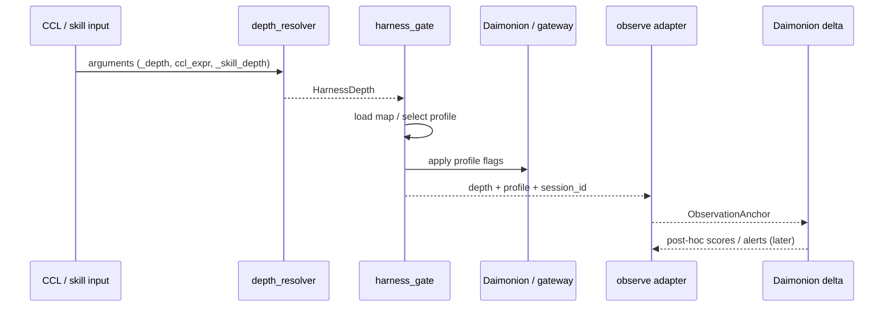

# Organon Kernel Contract - Wave 0.5

> **位置付け**: Organon Wave 0.5 の設計正本。Wave 1 の 48 evaluator 実装へ入る前に、`CCL → harness gate → Daimonion δ observe` の最小 loop を固定する。
>
> **上位台帳**:
> - /home/makaron8426/Sync/oikos/01_ヘゲモニコン｜Hegemonikon/10_知性｜Nous/04_企画｜Boulēsis/15_道具｜Organon/README.md
> - /home/makaron8426/Sync/oikos/01_ヘゲモニコン｜Hegemonikon/10_知性｜Nous/04_企画｜Boulēsis/15_道具｜Organon/meta.md §M0.7
> - /home/makaron8426/Sync/oikos/01_ヘゲモニコン｜Hegemonikon/10_知性｜Nous/04_企画｜Boulēsis/15_道具｜Organon/04_実装｜Impl/01_roadmap_v0.1.md Wave 0.5
>
> **対応実装**:
> - /home/makaron8426/Sync/oikos/01_ヘゲモニコン｜Hegemonikon/20_機構｜Mekhane/_src｜ソースコード/mekhane/mcp/depth_resolver.py
> - /home/makaron8426/Sync/oikos/01_ヘゲモニコン｜Hegemonikon/20_機構｜Mekhane/_src｜ソースコード/mekhane/mcp/harness_gate.py
> - /home/makaron8426/Sync/oikos/01_ヘゲモニコン｜Hegemonikon/20_機構｜Mekhane/_src｜ソースコード/mekhane/mcp/harness_map.yaml
> - /home/makaron8426/Sync/oikos/01_ヘゲモニコン｜Hegemonikon/20_機構｜Mekhane/_src｜ソースコード/mekhane/sympatheia/daimonion_delta.py
>
> **非目標**: 48 evaluator 完成、X-series dispatcher 完成、Q-series scheduler 完成、full benchmark harness、hook universal bus 化、δ による同期的 runtime gate。
>
> **1文要約**: Organon kernel contract は、1 つの invocation を `DepthSignal → HarnessProfile → ObservationAnchor` へ変換する最小契約である。
>
> **確信度**: [推定 82%] 入力面と実行面は既存コードで確認済み。観測面の `observe()` は未実装なので、Wave 0.5 では adapter contract として固定する。

---

## §1 目的

Wave 0.5 の目的は、Organon の first identity を「48 evaluator の束」ではなく、**記述・実行・観測が同じ invocation 上で閉じる runtime contract** として固定することである。

ここでいう kernel は、全機能の中心実装ではない。むしろ、後続 Wave が何を拡張しているのかを見失わないための薄い芯である。

| 相 | 問い | Wave 0.5 の固定点 |
|---|---|---|
| 記述 | LLM をどう動かすと書いたか | `ccl_expr` / `_depth` / `_skill_depth` から `DepthSignal` を作る |
| 実行 | どの厚さの runtime が起動したか | `HarnessProfile` を選び、Daimonion / gateway へ適用する |
| 観測 | その invocation は何として観測されるか | `ObservationAnchor` を残し、Daimonion δ の post-hoc 観測へ接続する |

## §2 Contract Skeleton

| Phase | Input | Operation | Output | 実装責任 |
|---|---|---|---|---|
| 1. Description | invocation arguments | `resolve_depth(arguments)` | `HarnessDepth` | `depth_resolver.py` |
| 2. Profile selection | `HarnessDepth` | `load_harness_map()` + `get_profile(depth, map)` | `HarnessProfile` | `harness_gate.py` + `harness_map.yaml` |
| 3. Runtime application | `HarnessProfile`, `daimonion`, `gateway` | `apply(daimonion, gateway, profile)` | mutated runtime flags | `harness_gate.py` |
| 4. Bypass check | `HarnessProfile` | `is_bypass(profile)` | bare LLM only or normal path | `harness_gate.py` |
| 5. Observation anchor | invocation/session/profile | `observe(...)` adapter | `ObservationAnchor` | Wave 0.5 contract; code adapter 未実装 |
| 6. Delta scoring | session id / logs | `compute_delta_scores(session_id)` | δ score payload | `daimonion_delta.py` |

注意: `observe()` は 2026-04-24 時点で `daimonion_delta.py` に存在しない。したがって Wave 0.5 では、既存の `compute_delta_scores(session_id)` を直接「リアルタイム観測」と呼ばず、後続で挿入する adapter 名として `observe()` を予約する。

## §3 Input Contract

### §3.1 正式入力

| Field | 種別 | 優先度 | 意味 |
|---|---|---:|---|
| `_depth` | explicit invocation override | 1 | 呼び出し側が L0-L4 を直接指定する |
| `HGK_DEPTH` | process environment override | 2 | プロセス全体の depth を強制する |
| `ccl_expr` | CCL expression | 3 | `/noe+` などの modifier から depth を推定する |
| `_skill_depth` | skill frontmatter injection | 4 | skill loader が前処理で注入する想定の depth |
| fallback | default | 5 | 何もなければ L2 |

ここで `_depth` と `HGK_DEPTH` は両方とも explicit override だが、性質が異なる。`_depth` は invocation 単位、`HGK_DEPTH` は process 単位の上書きである。

### §3.2 CCL modifier 対応

| CCL modifier | Depth | 読み |
|---|---|---|
| `--` | L0 | bare / bypass 寄り |
| `-` | L1 | light |
| なし | L2 | default |
| `+` | L3 | enforced / richer |
| `++` | L4 | maximal / research-heavy |

この対応は `depth_resolver.py` の `_MODIFIER_TO_DEPTH` に基づく。

### §3.3 TAINT / 未確定点

`depth_resolver.py` の docstring には「`ccl_expr` が無い場合に string field から CCL modifier を読む」趣旨の記述がある。しかし、確認できる現行コードの正式経路は `arguments["ccl_expr"]` である。したがって Wave 0.5 contract では、広い string-field 推定を正式入力に含めない。

`_skill_depth` は resolver 側には入力名として存在するが、skill loader からの注入は別拡張である。Wave 0.5 は注入済み field を読む contract までを固定し、frontmatter parser の完成を検収条件にしない。

## §4 Execution Contract

### §4.1 実行順序

| Step | Call | 成果 |
|---|---|---|
| 1 | `depth = resolve_depth(arguments)` | invocation から L0-L4 を決める |
| 2 | `harness_map = load_harness_map(path)` | YAML から profile 定義を読む |
| 3 | `profile = get_profile(depth, harness_map)` | depth に対応する profile を得る |
| 4 | `apply(daimonion, gateway, profile)` | Daimonion / gateway の runtime flags を設定する |
| 5 | `is_bypass(profile)` | L0 など bare path へ逃がすべきかを判定する |

`HGK_HARNESS_GATE=disabled` が設定されている場合、`apply(...)` は no-op として扱う。これは harness gate 自体の kill-switch であり、depth が消えることではない。

### §4.2 HarnessProfile keys

| Key | Runtime meaning | 適用先 |
|---|---|---|
| `alpha` | Daimonion α per-tool-call refutation | `daimonion` |
| `beta` | Daimonion β per-tool-call exploration | `daimonion` |
| `gamma` | Sekisho γ audit / block requirement | `gateway` |
| `periskope` | external/deep research path requirement | `gateway` |
| `rom_persist` | ROM persistence requirement | `gateway` |
| `subagent_allowed` | Agent dispatch permission | `gateway` |
| `bypass_llm_only` | bare LLM path permission | `gateway` / dispatch |

`harness_gate.py` の `_PROFILE_KEYS` はこの 7 key を profile の contract として扱う。Wave 0.5 では、新しい key を増やすより、まずこの 7 key が invocation の説明に出る状態を優先する。

### §4.3 Regression guard

`harness_map.yaml` は L2 を現在の implicit default として扱う。L2 の意味を不用意に変えると、既存運用の回帰になりうる。Wave 0.5 の検収では、L2 default が説明可能であることを守る。

## §5 Observation Contract

### §5.1 現在あるもの

`daimonion_delta.py` は Phase 1 の E proxy calculator であり、session log から H-series proxy score と alert を post-hoc に計算する。中心 API は `compute_delta_scores(session_id)` である。

これは「実行前に止める gate」ではない。Daimonion δ は、α/β/γ のように即時判定するのではなく、session / turn / transcript を束ねて being のズレを観測する後段である。

### §5.2 Wave 0.5 で置く adapter

Wave 0.5 の `observe()` は、同期的な δ score 計算ではなく、invocation と後段 δ 計算を接続する anchor を作る adapter として定義する。

```python
observe(invocation, depth, profile, session_id) -> ObservationAnchor
```

最小 `ObservationAnchor`:

| Field | 意味 |
|---|---|
| `invocation_id` | 1 呼び出しを指す識別子 |
| `session_id` | δ post-hoc scoring が読む session |
| `depth` | `resolve_depth(...)` の結果 |
| `profile` | `get_profile(...)` の結果または profile 名 |
| `delta_source` | 初期値は `posthoc_e_proxy` |
| `delta_scores_ref` | 後段の `compute_delta_scores(session_id)` 結果への参照。初期は optional |
| `alerts_ref` | 後段 alert への参照。初期は optional |
| `timestamp` | anchor 作成時刻 |
| `confidence` | anchor の完全性。初期は `partial` を許す |

この contract により、Wave 1 の `CognitiveOp.observe()` は「δ をその場で完全計算する関数」ではなく、「自分の操作を δ 観測面へ登録する関数」として読める。

### §5.3 してはいけない言い方

| 誤り | 理由 |
|---|---|
| `daimonion_delta.py` は `observe()` を既に提供している | 2026-04-24 時点の現物に `observe()` はない |
| δ が invocation を即時 BLOCK する | δ は post-hoc aggregate の観測線であり、BLOCK は主に γ / gateway 側 |
| hook event だけで δ が完成する | hooks は `δ-anchor` を切るだけで、being 観測本体は δ 側 |
| `compute_delta_scores(session_id)` をそのまま Wave 1 の `CognitiveOp.observe()` と同一視する | 粒度が違う。session aggregate と operation-local anchor を分ける必要がある |

## §6 Invocation Loop



読み方:

1. CCL / skill input は「何をしたいか」と depth signal を出す。
2. `depth_resolver.py` は L0-L4 の `HarnessDepth` に正規化する。
3. `harness_gate.py` は YAML profile を選び、runtime flags を設定する。
4. invocation 本体は選ばれた harness profile の下で進む。
5. `observe()` adapter は、その invocation が後から δ に読まれるための anchor を残す。
6. `daimonion_delta.py` は session log を読んで post-hoc に being signal を計算する。

## §7 Acceptance Criteria

| ID | Criterion | 判定 |
|---|---|---|
| A1 | `_depth=L0` / `_depth=L3` などの explicit input が期待 depth に解決される | 必須 |
| A2 | `ccl_expr="/noe--"` が L0、`"/noe-"` が L1、`"/noe"` が L2、`"/noe+"` が L3、`"/noe++"` が L4 として説明できる | 必須 |
| A3 | `HarnessProfile` が 7 key (`alpha`, `beta`, `gamma`, `periskope`, `rom_persist`, `subagent_allowed`, `bypass_llm_only`) を持つ | 必須 |
| A4 | `apply(...)` が Daimonion / gateway の flags を変える、または `HGK_HARNESS_GATE=disabled` で no-op になる | 必須 |
| A5 | `observe()` adapter が `session_id`, `depth`, `profile` を含む `ObservationAnchor` を作れる | 必須 |
| A6 | `ObservationAnchor` は δ score の即時計算を要求しない | 必須 |
| A7 | README / meta / roadmap がこの design note を Wave 0.5 の詳細として参照する | 必須 |

Wave 0.5 は docs-only でも通過できる。ただし次に code adapter を作るなら、A1-A6 を unit test 化する。

## §8 Failure Modes

| Failure | 症状 | 回避 |
|---|---|---|
| observe overclaim | 未実装の `observe()` を既存 API として書く | adapter contract と現物 API を分ける |
| benchmark premature | Wave 0.5 を full benchmark harness に拡大する | 3 相 contract だけを検収する |
| L2 regression | default L2 の意味を変えて既存運用を壊す | `harness_map.yaml` の regression policy を守る |
| hook universalization | hooks に 48 / X / Q / δ 本体を背負わせる | hooks は layered bus / anchor に留める |
| source drift | docs が実装名や path とずれる | acceptance に source path 再確認を含める |

## §9 Next

Wave 0.5 の次に作るべきものは、48 evaluator そのものではなく、まず薄い adapter である。

| 次手 | 出力 |
|---|---|
| `ObservationAnchor` 型の実装位置を決める | `mekhane/organon/` か `mekhane/sympatheia/` の境界判断 |
| `observe()` adapter の最小実装 | invocation metadata を δ post-hoc scoring に渡す |
| A1-A6 の smoke test | `depth_resolver` / `harness_gate` / `observe` の contract regression guard |
| Wave 1 `CognitiveOp` protocol 改稿 | `observe()` を operation-local anchor として定義 |

この順序を守ると、Organon は「48 個の関数を増やす PJ」ではなく、**記述された意図が runtime の厚みを変え、その結果が being 観測へ接続される PJ** として進む。
