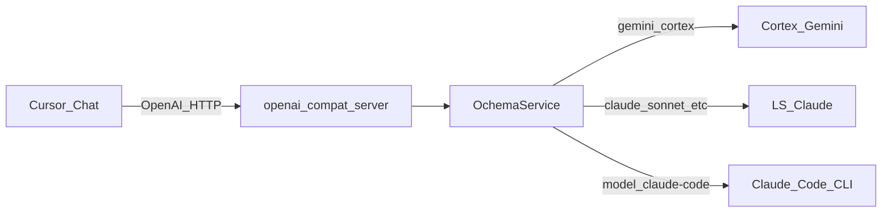
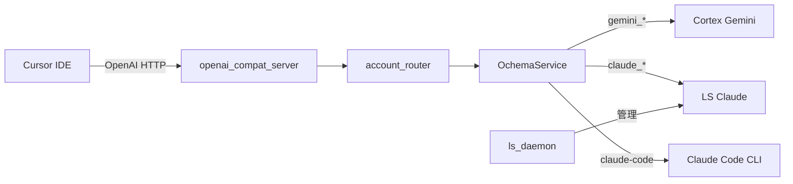

# 引き継ぎ: Cursor カスタムモデル × Claude Code（CLI）× Ochema ブリッジ

**対象読者**: このリポジトリの ochema / Mekhane を引き継ぐ別の AI または開発者  
**作成趣旨**: 「OpenAI 互換ブリッジ経由で Cursor のモデル一覧に `claude-code` を載せ、実体は Anthropic Claude Code CLI（`claude -p`）を呼ぶ」実装の文脈・変更点・検証・注意を一括で渡す。

---

## 1. 背景とゴール

- **課題**: Cursor のチャット用モデルドロップダウンに、**Anthropic の Claude Code（CLI）** を「モデル ID」として載せたい。
- **方針**: Cursor 標準の「別モデル追加」ではなく、既存の **OpenAI 互換 HTTP ブリッジ**（`openai_compat_server`）を拡張する。
- **要点**: `GET /v1/models` で `claude-code` を列挙し、`POST /v1/chat/completions` で `model=claude-code` のとき **サブプロセスで `claude -p …` を実行**する。これは **LS 経由 Claude** や **Cortex Gemini** とは**別プロバイダ**。

公式の運用手順の骨格は次を参照（本ドキュメントはその **Claude Code 拡張**の説明）:

- [`README_CURSOR_OPENAI.md`](./README_CURSOR_OPENAI.md)

---

## 2. アーキテクチャ（データフロー）



- **`claude-code` のみ** `OchemaService._ask_claude_code` → `subprocess` で CLI 実行。
- ブリッジ全体の制約（ツール呼び出し未対応等）は **従来どおり** README に記載。

---

## 3. 変更したファイル（正本パス）

| 役割 | パス（ワークスペースルートからの相対） |
|------|----------------------------------------|
| ルーティング + CLI 実行本体 | `20_機構｜Mekhane/_src｜ソースコード/mekhane/ochema/service.py` |
| Cursor 向け手順・環境変数 | `20_機構｜Mekhane/_src｜ソースコード/mekhane/ochema/README_CURSOR_OPENAI.md` |
| ルーティングの単体テスト | `20_機構｜Mekhane/_src｜ソースコード/mekhane/ochema/tests/test_service.py` |
| 本引き継ぎドキュメント | `20_機構｜Mekhane/_src｜ソースコード/mekhane/ochema/HANDOFF_CLAUDE_CODE_CURSOR_BRIDGE.md` |

---

## 4. 実装の要点（ソース上の「ここを読め」）

### 4.1 モデル登録

- `AVAILABLE_MODELS` に **`"claude-code": "Claude Code (CLI)"`** を追加済み。
- `/v1/models` はこの辞書を列挙するため、Cursor 側で **Model ID = `claude-code`** を選べる。

### 4.2 フォールバック候補（`ModelCandidate`）

- `_build_candidates("claude-code")` は **`provider="claude_code"` の単一候補**のみ返す（Vertex / LS / Cortex と混ざらない）。

### 4.3 同期・非同期・ストリーム

- `_execute_attempt` / `_execute_attempt_async` に **`claude_code` 分岐**あり → `_ask_claude_code` を呼ぶ。
- `stream(model="claude-code")` は **CLI にトークンストリームがない**ため、**完了後に全文を一度 `yield` する擬似ストリーム**。

### 4.4 `_is_claude_model` の落とし穴（重要）

- クラス後半（Tool Use API 付近）に **`_is_claude_model` が prefix 判定**（`claude` で始まる等）する実装がある。
- 正規化後の ID **`claude_code`（ハイフン→アンダースコア）も `claude` 接頭でマッチしてしまう**ため、**明示的に `claude_code` だけ `False`** にしている。
- 過去には **同名メソッドが二重定義**されていたが、**先頭の `CLAUDE_MODEL_MAP` のみ版は削除し、1 本化**済み。再編集時は **二重定義に戻さない**こと。

### 4.5 `_ask_claude_code` の挙動

- コマンド形: **`[bin, *extra_parts, "-p", full_prompt]`**
  - `bin`: 環境変数 `HGK_CLAUDE_CODE_BIN` または **`claude`**
  - `extra_parts`: `HGK_CLAUDE_CODE_EXTRA_ARGS` を **shlex.split**（`claude` と `-p` の**間**に挿入）
- `system_instruction` がある場合は **`system` + 改行 + `user` 相当メッセージ**を連結して `-p` に渡す。
- 失敗時は **`RuntimeError`**（タイムアウト / `FileNotFoundError` / 非ゼロ終了コード + stderr 先頭抜粋）。

---

## 5. 環境変数（Claude Code 用）

| 変数 | 必須 | 説明 |
|------|------|------|
| `HGK_CLAUDE_CODE_BIN` | いいえ | CLI のパス。未設定時は `claude`（PATH 必須）。 |
| `HGK_CLAUDE_CODE_EXTRA_ARGS` | いいえ | 例: `--bare`。`claude` 直後・`-p` より前に挿入。 |

ブリッジ本体のトークン等は従来どおり `README_CURSOR_OPENAI.md` の表を参照。

---

## 6. Creator / 検証者向けチェックリスト

1. 端末で **Claude Code が非対話で動く**こと（例: 公式 headless / `-p` の手順に従う）。
2. `HGK_OPENAI_COMPAT_TOKEN` を設定し **`python -m mekhane.ochema.openai_compat_server`** を起動。
3. Cursor の **Custom OpenAI-compatible API**: Base URL `http://127.0.0.1:8765/v1`、API Key = 上記トークン。
4. モデル **`claude-code`** を選択して短いプロンプトを送信。
5. 失敗時: `claude` が PATH か、`HGK_CLAUDE_CODE_BIN`、認証（Claude Code 側）、`HGK_CLAUDE_CODE_EXTRA_ARGS`（対話プロンプト回避用フラグが必要な場合）を確認。

---

## 7. テスト状況

- **意図的に通す範囲**: `TestModelRouting`（`claude-code` が LS マップに載らないこと、`_build_candidates` が `claude_code` プロバイダになること）、`TestConstants`（`AVAILABLE_MODELS` に `claude-code` が含まれること）。
- **実行例**（ソースコードディレクトリで）:

```powershell
cd "…\20_機構｜Mekhane\_src｜ソースコード"
python -m pytest mekhane/ochema/tests/test_service.py::TestModelRouting mekhane/ochema/tests/test_service.py::TestConstants -q
```

- **注意**: `test_service.py` 全体を Windows で流すと、**既存の別件**（例: `fcntl` 未実装、`psutil` モックパス）で失敗することがある。今回の変更のゲートは上記サブセットで十分とする。

---

## 8. 既知の制限・セキュリティ

- **Cursor Agent の標準ツール**はブリッジ経由では従来どおり **未対応**（README の制限表）。
- **CLI 側**がファイル編集・Bash 実行するかは **Claude Code の設定・`--allowedTools` 等**に依存。本実装は **Ochema から追加のサンドボックスはかけていない**。
- **プロンプト全文を `-p` の引数として渡す**。極端に長いコンテキストは OS の引数長制限に抵触する可能性あり（必要なら将来 stdin 経由の拡張が検討対象）。

---

## 9. フォローアップ案（未実装・任意）

- `claude-code` 用の **統合テスト**（モック `subprocess` で `_ask_claude_code` の成否）。
- **ストリーミング**: CLI が行単位で stdout するなら、**逐次 yield** に改良可能。
- **README のアーキテクチャ図**に `Claude Code CLI` ノードを明示（現状は本文と表で言及）。

---

## 10. 履歴メモ（人間向け）

- 初期に **未承認で `service.py` を部分編集**し `_ask_claude_code` 未定義の壊れた状態があった。**計画に沿い追加実装で修復**。
- ユーザー要求は **「既存の書き換えではなく追加」** — 既存 LS/Cortex ルートは維持し、`claude-code` だけ分岐追加。

---

## 11. マルチアカウント LS プール（2026-03-26 追加）

### 11.1 背景

単一アカウントでは Cortex / LS の quota が競合し、並列利用（MCP + Hermēneus + Periskopē）でレート制限に到達していた。**6アカウントプール**を構築し、パイプライン別にラウンドロビン分散する。

### 11.2 アカウント一覧

| アカウント | TokenVault 登録名 | 主な用途 |
|:----------|:-----------------|:---------|
| default | `default` | IDE 固定 |
| movement | `movement` | MCP / Hermēneus / Chat |
| Tolmeton | `Tolmeton` | MCP / Hermēneus / Chat |
| rairaixoxoxo | `rairaixoxoxo` | Periskopē / Cursor / Batch |
| hraiki | `hraiki` | Periskopē / Cursor / Batch |
| nous | `nous` | 予備 (reserve) |

### 11.3 `account_router.py`

- **パス**: `mekhane/ochema/account_router.py` (76行)
- `PIPELINE_ACCOUNTS` 辞書でパイプライン → アカウントリストをマッピング
- `get_account_for(pipeline)` でラウンドロビン取得
- 未知パイプラインは `"auto"` を返す（TokenVault 自動選択）

```python
from mekhane.ochema.account_router import get_account_for
account = get_account_for("periskope")  # → "rairaixoxoxo" or "hraiki" ...
```

### 11.4 パイプライン対応表

| パイプライン | アカウント群 | 方式 |
|:-----------|:-----------|:-----|
| `ide` | `default` | 固定 |
| `mcp` | `movement`, `Tolmeton` | ラウンドロビン |
| `hermeneus` | `movement`, `Tolmeton` | ラウンドロビン |
| `periskope` | `movement`, `Tolmeton`, `rairaixoxoxo`, `hraiki` | ラウンドロビン |
| `chat` | `movement`, `Tolmeton` | ラウンドロビン |
| `cursor` | `movement`, `Tolmeton`, `rairaixoxoxo`, `hraiki` | ラウンドロビン |
| `batch` | `movement`, `Tolmeton`, `rairaixoxoxo`, `hraiki` | ラウンドロビン |
| `reserve` | `nous` | 固定 |

---

## 12. LS デーモン（Non-Standalone LS 常駐管理）

### 12.1 目的

IDE に依存せず Language Server プールを維持する。`ls_daemon.py` がプロセスを監視し、クラッシュ時に自動再起動する。

### 12.2 起動

```powershell
cd "…\20_機構｜Mekhane\_src｜ソースコード"
python -m mekhane.ochema.ls_daemon --num-instances 2
```

### 12.3 接続情報

- 起動時に `~/.gemini/antigravity/ls_daemon.json` へ接続情報を書き出す
- `OchemaService` はこのファイルを自動読み取りして LS に接続
- 環境変数 `LS_DAEMON_INFO_PATH` で保存先を変更可能

### 12.4 LS クライアントの優先順位（`_get_ls_client_inner`）

1. **Daemon LS** (`ls_daemon.json`) — Docker / 手動起動済みデーモン
2. **NonStandaloneLSManager** — 独立 LS をフォールバック起動
3. IDE LS は**使わない**（MCP 経由リクエストが IDE に出現するのを防ぐ）

---

## 13. Cursor IDE 移行に伴う変更

### 13.1 ブリッジデフォルトパラメータ

Cursor は `max_tokens` や `thinking_budget` を送信しないことが多いため、ブリッジ側でデフォルトを設定済み:

```python
_DEFAULT_MAX_TOKENS = 65536       # CortexClient の DEFAULT_MAX_TOKENS と同値
_DEFAULT_THINKING_BUDGET = 32768  # 思考トークン予算
```

### 13.2 モデル名エイリアス

`_normalize_model` でエイリアス解決:
- `gpt-4` / `gpt-4o` / `default` → `gemini-3-flash-preview`

### 13.3 `cursor` パイプライン

`account_router.py` に `cursor` パイプラインを追加済み。ブリッジからの呼び出しは4アカウントでラウンドロビンする。

### 13.4 Cursor 側設定手順

1. **Settings → Models** → Custom OpenAI-compatible API
2. **Base URL**: `http://127.0.0.1:8765/v1`
3. **API Key**: `HGK_OPENAI_COMPAT_TOKEN` と同じ文字列
4. **Model ID**: `AVAILABLE_MODELS` のキー（`gemini-3-flash-preview`, `claude-sonnet`, `claude-code` 等）

---

## 14. 拡張されたアーキテクチャ（2026-03-26 時点）



### 14.1 変更ファイル一覧（更新）

| 役割 | パス |
|------|------|
| ルーティング + CLI 実行 + LS 接続 | `mekhane/ochema/service.py` (1672行) |
| OpenAI 互換ブリッジ | `mekhane/ochema/openai_compat_server.py` (337行) |
| パイプライン別アカウント分離 | `mekhane/ochema/account_router.py` (76行) |
| LS 常駐デーモン | `mekhane/ochema/ls_daemon.py` |
| テスト | `mekhane/ochema/tests/test_service.py` |
| 運用手順（正本） | `mekhane/ochema/README_CURSOR_OPENAI.md` (213行) |
| 本引き継ぎ | `mekhane/ochema/HANDOFF_CLAUDE_CODE_CURSOR_BRIDGE.md` |

---

## 15. 既知の制限（更新）

| 項目 | 状態 | 備考 |
|:-----|:-----|:-----|
| Tool Use (`tools` / `function_calling`) | **未対応** | Cursor 標準ツールはブリッジ非経由 |
| マルチパート Content | **未対応** | `content` は文字列のみ想定 |
| 画像入力 | **未対応** | Gemini マルチモーダルはブリッジ未対応 |
| `/v1/models` 動的マージ | **未実装** | `AVAILABLE_MODELS` 静的リスト |
| Claude REST 直接接続 | **非推奨** | DX-010 偽陽性。LS 経由を使用 |
| `claude-code` ストリーミング | **擬似** | CLI 完了後に一括 yield |
| OS 引数長制限 | **潜在** | 長大プロンプトは stdin 経由の拡張が将来候補 |
| Windows の `fcntl` | **N/A** | テスト一部がスキップ |

---

## 16. 履歴メモ（続き）

- **2026-03-26**: Antigravity IDE → Cursor IDE 完全移行。6アカウント LS プール構築。`account_router.py` 新設。`ls_daemon.py` をマルチインスタンス対応。ブリッジに `max_tokens` / `thinking_budget` デフォルト追加。
- **2026-03-26**: `.cursor/rules/` に Hóros 12法 + episteme を移行。WF を Skill ベースに再構成。θ12.1 を v4.4 3層ルーティングに更新。
- README_CURSOR_OPENAI.md にアーキテクチャ図・マルチアカウント・LS デーモン・セキュリティ詳細を追加。

---

*このファイルは引き継ぎ用である。運用の正本は引き続き [`README_CURSOR_OPENAI.md`](./README_CURSOR_OPENAI.md) と DX-010 関連ドキュメントとする。*
