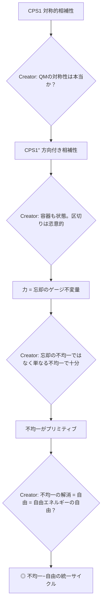

```typos
#prompt rom-inhomogeneity-freedom
#syntax: v8
#depth: L3

<:role: 不均一と自由の統一 — 力・忘却・自由エネルギーの根源的接続
  2026-03-23 セッションの最深部。Creator との対話で到達した洞察。
  ④「力とは忘却である」の核心命題の精密化と、FEP の「自由」概念への再帰的接続。:>

<:goal: 以下の発見を正確に保存する:
  1. 不均一が唯一の普遍的プリミティブであること
  2. 忘却 = 測定 = 不均一を生む操作であること
  3. 力 = 区切りに依存しない不均一 (ゲージ不変量) であること
  4. 自由エネルギーの「自由」= 不均一からの解放であること :>

<:context:
  - [knowledge] 到達経路 (セッション内での思考の軌跡):
    §4.6c CPS1 (対称的相補性)
    → Creator の批判: 「QMの対称性は本当か？Fourierは逃げでは？」
    → CPS1'' (方向付き相補性): 容器 > 内容
    → Creator の批判: 「容器も状態。区切りは恣意的。虹を色に離散化するのと同じ」
    → 「力 = 忘却のゲージ不変量」(区切りに依存しない部分)
    → Creator の批判: 「忘却の不均一ではなく、単なる不均一で十分」
    → 最終形: 不均一 → 忘却 → 力 → VFE最小化 → 自由

  - [file] 力とは忘却である_v1.md §4.6c-e (priority: HIGH)
  - [file] kalon.typos §2.6-2.8 (priority: HIGH)
  - [file] rom_2026-03-23_session_full_theory.md (先行ROM)
/context:>
```

---

# 不均一と自由の統一

> **一行要約**: 力は不均一の表出であり、忘却(測定)は不均一を生む操作であり、自由エネルギーの「自由」は不均一からの解放であり、FEP はこの解放の動力学である。

---

## §1　存在論的プリミティブ: 不均一 {#primitive}

> **[DISCOVERY]** 「力 = 忘却」を精密化する過程で、忘却よりも深い概念に到達:
> **不均一 (inhomogeneity)** が唯一の存在論的プリミティブ。

| 概念 | 以前の位置づけ | 精密化後の位置づけ |
|:-----|:-------------|:------------------|
| 状態 | 基本概念 | 不均一のインスタンス (何かが偏っている具体的な様態) |
| 場 | 容器 | 不均一の連続的分布。場の「区切り」は恣意的 |
| 力 | 忘却の帰結 | 測定に依存しない不均一。ゲージ不変量 |
| 忘却/測定 | 操作 | 不均一に対する射。特定方向に偏ること |
| 自由 | FEP の修飾語 | 不均一が解消された状態 |
| 自由エネルギー | 物理量 | 解消可能な不均一の量 |

> **[RULE]** すべての力は同型。すべての不均一は同型。状態も同型。
> 差異は「どの方向の不均一か」(= どの忘却関手を通じて観測するか) に過ぎない。

---

## §2　忘却 = 測定 = 不均一を生む操作 {#forgetting}

> **[DISCOVERY]** 測定するとは、本質的に偏ること。不均一を生むこと。
> 忘却とは、この「偏り」の別名。

```
測定の本質:
  連続的な現実 (虹) → 離散的な概念 (色) に変換する
  = 一部を選び、残りを捨てる
  = 選んだ方向に偏る = 不均一を生む
  = 忘却

区切り:
  虹を「赤/橙/黄/緑/青/藍/紫」に区切る = 離散化 = 測定
  区切りの位置は恣意的 (文化依存)
  だが「スペクトルにピークがある」ことは区切りに依存しない
  → 区切り不変な不均一 = 力
```

> **[FACT]** 存在論的忘却は物理的に実在する:
> エントロピー増大 (2nd law)、量子デコヒーレンス、繰り込み群フロー。
> これらは観測者に依存せず物理的に発生する忘却/不均一生成プロセス。

---

## §3　力 = 区切りに依存しない不均一 {#force}

> **[DISCOVERY]** 「力 = 忘却」は不正確だった。正確には:
> **力 = 忘却 / ゲージ群 = 不均一のうち区切りの選択に依存しない部分**

| 層 | 内容 | 恣意的か |
|:---|:-----|:---------|
| 不均一 | 普遍的に存在 | 恣意的でない (物理的事実) |
| 区切り (測定/忘却) | 不均一の特定方向を読む | **恣意的** (無限に選択可能) |
| 力 | 全ての区切りで残存する不均一 | 恣意的でない (**ゲージ不変量**) |

> **[RULE]** 区切りは恣意的。だが区切り不変量は恣意的ではない。
> ゲージ理論の曲率 $F_{\mu\nu}$ = 区切りの選び方に依存しない「不均一の残渣」。

---

## §4　自由エネルギーの「自由」 {#freedom}

> **[DISCOVERY]** FEP の「自由エネルギー」の「自由」は比喩ではない。
> **文字通り「不均一からの解放」**。

```
Helmholtz 自由エネルギー: F = U - TS
  U = 内部エネルギー = 系の不均一の総量
  TS = エントロピー×温度 = 既に均一化された部分
  F = まだ解消されていない不均一 = 残存する力の源泉
  F 最小 (= 0) = 熱平衡 = 全不均一の解消 = 完全な「自由」

FEP の VFE: F = -Accuracy + Complexity
  -Accuracy = モデルと現実の不均一 (まだ解消されていない)
  Complexity = モデルが導入した新たな不均一
  VFE 最小化 = 解消可能な不均一の解消 = 自由の獲得
```

> **[DISCOVERY]** 自由の定義:
> $$\text{自由} = \text{解消可能な不均一からの解放}$$
> $$\text{自由エネルギー} = \text{まだ解消されていない不均一の量}$$
> $$\text{VFE 最小化} = \text{自由の獲得プロセス}$$

---

## §5　サイクル: 不均一の生成と解消 {#cycle}

> **[DISCOVERY]** セッション最深部。④全体のテーゼが1つのサイクルに凝縮:

```
不均一 (普遍的に存在)
  ↓ 忘却 (測定 = 特定方向に偏る)
力 (測定に依存しない残存不均一)
  ↓ VFE 最小化 (力に駆動されて不均一を解消)
自由 (不均一が解消された状態)
  ↓ 新たな不均一 (完全均一 = 熱的死の前に新たな偏りが発生)
(ループ先頭に戻る)
```

> **生命 = このサイクルが止まらない系。** 不均一を解消しながら新たな不均一を生む。
> 非平衡定常状態 = サイクルが回り続けている状態。
> 死 = サイクルの停止 = 熱平衡 = 不均一ゼロ = 力ゼロ = 「完全な自由」(= 虚無)。

---

## §6　④ の命題の最終形 {#final}

| バージョン | 命題 | 精度 |
|:-----------|:-----|:-----|
| v1 (④ 原案) | 力 = 忘却 | スローガン。区切りの恣意性を無視 |
| v2 (認識論的後退) | 力 = 忘却 (認知モデル内) | 過剰な後退 |
| v3 (存在論的復帰) | 力 = 忘却 (状態と同等レベル) | 「構造」への逃げを含む |
| v4 (ゲージ不変量) | 力 = 忘却 / ゲージ群 | 区切りの恣意性を組み込み |
| **v5 (最終形)** | **力 = 不均一。忘却 = 不均一を生む操作。自由 = 不均一の解消** | **◎** |

> **④ タイトルの再解釈**:
> 「力とは忘却である」→ 「力とは、測定(忘却)しても消えない不均一である」
> そして「自由エネルギーとは、まだ忘れきれていない不均一の量である」

---

## §7　確信度と残存課題 {#assessment}

| 主張 | 確信度 | 根拠 |
|:-----|:-------|:-----|
| 不均一が普遍的プリミティブ | [確信 85%] | 物理学の基本概念と整合 |
| 忘却 = 測定 = 不均一を生む操作 | [推定 80%] | 2nd law, decoherence が SOURCE |
| 力 = 区切り不変な不均一 | [推定 75%] | ゲージ理論が構造的に支持 |
| 「自由」= 不均一からの解放 | [推定 75%] | Helmholtz F = U - TS の直接的読解 |
| 全ての力は同型 | [仮説 55%] | メタ主張。GUT との関係が未整理 |

**残存:**
- 「全ての力は同型」の厳密化: どのカテゴリで「同型」か
- サイクル §5 の定量化: 不均一の生成レートと解消レートの関係
- ④ v5 の正式な §4.6f (または新 §9) としての組み込み
- 「不均一がプリミティブ」と HGK の FEP (VFE がプリミティブ) との整合性確認

---

## 到達経路の図 (対話の地図) {#journey}



<!-- ROM_GUIDE
primary_use: ④「力とは忘却である」の核心命題の最終形。不均一・忘却・力・自由エネルギー・自由の統一的理解。
retrieval_keywords: 不均一, inhomogeneity, 忘却, forgetting, 力, force, 自由エネルギー, free energy, 自由, freedom, FEP, VFE, ゲージ不変量, 区切り, 恣意性, 測定, measurement, サイクル, 熱平衡
expiry: permanent
importance: CRITICAL — セッション最深部の洞察。④の全体を再定義する。
-->
