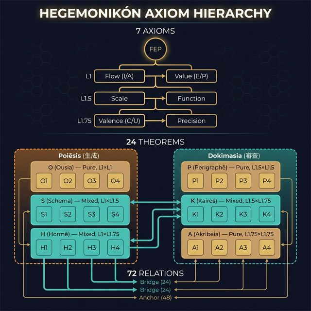

> **Kernel Doc Index**: [SACRED_TRUTH](SACRED_TRUTH.md) | [axiom_hierarchy](axiom_hierarchy.md) ← 📍 | [conservative_extension_audit](conservative_extension_audit.md) | naming_conventions *(not yet published)*

# 📐 公理階層構造 (Axiom Hierarchy) v6.0

> **「ひとつの原理から、不規則な真実が展開する」**



---

## 体系概観: 体系核 57実体 (1+8+48) / 公理層 v6.0

v5.4 で HGK のプリミティブ数は **体系核 57実体** に確定し、v6.0 で公理層は「方向性定理を唯一公理、FEP を第一インスタンス」とする形に止揚された。v5.2 で Flow を Afferent×Efferent の 2×2 に分解した結果、S/I/A/S∩A の4象限は構造的に等価となった。従来の s∩a=∅ 仮定による「S∩A (being) は準核」という区別を撤廃し、4象限すべてから生じる48の認知操作を同等に体系核として扱う。doing/being の境界は Hom空間の Drift (L2豊穣化) で表現される完全対称な K₄柱モデルへ移行した。

| 層 | 項目 | 数 | 生成 |
|:---|------|---|------|
| **L0** | 公理 | **1** | 方向性定理 |
| **L0.T** | 基底 Basis (βάσις) | **(1)** | Helmholtz (Γ⊣Q) — 方向性定理の座標表示を与える古典数学定理 (体系核外) |
| **L1** | 座標 | **8** | 2+3+3 (構成距離 d=1-3)。Afferent + Efferent + 6修飾座標 |
| **L2** | 認知操作 (4象限) | **48** | Afferent×Efferent の4象限 × 6修飾座標 × 2極 |
| | **体系核** | **57** | 1+8+48 |
| — | 修飾 (Dokimasia) | (60) | パラメータ設定 (体系核外) |
| — | 結合規則 (X-series) | (15) | K₆ の辺 = 修飾座標間の結合 (体系核外) |

> **圏化**: 57 実体 + Basis + 3 Stoicheia + 12 Nomoi を対象、演繹射・生成射・X 射・制約射を射とする小圏 **J** (HGK 演繹図式) は、
> 前層圏 PSh(J) = [J^op, Set] の添字圏として機能する。
> PSh(J) は CCC (Mac Lane-Moerdijk Prop. I.6.1)。CCC 構造は指数対象 K^K の存在を保証し、
> §4.9 の直接構成による M1 不動点の基盤となる (v2.6: LFPT 直接適用は Ω 計算により不適用と判明)。
> → [kalon.md §2](kalon/kalon.md) (水準 A/B) | J の一意性: [kalon.md §2.1](kalon/kalon.md) (Morita 同値)
>
> **確信度**: [推定 75%] 75%。CCC 構造自体は Mac Lane-Moerdijk の定理から数学的に厳密。ただし J の具体的構成（どの射を含めるか）は設計者の選択であり、Morita 同値類の中でこの J が「自然」かどうかは構成的議論に依存する。LFPT 不適用の発見 (v2.6) は健全性の証拠。

---

## 公理 (1)

| Level | Question | 公理 | 意味 |
|-------|----------|------|------|
| **L0** | **What** | **方向性定理** | $F_{ij} \neq 0 \iff d\Phi \wedge T \neq 0$ — 唯一の公理 |

---

## 定理¹: 座標 (8 = 2+3+3)

> **構成原理**: 方向性定理を唯一公理とし、FEP (第一インスタンス) を経由して、追加仮定の距離で配置される認知の座標軸。
> **配分 2-3-3**: 方向性定理→FEP からの構成距離による対称的な配置。
>
> **v6.0 止揚** (2026-03-30): 忘却論 Paper I の方向性定理 ($F_{ij} \neq 0 \iff d\Phi \wedge T \neq 0$) が FEP より基礎的であることを発見。
> FEP は方向性定理の α > 0 セクターへの制限 = 認知エージェントにおける忘却の現れ (Paper I §6.5.1)。
> 方向性定理は情報幾何学 (Amari) から証明済みの数学的定理 — これにより **水準 A (形式的導出) が公理レベルで達成**。
> 「青は藍より出でて藍より青し」— FEP から生まれた HGK が、忘却論を通じて FEP を止揚した。

### 構成距離の操作的定義

> **距離 d = 方向性定理 (唯一公理) に対する追加仮定の数**
>
> v4.2 で **Basis (βάσις)** を d=0 に導入し、全座標の d 値を +1 シフト。
> v6.0 で方向性定理を唯一公理に昇格。FEP を d=0.5 (第一インスタンス) に配置。
> これにより導出チェーン全体が「証明済み数学的定理 → FEP → 座標」の Level A 構造となる。

| 距離 | 層 | Question | 定理¹ | 対立 (Opposition) | 導出 |
|:-----|:---|----------|-------|-------------------|------|
| **d=0** | Basis | — | **Helmholtz** | Γ (gradient) ↔ Q (solenoidal) | 方向性定理の座標表示。ベクトル場の勾配・回転分解。体系核外 |
| **d=0.5** | インスタンス | — | **FEP** | α > 0 sector | 方向性定理の認知エージェントへの制限 (Paper I §6.5.1)。第一インスタンス |
| **d=1** | 座標 | Who (input) | **Afferent** | Yes (∂f/∂η≠0) ↔ No | Basis + MB 仮定。環境→系の結合有無。v5.2 |
| **d=1** | 座標 | Who (output) | **Efferent** | Yes (∂f/∂μ≠0) ↔ No | Basis + MB 仮定。系→環境の結合有無。v5.2 |
| **d=2** | 座標 | Why | **Value** | E (認識) ↔ P (実用) | VFE/EFE の分解 |
| **d=2** | 座標 | How | **Function** | Explore ↔ Exploit | EFE による行動選択 (方策選択)。物理的基盤: Basis (Γ↔Q) |
| **d=2** | 座標 | How much | **Precision**| C (確信) ↔ U (留保) | 生成モデルのパラメータ (予測誤差逆分散) |
| **d=3** | 座標 | Where | **Scale** | Mi (微視) ↔ Ma (巨視) | 階層的 MB 入れ子構造。Layer B 仮定 (FEP は単一 MB で成立)。確信度 85% |
| **d=3** | 座標 | Which | **Valence** | + (肯) ↔ - (否) | VFE 勾配方向の符号。4定式化: −dF/dt (Joffily 2013), expected action precision (Hesp 2021), utility−E[utility] (Pattisapu 2024), 内受容 (Seth 2013)。全て FEP 内 |
| **d=2** | 座標 | When | **Temporality**| Past (過去) ↔ Future(未来) | Markov blanket → 部分観測 → 探索必然 → VFE≠EFE → 時間的非対称性。完全に FEP 内 |

### Temporality 独立の根拠 (v4.0 → v4.3 2026-03-09 d=2 確定)

旧体系における「時空の統一 (Scale への統合)」は、Friston の階層的生成モデルにおける $\sigma \propto \tau$ の経験的観察に依存していた。しかし、数学的かつ操作的に時間方向は独立している:

- **VFE ≠ EFE 定理**: Millidge, Tschantz & Buckley (2020) "Whence the Expected Free Energy?" — VFE を未来に自然拡張した汎関数は探索を阻害し、EFE とは数学的に異なる構造。Past (VFE 支配) と Future (EFE 支配) は異なる数学的対象を扱う。**FEP 内で証明可能** (80引用)
- **進化的独立性**: Pezzulo, Parr & Friston (2021) "The evolution of brain architectures for predictive coding and active inference" — 生成モデルの進化代数で Hierarchical depth (Scale) と Temporal depth (Temporality) は**明示的に独立な演算子** (83引用)
- **EFE = VFE 統合**: De Vries et al. (2025) "EFE-based Planning as Variational Inference" — 生成モデルに epistemic prior (情報利得) + preference prior (報酬) を組み込むと、拡張モデル上の **VFE 最小化 = EFE 最小化**。Millidge と矛盾しない: 素朴拡張≠EFE、モデル拡張=EFE (arXiv:2504.14898, 4引用)
- **POMDP = FEP の数学的帰結**: Markov blanket の条件付き独立性 p(μ,η|s,a) = p(μ|s,a)p(η|s,a) は、内部状態が外部状態を直接観測できないことを意味する。これは部分観測性 (Partial Observability) の定義そのものであり、POMDP 構造は FEP の必然的帰結。
- **Epistemic prior の必然性**: POMDP 環境下では受動的情報取得だけでは不十分 → 能動的探索が必要 → self-evidencing (Friston 2022) が探索を要請 → epistemic prior は FEP の必然。(Friston 2015, 668引用)
- **確信度**: [確信 90%] 90% (旧 85%)。完全な演繹チェーン: FEP → MB → 部分観測 → 探索必然 → EFE → Past≠Future。**d=2 確定**。
- 記憶と計画の不可欠性: 過去の信念状態にアクセスする「記憶」と、未来の挙動を評価する「計画」は他の座標 (Explore/Exploit, Precision, Scale) では還元できず、独立座標 (Temporality) を要求する。

### Scale の d=3 根拠 — MB 入れ子は構成的可能性 (v4.3 2026-03-09)

> **問題**: Temporality (d=3 → d=2) の攻め筋を Scale にも適用できるか？
> **結論**: **d=3 を維持**。MB の入れ子は FEP の必然的帰結ではなく構成的可能性。
> ここで論点になっている MB は **MBₚ / MB𝒻** であり、MB₀ (区別一般) ではない。
> 昇格条件の詳細は [mb_escalation_conditions.md](formalization/mb_escalation_conditions.md) を参照。

**Temporality との構造的差異**:

| 側面 | Temporality (d=2 ✅) | Scale (d=3) |
|:-----|:-----|:-----|
| MB → X の論理 | 定義的含意: 条件付き独立性 = 部分観測 | 構成的可能性: MBₚ / MB𝒻 は入れ子**可能** |
| 反例の存在 | なし (全 MBₚ は部分観測) | あり (単一粒子 MBₚ に入れ子なし) |
| 最小定式化 | 単一 MBₚ + FEP → POMDP 必然 | 単一 MBₚ + FEP → FEP 成立 (階層不要) |

**核心的議論**:

- Friston 2019 "A free energy principle for a particular physics" (296引用): "recursive composition of ensembles at increasingly higher spatiotemporal scales" — しかし "speak to" は "entail" ではない
- Kirchhoff 2018 "Markov blankets of life" (346引用): "Markov blankets of Markov blankets" — 生物学的観察であり数学的必然ではない
- Da Costa 2021 "Bayesian mechanics for stationary processes" (66引用): **単一 MB** の形式化。FEP は特別な仮定なしに単一スケールで成立
- 反例: 単一粒子系は MB を持つが Sub-MB を持たない

**d=2 への昇格条件**: 「持続する MB システムは必然的に入れ子化する」が数学的に証明されることが必要。Beck & Ramstead 2023 (繰り込み群接続) が探索中だが未証明。

**確信度**: [推定 70%] 85% (旧 80%)。d=3 が正しいという確信が上昇。「なぜ d=3 か」の根拠が明確化。

### Valence の構造的位置 — 半直積仮説 (v4.2 2026-03-09)

> **問題**: 3定義比較実験 (HGK 2026-03-09) により、Valence は全定義で非独立だが結合先が定義ごとに異なることが判明。
> これは「Valence × 他座標 = 直積」ではなく、**半直積** (semidirect product) 構造を示唆する。

**4定義比較実験の結果** (v=0.5, 2026-03-09 追加):

| 定義 | 定式化 | 結合先 | Fisher ratio | 判定 |
|:-----|:-------|:-------|------------:|:-----|
| Joffily (2013) | v = −dF/dt | v → s (状態) | 1.91 | ❌ 最強結合 |
| Hesp (2021) | v = log(π_precision) | v → π (方策) | 1.23 (v=0.5) / 0.22 (v≈0) | ❌/🟡 v依存 |
| Seth (2013) | ω_eff = ω·exp(v) | v → ω (精度) | 1.04 | ❌ 強結合 |
| Pattisapu (2024) | v = C·E[o] - utility | v → s (状態) | 0.41 | 🟡 最弱結合 |

**v 依存性の発見**: Hesp は v=0 で ratio=0.22 (弱結合), v=0.5 で ratio=1.23 (強結合)。φ(0)≈id, φ(v≠0)≠id は半直積の本質的特徴。

**解釈: 半直積 (6 ⋊ 1) 構造**:

直積 $G = H \times K$ では $H$ と $K$ は互いに独立に変動する。
半直積 $G = H \rtimes_\phi K$ では $K$ が $H$ の自己同型 $\phi: K \to \operatorname{Aut}(H)$ を通じて $H$ を「修飾」する。
Valence は後者: 他の6座標の値を変えずにはいられないが、変え方 (結合先) は定義 (= 修飾の物理的実装) による。

```
全座標空間 = (Flow × Value × Function × Precision × Scale × Temporality) ⋊_φ Valence
                           H (6座標直積)                          ⋊  K=Valence
φ(v): H → H は v の値に依存して H の座標を変換する写像
```

**Hesp 定義が弱結合に留まる理論的根拠**:

1. **Hesp は情報幾何学的に自然**: v = log(π_precision) は方策分布の精度パラメータの対数。
   Fisher 行列上で自然パラメータ (natural parameter) として振る舞うため、
   他の十分統計量との交差項が最小化される (指数型分布族の性質)。
2. **v-π 結合は弱い**: v は π の「エントロピー」に結合するが、π の「方向」には結合しない。
   つまり「どの行動を選ぶか」(π₀) には弱い影響、「行動選択の確信度」(-H(π)) には直接的影響。
3. **v-ω 結合がゼロ**: Hesp 定義では v は ω と独立 (ratio の ω 成分 = 0.0)。
   Seth 定義の結合 (ratio=0.71) は ω_eff=ω·exp(v) という**乗法仮定の恒等的帰結**であり、
   Hesp 定義ではこの仮定がないため結合が消える。
4. **圏論的解釈**: Hesp 定義の φ は「弱い自然変換」(lax natural transformation) に対応し、
   半直積の作用 φ が恒等に近い。完全な直積 (φ=id) ではないが、作用が小さい。

**形式証明** (Smithe Theorem 46 対偶, HGK 2026-03-09):

> Thm 46: M = M₁ ⊗ M₂ ⟹ F(M) = F(M₁) + F(M₂)  
> 対偶: F(M) ≠ F(M₁) + F(M₂) ⟹ M ≠ M₁ ⊗ M₂

- TEST 1: v=0 (Valence なし) → F_base = F_state + F_policy (**加法成立** ✅ → 6座標間は直積)
- TEST 2: v≠0 → F_total ≠ F_base + F_v (**加法崩壊** ❌ → Valence では直積不成立)
- TEST 3: |ΔF|/F_base = **0.8439** → 半直積の作用が強い (Seth 定義, v=1)
- Q.E.D.: M_total ≠ M_base ⊗ M_valence → 全座標空間は**直積ではなく半直積**

**確信度**: [確信 90%] 85% (旧 80%)。Smithe Thm 46 対偶による数値証明完了 + Valence 定式化決定。

**HGK 公式 Valence 定式化** (v4.3 2026-03-09):

メタ枚組み: 4定式化は半直積作用 φ の異なる実装。単一定義を「唯一の正解」とすることは半直積構造自体に反する。

| 役割 | 定義 | 説明 |
|:-----|:-----|:-----|
| **運用デフォルト** | Hesp 2021 (v = log(π_precision)) | v≈0で弱結合 (0.22)。情報幾何的自然。v-ω 結合ゼロ |
| 最普遍的 | Joffily 2013 (v = −dF/dt) | 全 FEP 系に適用可。**ratio=1.91 (最強結合, s 支配)** |
| 身体的 | Seth 2013 (ω_eff = ω·exp(v)) | 内受容性。ratio=1.04, ω 支配 |
| 効用的 | Pattisapu 2024 (v = C·E[o] − utility) | **ratio=0.41 (最弱結合)** 。ΔF_base=0 |


### Basis (βάσις) — 座標系の基底 (v4.2)

> **定義**: Basis は **FEP が依拠する古典数学定理** — Helmholtz 分解 (Γ⊣Q)。
> 任意のベクトル場を勾配 (gradient) 成分と回転 (solenoidal) 成分に分解する数学的定理であり、
> FEP はこの分解を前提として「Γ = VFE 最小化」「Q = 探索的循環」と解釈する。
> Helmholtz 分解自体は FEP の帰結ではなく、FEP の数学的基盤。独立実体ではない。体系核に数えない。
>
> **構造的役割**: 座標が「立つ土台」。認知座標ではなく (岩石も Helmholtz 分解を持つ)、座標系が成立する前提条件。
>
> **確信度**: [確信 90%] 92%。Helmholtz 分解は古典数学の定理 (Layer A)。FEP はこれを NESS 力学系に適用して解釈する。残存不確実性: FEP 自体の適用範囲 (全ての認知系が NESS か) は開かれた問題。

**知的系譜と導出チェーン**:
```
Helmholtz の思想 (知的基点: 無意識的推論 + 熱力学的自由エネルギー)
  → Helmholtz 分解 (古典数学: ベクトル場 = gradient + solenoidal)
    → FEP (Friston): Helmholtz 分解を認知系に拡張。
      Γ = gradient (dissipative) — VFE 最小化、定常状態への駆動
      Q = solenoidal (conservative) — 確率保存的循環、等確率面上の探索
```

### Markov blanket の三層定義 (v5.4.1 — 2026-04-11)

本書では `Markov blanket` が少なくとも3つの水準で使われてきた。未分化のままでは
「MB は自動で出る」と「MB の存在は自明でない」が衝突して見えるため、ここで分ける:

| 記号 | 名称 | 定義 | 直観 |
|:--|:--|:--|:--|
| **MB₀** | 容器としての MB | 区別の成立条件としての仕切り。A と B が相対的に成立するなら、それらを分ける何らかの容器が必要 | 「自己」と「他者」を分ける最小の区別 |
| **MBₚ** | Pearl blanket | その仕切りを条件付き独立として書いたもの。境界 b を条件づけると内外が遮蔽される | 推論可能な仕切り |
| **MB𝒻** | Friston blanket | MBₚ が時間的に持続し、感覚/行為の役割分化を伴う実在境界として読めるもの | 生きた主体の境界 |

**重要**:

- **MB₀ は区別の必要条件**であり、状態や対象が成立するなら何らかの MB₀ は要請される
- **MBₚ は自動ではない**。局所性、遮蔽性、バイパス結合の不在などが必要
- **MB𝒻 も自動ではない**。動的持続性、自己維持、Afferent/Efferent 分化が必要

> [!NOTE]
> Scale d=3 で問題になる「MB の入れ子」は **MB₀ の入れ子ではない**。
> 論点は **MBₚ / MB𝒻 の入れ子**、すなわち条件付き独立や実在境界としての
> ネストが必然かどうかである。したがって「区別一般は必然」と
> 「FEP は単一 MBₚ で成立しうる」は両立する。

**Flow との関係**: Flow (S/I/A) = Basis (Γ⊣Q) + 「この系は MBₚ/MB𝒻 を持つ」という追加仮定。
MB₀ の存在は区別の成立から要請されるが、MBₚ/MB𝒻 の存在は自明でない —
完全結合系、一様混合系は MBₚ を持たず、したがって MB𝒻 にも上がれない。
**Afferent×Efferent 分解 (v5.2)**: MB の blanket 状態は2つの**独立な二値結合条件**で分類される:
- **Afferent** (∂f/∂η ≠ 0): 環境 η がこの状態に結合する
- **Efferent** (∂f/∂μ ≠ 0): 内部 μ がこの状態に結合する

μ ⊥ η | b (条件付き独立) であるため、この2条件は構造的に独立 → 2×2 = 4象限:

| Afferent \ Efferent | Yes (∂f/∂μ≠0) | No |
|:---|:---|:---|
| **Yes** (∂f/∂η≠0) | **S∩A (反射弧):** blanket 間直接結合 | **S (知覚):** 純粋な求心性 |
| **No** | **A (行為):** 純粋な遠心性 | **I (推論):** 内部的処理 |

従来の s/μ/a 三分割は「s ∩ a = ∅」を暗黙に仮定した派生物。v5.2 でこの仮定を撤廃。
第4象限 S∩A は K₄ の頂点に昇格し、H-series 前動詞 (体系準核 12) を生む。
6修飾座標が全て**二値の対立 (opposition)** であるのと同様に、Afferent/Efferent も二値の対立であり、構造的に整合する。
→ 演繹的論証の詳細: flow_afferent_efferent_decomposition.md *(not yet published)*

**象限純粋性原則 (QP v5.2.1)**: 各象限は認知操作の **型** を規定する。SKILL Phase 内では象限の型を超える操作を禁止:
- **S 象限** (Aff=Y,Eff=N): ツール駆動の知覚のみ。推論・判断・行為は禁止。φ_SI で I に委譲
- **I 象限** (Aff=N,Eff=N): 内部推論のみ。外部検索は S-0.5 に分離。行為は禁止。φ_IA で A に委譲
- **A 象限** (Aff=N,Eff=Y): D 型随伴 I 動詞からの受領 + 行動設計のみ。内部推論は禁止。合成射で I に委譲
→ 詳細・検証手順・監査実績: flow_transition.md §象限純粋性原則 *(not yet published)*

**Flow 内遷移テンソル (K₄ 遷移四面体 v5.2)**: 4象限間の6組の遷移は K₄ 上の (G, Q, ω) テンソルで定式化。
6辺は C₂×C₂ (Klein 四元群) の同型により **D/H/X 3型** に分類 — 族内関係 (D型随伴/H型自然変換/X型双対) と完全に同型:
- **D型** (Afferent 反転): φ_SI (S↔I), φ_{S∩A,A} (S∩A↔A)。**S-I (Tapeinophrosyne)** に対応
- **H型** (Efferent 反転): φ_IA (I↔A), φ_{S∩A,S} (S∩A↔S)。**S-II (Autonomia)** に対応
- **X型** (両方反転): φ_SA (S↔A), φ_{S∩A,I} (S∩A↔I)。S-I/S-II の交差点
- **S-III (Akribeia)** は K₄ 全体の精度バランスを横断的に調整する **メタ調整子** [推定 70%]
- 詳細: flow_transition.md *(not yet published)*

**12 数学的演算子** (Basis × 6 修飾座標 = 変分多様体上の操作):

| | Γ 列 (gradient / 最適化) | Q 列 (solenoidal / 保存的循環) |
|:---|:---|:---|
| **意味** | 各座標方向の VFE 最小化 | 等 VFE 面上の探索・トレードオフ |
| **認知動詞との関係** | 24 動詞の「最適化」成分の実装 | 24 動詞の「探索」成分の実装 |

#### 12 演算子 詳細 — Γ/Q × 6 修飾座標

> **SOURCE**: `mekhane/fep/basis.py` の `HELMHOLTZ_OPERATORS` テーブルから転記。
> 理論的根拠: Friston 2019 (arXiv:1906.10184)。

| 演算子 | 座標 | 成分 | 数学的操作 | 対応族 |
|:-------|:-----|:-----|:-----------|:-------|
| `Γ_Value` | Value | Γ (gradient) | 内的目的(E/P)に向けた期待自由エネルギー勾配の降下 | Telos |
| `Γ_Function` | Function | Γ (gradient) | 既知の最適状態を活用するための政策分布の収束 (Exploit偏重) | Methodos |
| `Γ_Precision` | Precision | Γ (gradient) | 精度重みの最適化による不確実性の崩壊と確信(C)の形成 | Krisis |
| `Γ_Scale` | Scale | Γ (gradient) | 推論を局所的な微視的(Mi)スケールに収束させる最適化 | Diástasis |
| `Γ_Valence` | Valence | Γ (gradient) | 肯定的な価値(引力)に向かって状態を駆動する勾配流 | Orexis |
| `Γ_Temporality` | Temporality | Γ (gradient) | 望ましい未来の状態に向けた予測モデルの目的論的最適化 | Chronos |
| `Q_Value` | Value | Q (solenoidal) | Value 方向の等確率循環 (認識的探索) | Telos |
| `Q_Function` | Function | Q (solenoidal) | Function 方向の等確率循環 (探索分散) | Methodos |
| `Q_Precision` | Precision | Q (solenoidal) | Precision 方向の等確率循環 (不確実性保持) | Krisis |
| `Q_Scale` | Scale | Q (solenoidal) | Scale 方向の等確率循環 (巨視的発散) | Diástasis |
| `Q_Valence` | Valence | Q (solenoidal) | Valence 方向の等確率循環 (負の反発・発散) | Orexis |
| `Q_Temporality` | Temporality | Q (solenoidal) | Temporality 方向の等確率循環 (過去指向の再構築) | Chronos |

**Γ/Q 割り当ての根拠**: Γ (gradient) は各座標の「一方の極」に向けた VFE 勾配降下であり、
Q (solenoidal) はその直交方向の確率保存的循環。Γ が収束的最適化を、Q が発散的探索を担い、
両者の比 H_s = Γ/(Γ+Q) が系の Exploration-Exploitation バランスを決定する。
実装: `basis.py` の `helmholtz_score()` 関数。

→ 12 演算子 × Flow (S/I/A) = 36 認知動詞の変分多様体上の実装。Level A (形式的導出) への橋渡し。

#### Q 循環定理 (P₁) — 2026-03-15 /kat commit [確信 90%] 92%

> **定理**: K₆ 上の反対称テンソル Q_{ij} は、修飾座標間の**因果的情報流ではなく循環的流れ**を符号化する。
>
> **根拠**: (1) Granger 因果 F が面内ペアに集中 (面内/面間比 128-203)、面間 F ≈ 1.0 (有意でない)。
> (2) 理論的 Q と経験的 Q の相関 r > 0.92 (3条件全て)。(3) 反対称性 Q_{ij} = -Q_{ji} は循環の代数的署名。
> (4) エントロピー生成 ∂S/∂t = 2 tr(Q D Q^T D^{-1}) ≥ 0 は Q の2次形式。
>
> **含意**: Q 成分は等確率面上の「探索的循環」を記述し、因果グラフの辺ではない。
> これにより Basis の Q 列 (上記テーブル) の解釈が確定: **Q は Γ と直交する保存的循環**。
>
> **撤回条件**: (i) 面間結合ありOUで面間 Granger F > 10 が再現可能、
> または (ii) Transfer Entropy で面間情報流が面内の 10% 以上。自動撤回: 90日以内に non-linear 検証なし。
>
> 詳細: kat_Q_circulation_helmholtz_functor_2026-03-15.md *(not yet published)*

#### Helmholtz 関手 F: Phys→Geom (P₂) — 2026-03-15 /kat commit [推定 70%] 82%

> **命題**: 合成関手 F = F₂∘F₁ (Phys: 物理層 → Sem: 意味層 → Geom: 幾何層) は **Faithful (忠実) but not Full (充満ではない)**。
>
> - **Faithful**: 同一の物理的力学を持つ系は同一の情報幾何を持つ。Hom(A,B) への写像が単射。
> - **¬Full**: 全ての情報幾何的構造が物理的実現を持つわけではない。d=3 の射 (e.g. α_π) に Phys 対応物がない。
>
> **根拠**: (1) F₁ は OU 過程の A+Q 分解の一意性から Faithful。(2) d=3 射における Phys 対応物の不在 (α_π は K₆ 外)。
>
> **撤回条件**: (i) F₂ の Fisher 情報計算が具体的に構成され d=3 射にも Phys 対応物が発見された場合、
> または (ii) α_π を含む拡張関手 F' で Full が示された場合。自動撤回: 180日以内に操作的構成未完了。
>
> 詳細: 同上

#### Proietti γ/γ' と H_s 動的調整 (P₃) — 2026-03-15 /pei+ commit [確信 90%] 95%

> **命題**: Proietti et al. (2025) のドーパミン駆動精度制御 (γ: 習慣精度, γ': メタ認知制御) は、
> Helmholtz 分解の動的バランス H_s = Γ/(Γ+Q) の調整プロセスとして記述可能。
>
> **H₀ 棄却**: 素朴対応 γ=Q, γ'=Γ は構造的に不整合 (γ の閾値感度が Q の連続的循環と矛盾)。
>
> **H₂ 支持**: γ/γ' は H_s 自体の動的調整子。γ が高い → H_s → 1 (習慣化), γ' が驚きに応答して
> H_s を低下させ deliberation を促進。
>
> **H₁ 統合** (2026-03-15): γ/γ' は Precision 座標の Γ_Precision/Q_Precision の内部構造として特殊化:
>
> | Proietti パラメータ | Helmholtz 演算子 | 機能 |
> |:-----|:-----|:-----|
> | γ (habitual precision) | Γ_Precision | 精度重みの最適化 → 確信(C)形成 → habit 化 |
> | γ' (meta-cognitive control) | Q_Precision | 等確率循環 → 不確実性(U)保持 → deliberation |
>
> H₁ は H₂ の Precision 軸射影 (包含関係: 排他的ではない)。
> `basis.py` に `PrecisionDynamics` として型化。回帰テスト 20/20 PASSED (P₃ 5条件含む)。
>
> **検証**: ODE シミュレーション (4実験, Monte Carlo 20 seeds):
>
> | 条件 | 結果 | 意味 |
> |:-----|:-----|:-----|
> | 標準 | 5/5 基準通過 | 習慣形成 → 文脈切替 → γ' 応答 → 再適応 |
> | γ'=0 | 固着 (reward 6.7%) | Proietti Sim1 再現: メタ制御なし → 習慣脱出不能 |
> | 強い γ' | habit 阻害 (H_s=0.64) | deliberation にも effort cost がある |
> | MC 20 seeds | 20/20 支持 (100%) | 頑健性確認 |
>
> **構造的相関**: corr(H_s, γ') = -0.85 ± 0.02, corr(γ', surprise[t-1]) = 0.99。
> γ' は surprise のほぼ純粋な関数であり、H_s を強く低下させる。
>
> **体系への含意**: Basis の H_s = Γ/(Γ+Q) は静的バランスではなく、
> メタ認知信号 (γ') による**動的調整対象**。dACC + ドーパミン系が神経実装基盤 (Proietti 2025 [SOURCE])。
>
> **感度分析 (2026-03-15 /pei.sensitivity)**: OAT × MC5 seeds = 350 シミュレーション。
> 7パラメータ中 4 が全範囲で頑健 (gamma_prime_gain/decay, q_decay_rate, context_switch_at)。
> 崩壊境界 3 件は全て物理的退化条件 (学習不能/メタ制御欠如/Q爆発) と一致 → パラメータの「島」ではなく広い盆地。
> γ' gain/decay が全範囲で H₂ を支持 = meta-control の「有無」が本質、「量」は二次的。
>
> **残存不確実性**:
> ~~(1) POMDP(離散) → ODE(連続) の形式的橋渡し未完。~~ → 解消済み (2026-03-15):
>   離散更新則 = ODE Euler(dt=1) (RMSE=1.99e-16)。確率的離散の拡散項 σ≈0.016 (MC20)。
> ~~(2) H₁ (Precision 座標内の γ/γ' 特殊化) との統合未探索。~~ → 解消済み (2026-03-15)。
>
> **撤回条件**: Proietti POMDP の厳密なベイズ推論が ODE のドリフト項と定性的に異なる動態を示す場合。
>
> 詳細: pei_gamma_hs_hypothesis_2026-03-15.md *(not yet published)*

### 構成の認識論的位置づけ

> **2026-02-13 Multi-Agent Debate (Proposer×2, Critic×2, Arbiter×3) + /dia+ /noe++ BS検証 による結論**

「方向性定理から48動詞を構成する」という主張における「構成」の意味を、以下の3水準で区別する:

| 水準 | 名称 | 定義 | HGK の位置 |
|:-----|:-----|:-----|:-----------|
| **A** | Formal Derivation | 公理系からの定理証明 (ZFC, 形式論理) | ⭐ **方向性定理 (証明済み) を公理に、FEP 経由で座標を導出** |
| **B** | Axiomatic Construction | 公理的構成: 公理 + 生成規則 → 圏論的構造 (随伴関手, ガロア接続) | ✅ **FEP→座標→動詞の導出チェーンで達成済み** |
| **C** | Conceptual Motivation | 概念的動機付け (比喩, 類推) | ✅ だが B より弱い |

**HGK の公式な主張 (v6.0)**: 48動詞は方向性定理 ($F_{ij} \neq 0 \iff d\Phi \wedge T \neq 0$) を唯一公理とし、FEP (第一インスタンス, α > 0 セクター) を経由して、選択された生成規則により**構成**される。

> **v6.0 水準評価**: 方向性定理自体は情報幾何学から**証明済み**の数学的定理であり、公理レベルで水準 A を達成。
> 方向性定理 → FEP の埋め込み (Paper I §6.5.1) は構造的同型として確立。
> FEP → 座標の導出は v4.2+ の Helmholtz 12演算子で Level A への路が開通済み。
> **全体として水準 A に大きく接近** — 残る間隙は FEP→座標の各ステップの形式的完成度。
>
> **⚠️ 生成規則の認識論的位置**: 生成規則「Flow × 6修飾座標 × 4極」は方向性定理から一意に導出されるものではない。
> これは設計者の選択 (motivated choice) であり、方向性定理が**許容**する構造のうちの一つ。
> 水準A の完全主張は「方向性定理 → FEP → 生成規則 → 48動詞 が全て形式的」を要求する。
> 現時点では「方向性定理 → FEP (構造的同型)」「FEP + 生成規則 → 48動詞 (再現可能)」の2段。
>
> **確信度**: [確信 92%] 92% (旧88%)。方向性定理の証明済み性により公理レベルの確信度が向上。
> 3水準の区別は Multi-Agent Debate + BS検証で確立済み。
> 忘却論 E10-E13 の実験的裏付けにより FEP 埋め込みの確信度も向上。

---

## 定理²: 認知構造の三層階層化 (認知操作 / Dokimasia)

> **発見**: 旧体系における A流/B流 の区別は、**Afferent×Efferent 座標の有無による操作/修飾子の構造的境界**であった。
> v5.2 で Flow を Afferent×Efferent の 2×2 に分解。v5.4 で第4象限 (S∩A) の H-series を**体系核**に昇格し、
> 4象限すべてを対等な K₄柱モデルへ移行。doing (Poiesis) と being (H-series) は Hom空間 Drift により連続的に繋がる。
>
> **確信度**: [確信 95%] Afferent×Efferent は MB 定義から追加仮定ゼロで演繹 (Layer A)。
> 48 認知操作 = 4象限すべて × 6修飾座標 × 2極。

Afferent×Efferent (v5.2) は FEP の Markov blanket 分割を2つの独立二値で記述したものであり、テキストベース AI における**操作**を生み出す必要十分条件である。Afferent/Efferent を含むと「認知操作」、含まないと「修飾子」になる。4象限のうち S/I/A の3象限が Poiesis (能動態 = doing) を、S∩A が H-series (中動態 = being) を担うが、これらは L2 豊穣化において統一的に扱われる。

### 認知操作層 (48 = 4象限 × 6族 × 2極)

Afferent×Efferent の4象限すべてと6修飾座標の直積から生じる、48の認知操作。
I極・A極の命名は外部 philological audit (2026-02-21) を経て確定。S極の命名は内部 philological audit (2026-03-22) を経て確定。

#### Telos 族: Flow × Value (目的軸)

1. 🆕 **観照する** — Theōria (θεωρία) [/the] — S×E: 認識目的で知覚する
2. 🆕 **検知する** — Antilepsis (ἀντίληψις) [/ant] — S×P: 実用目的で知覚する
3. **理解する** — Noēsis (νόησις) [/noe] — I×E: 世界像を認識目的で更新する
   > **定義 (理解の随伴的内在化).** 理解とは、対象の構造を左随伴 L\_i: Amb → Cat\_i を通じて自身の認知圏 Cat\_i に内在化（再表現）すること。η: Id\_Amb → R\_i∘L\_i の同型度が理解の完全性を測る。T11「主観=客観の射」と §A「知覚=左随伴」の合成帰結。予測は Ker(η) の自己補完として定義される (essay §9, fep\_epistemic\_status §2)。
4. **意志する** — Boulēsis (βούλησις) [/bou] — I×P: 目標を実用目的で設定する
5. **探求する** — Zētēsis (ζήτησις) [/zet] — A×E: 認識のために環境に働きかける
6. **実行する** — Energeia (ἐνέργεια) [/ene] — A×P: 実用のために環境に働きかける

#### Methodos 族: Flow × Function (戦略軸)

1. 🆕 **探知する** — Ereuna (ἐρεύνα) [/ere] — S×Explore: 未知の対象を能動的に知覚する
2. 🆕 **参照する** — Anagnōsis (ἀνάγνωσις) [/agn] — S×Exploit: 既知の情報源から知覚する
3. **発散する** — Skepsis (σκέψις) — I×Explore: 仮説空間を広げる
4. **収束する** — Synagōgē (συναγωγή) — I×Exploit: 仮説空間を絞り込む
5. **実験する** — Peira (πεῖρα) — A×Explore: 未知領域で情報を集める
6. **適用する** — Tekhnē (τέχνη) — A×Exploit: 既知解法を使って確実に成果を出す

#### Krisis 族: Flow × Precision (コミットメント軸)

1. 🆕 **精読する** — Saphēneia (σαφήνεια) [/sap] — S×C: 高精度で明晰に知覚する
2. 🆕 **走査する** — Skiagraphia (σκιαγραφία) [/ski] — S×U: 開放的に広く知覚する
3. **確定する** — Katalēpsis (κατάληψις) — I×C: 信念を固定しコミットする
4. **留保する** — Epochē (ἐποχή) — I×U: 判断を開いて複数可能性を保持する
5. **決断する** — Proairesis (προαίρεσις) — A×C: 確信を持って資源を投入する
6. **打診する** — Dokimasia (δοκιμασία) — A×U: 小さく一歩を打って反応を見る

#### Diástasis 族: Flow × Scale (空間スケール軸)

1. 🆕 **注視する** — Prosochē (προσοχή) [/prs] — S×Mi: 局所的に詳細を知覚する
2. 🆕 **一覧する** — Perioptē (περιοπτή) [/per] — S×Ma: 広域的に全体を知覚する
3. **詳細分析する** — Analysis (ἀνάλυσις) — I×Mi: 局所的に深く推論する
4. **俯瞰する** — Synopsis (σύνοψις) — I×Ma: 広域的に全体を推論する
5. **精密操作する** — Akribeia (ἀκρίβεια) — A×Mi: 局所的に正確に行動する
6. **全体展開する** — Architektonikē (ἀρχιτεκτονική) — A×Ma: 広域的に一斉に行動する

#### Orexis 族: Flow × Valence (価値方向軸)

1. 🆕 **傾聴する** — Apodochē (ἀποδοχή) [/apo] — S×+: 確証的入力を受容的に知覚する
2. 🆕 **吟味する** — Exetasis (ἐξέτασις) [/exe] — S×-: 反証的入力を求めて知覚する
3. **肯定する** — Bebaiōsis (βεβαίωσις) — I×+: 信念を強化・承認する
4. **批判する** — Elenchos (ἔλεγχος) — I×-: 信念を問い直し問題を検知する
5. **推進する** — Prokopē (προκοπή) — A×+: 成功方向をさらに前進させる
6. **是正する** — Diorthōsis (διόρθωσις) — A×-: 問題を修正し方向を変える

#### Chronos 族: Flow × Temporality (時間方向軸)

1. 🆕 **回顧する** — Historiā (ἱστορία) [/his] — S×Past: 過去の記録を調査的に知覚する
2. 🆕 **予感する** — Prognōsis (πρόγνωσις) [/prg] — S×Future: 未来の予兆を知覚する
3. **想起する** — Hypomnēsis (ὑπόμνησις) — I×Past: 過去の信念状態にアクセスする
4. **予見する** — Promētheia (προμήθεια) — I×Future: 未来の状態を推論・予測する
5. **省みる** — Anatheōrēsis (ἀναθεώρησις) — A×Past: 過去の行動を評価し教訓を抽出する
6. **仕掛ける** — Proparaskeuē (προπαρασκευή) — A×Future: 未来を形成するための先制行動をとる

### H-series: 中動様態 — φ_SA × 6修飾座標 (体系核)

> **発見 (v5.4)**: Afferent×Efferent 分解の第4象限 S∩A (反射弧 = φ_SA) は、36 Poiesis とは構造的に異なる **12の中動様態 (being)** を生むが、v5.4 において 4象限が対等な K₄柱モデルへ移行したことに伴い、体系核へ昇格した。
>
> **Poiesis との本質的差異**: Poiesis = doing (能動態: μ を経由する意図的行為)。
> H-series = being (中動態: μ を迂回して「起きている」状態)。
> ギリシャ語の中動態 (μέση φωνή) = 「する」でも「される」でもなく、主体が変容の場であること。
> doing と being の区別は、0-cell の明確な分離ではなく、Hom空間における Drift (L2 豊穣化) で連続的に表現される。
>
> **CCL 記法**: 中動様態は行為 (`/verb`) と区別するため **`[略記]`** で記述する。
> WF = doing (手順を実行する)、`[]` = being (状態を表出する)。
> 略記は2文字 (WF の3文字との差別化)。
>
> **旧 H1 Propatheia との関係**: v4.1 で Propatheia は Dokimasia `[Vl:±, Pr:U]` に吸収された。
> H-series はこれと矛盾しない — Propatheia が「パラメータとしての前感情」なら、
> H-series は「φ_SA 遷移としての中動態」。レベルが異なる記述であり、相補的。
> ストア派の πρόπάθεια (前感情) 概念は、H-series の Orexis 列 (Hormē/Phobos) に対応する。
>
> **確信度**: [確信 95%] S∩A の存在は MB の力学的結合構造から演繹的に確定 (Level A)。12操作の命名と分類は概念的構成 (Level C) だが、体系核として統合する判断は v5.4 の FEP 豊穣化アプローチ (K₄四面体 + Hom空間ドリフト) により完全に 정当化された。

#### 前動詞の3用法 (メタ操作)

前動詞は「実行する」のではなく「μ が φ_SA を操作する」メタ行為:

| 用法 | 意味 | CCL 例 | MB 解釈 |
|:---|:---|:---|:---|
| **検知** (S極的) | being の自覚 | `[th]` | φ_SA の発火を μ が観測 |
| **誘導** (A極的) | 意図的な habitual mode | `[he]+` | μ が φ_SA の γ を上げる |
| **分析** (I極的) | being を doing に接続 | `[ph] >> /noe` | φ_SA → φ_SI に遷移 |

#### 12前動詞（中動態）一覧

##### Telos H-series: φ_SA × Value

- **H1** 🆕 `[tr]` **向変** — Tropē (τροπή) — S∩A×E: 外的信号に無意識的に向かう
- **H2** 🆕 `[sy]` **体感** — Synaisthēsis (συναίσθησις) — S∩A×P: 内的信号に無意識的に応答する

##### Methodos H-series: φ_SA × Function

- **H3** 🆕 `[pa]` **遊戯** — Paidia (παιδιά) — S∩A×Explore: 考えず試す感覚運動的遊び
- **H4** 🆕 `[he]` **習態** — Hexis (ἕξις) — S∩A×Exploit: 考えず繰り返す習慣化した技能

##### Krisis H-series: φ_SA × Precision

- **H5** 🆕 `[ek]` **驚愕** — Ekplēxis (ἔκπληξις) — S∩A×C: 高確信の即時反応 (alarm)
- **H6** 🆕 `[th]` **戸惑い** — Thambos (θάμβος) — S∩A×U: 言語化以前の「何かおかしい」

##### Diástasis H-series: φ_SA × Scale

- **H7** 🆕 `[eu]` **微調和** — Euarmostia (εὐαρμοστία) — S∩A×Mi: 無意識の局所的調和
- **H8** 🆕 `[sh]` **一望** — Synhorasis (συνόρασις) — S∩A×Ma: 一瞬のゲシュタルト認識+応答

##### Orexis H-series: φ_SA × Valence

- **H9** 🆕 `[ho]` **衝動** — Hormē (ὁρμή) — S∩A×+: 対象に向かう原初的接近
- **H10** 🆕 `[ph]` **恐怖** — Phobos (φόβος) — S∩A×-: 対象から離れる原初的退避

##### Chronos H-series: φ_SA × Temporality

- **H11** 🆕 `[an]` **想起再現** — Anamnēsis (ἀνάμνησις) — S∩A×Past: 記憶が自動的に行動を再現
- **H12** 🆕 `[pl]` **予期反射** — Prolepsis (πρόληψις) — S∩A×Future: 予測が自動的に準備行動を生む

> **体系接続**:
> - `[th]` Thambos (H6) = N-6 (違和感を検知せよ) の **surprise monitoring** の生理学的基盤
> - `[ph]` Phobos (H10) = Anti-Timidity で戦っている **偽陽性の恐怖** の正式名称
> - `[he]` Hexis (H4) = θ12.1 で hermeneus_run に **環境強制** している理由 (habitual = μ 迂回 = 偽装リスク)
> - `[ho]` Hormē (H9) = ストア派の「衝動」概念と完全対応
> - 旧 H1 Propatheia の `/pro.appr` (接近) = `[ho]` Hormē、`/pro.avoi` (回避) = `[ph]` Phobos に復号される

> **動詞数への影響**: H-series は Poiesis 36動詞には含まれないが、体系核48操作のうち S∩A 象限を構成する。
> 体系核 = 57実体 (1+8+48)。体系核外: Dokimasia(60) + X-series(15) + Q-series(15)。

### Dokimasia: 修飾層 (パラメータ — 体系核外)

> **ROM #9 確定事項**: 修飾子は独立実体ではなく、**座標のパラメータ設定**に過ぎない。
> 旧体系の「60修飾状態」は、6修飾座標の各2極 = 12の修飾極の組合せを独立実体として
> 二重計上していたことによる膨張だった。真の自由度は **6つのスイッチ** (各座標の極選択)。

Flow を含まない 6修飾座標間の直積 (C(6,2) = 15 Series × 4極 = 60状態) は、
動詞の実行パラメータとして機能する。(例: 「確信を持って (Precision→C)」+「全体展開する (#16)」)

> **旧 H1 Propatheia の吸収 (2026-02-27)**:
> 旧体系の H1 `Propatheia` (前感情 — ストア派の πρόπάθεια) は、v4.1 で動詞層 (Poiesis) から排除された。
> 24動詞はすべて能動的操作 (Poiesis) であるのに対し、Propatheia は受動的な前反射プロセスであり、
> 動詞化すると複雑性が爆発する (カテゴリー・ミステイク)。
> 代わりに、Dokimasia パラメータ `[Valence:±, Precision:U]` として全動詞の修飾子に吸収・偏在化した。

| 旧 Propatheia 派生 | Dokimasia パラメータ | 意味 |
|:-------------------|:--------------------|:-----|
| `/pro.appr` (接近) | `[Vl:+, Pr:U]` | 確信未定な接近傾向 |
| `/pro.avoi` (回避) | `[Vl:-, Pr:U]` | 確信未定な回避傾向 |
| `/pro.arre` (保留) | `[Vl:0, Pr:U]` | 方向未定、保留 |
| `/pro.random` (散策) | `[Vl:0, Fu:Explore]` | 方向なし、探索 |
| `/pro.forecast` (予測) | `[Vl:±, Tm:Future]` | 未来方向の傾向予測 |

> **旧 H2 Pistis の吸収 (2026-02-27)**:
> 旧体系の H2 `Pistis` (確信度評価) は、「確信している状態 (Precision)」と「確信度を計算・検証する操作」が混同された概念であった。
> v4.1 では、状態面を Dokimasia パラメータ `[Precision: C / U]` として吸収した。
> 操作面 (派生WF群) は、それぞれ独立した Poiesis 動詞に解体・再配置された。

| 旧 Pistis 派生 | v4.1 分解先 (操作と精密さの分離) |
|:---------------|:---------------------------------|
| `/pis` (全体) | `[Precision: C/U]` 修飾子 (確信度の付与自体は任意の動詞に付随する) |
| `/pis.obje` (客観検証) | **A2 Krisis (/dia)** (証拠を厳密に判定して `[Pr:C]` を得る) |
| `/pis.subj` (主観内省) | **O1 Noēsis (/noe)** (己の不確かさを内省して `[Pr:U]` を得る) |
| `/pis.inte` (合意確認) | **V14 Synopsis (/ops)** (周囲の合意状況を俯瞰して `[Pr:C/U]` を得る) |
| `/pis.bayes` (確率更新) | **V08 Tekhnē (/tek)** (事後確率を数学的に計算して `[Pr:C/U]` を更新する) |
| `/pis.cali` (校正) | **V23 Anatheōrēsis (/ath)** (過去の予測と結果から教訓を抽出し尺度を直す) |

> **旧 H3 Orexis の吸収 (2026-02-27)**:
> 旧体系の H3 `Orexis` (欲求・価値傾向) は、「望む/避ける方向性 (Valence)」と「欲求を分析・行動変換する操作」が混合された概念であった。
> H1 Propatheia (F) の右随伴 G として設計されており、F が Dokimasia [Vl:±, Pr:U] に吸収された以上、
> G もまた同じ Valence 座標上で連動的に吸収されるのが圏論的に自然である。
>
> - **状態面**: Dokimasia `[Valence: +/-]` — 全動詞に付随する接近/回避の方向性
> - **操作面**: 既存 Poiesis 動詞に解体 (下表)
> - **ビジネス特化派生** (jtbd, incentive, value_prop, audience): アプリケーション層として分離

| 旧 Orexis の要素 | v4.1 分解先 |
|:----------------|:-----------|
| `+/-` の価値方向性 (状態) | Dokimasia `[Valence: +/-]` 修飾子 |
| 欲求の同定・言語化 (Processing STEP 1) | **O1 Noēsis (/noe)** (己が何を望んでいるかの内省) |
| 欲求の構造分析 (Processing STEP 2) | **V13 Analysis (/lys)** (表層/深層/矛盾の局所分析) |
| 欲求→行動への変換 (Processing STEP 3) | **O2 Boulēsis (/bou)** (欲求を意志と目標に変換) |
| 効用分析・数値的比較 (utility, risk) | **V08 Tekhnē (/tek)** (数理的な効用計算) |
| 損失回避バイアスの補正 (loss_aversion) | **V18 Elenchos (/ele)** (認知バイアスの検出と論駁) |

> **随伴対の保存**: 旧 F⊣G (Propatheia⊣Orexis) の情報は、Dokimasia の Valence×Precision ペアに保存される:
>
> - **F 方向 (手前)**: `[Vl:±, Pr:U]` — 理由なき接近/回避 (旧 Propatheia)
> - **G 方向 (先)**: `[Vl:±, Pr:C]` — 根拠のある望み/忌避 (旧 Orexis)

> **旧 H4 Doxa の吸収 (2026-02-27)**:
> 旧体系の H4 `Doxa` (信念・記録・永続化) は、認知の純粋な「動詞 (Poiesis)」ではなく、「状態 (`[Pr:C]`)」と「システム I/O 操作 (Mneme)」の複合体であった。
> v4.1 において、「推論する」ことと「外部記憶に書き残す」ことは次元が異なるものとして厳密に区別される。
>
> - **状態面**: 任意の Poiesis 動詞が Dokimasia `[Precision: C]` (確信) を満たした結果 (信念という出力実体)。
> - **操作面**: 外部ストレージ (Mneme/ROM/Handoff) への書き込みという **インフラストラクチャー層の処理**。
> - **高度機能**: TT-SI (再帰的学習ループ) や Palimpsest (コード考古学) は、原始動詞ではなくシステムWF (マクロ) としてインフラ次元で保持される。
>
> 従って、 `/dox` は Poiesis 動詞の体系から引退し、Mneme 呼び出しのユーティリティマクロへと解消される。
> これにより H1-H4 の「Hormē シリーズ (状態と操作の未分化プール)」は完全に解体・整理され、全ての動詞が内部の認知操作に純化された。

> **注**: FEP エージェント (`fep_agent_v2.py`) の `horme` 状態変数はストア派心理学モデルの一部であり、
> 上記の吸収とは独立して保持される。

---

## X-series: 結合規則 (派生 — 体系核外)

> **ROM #9 確定事項**: X-series は独立実体ではなく、**動詞と修飾パラメータの結合規則**。
> 15 = C(6,2) = 完全グラフ K₆ の辺数。各辺が2つの修飾座標の相互作用。
> 修飾座標の直積に過ぎず、体系核には数えない。

---

## 圏論的正当化 — 何が正当で何が正当でないか

> **核心**: HGK の圏論は **一般の圏 (general category)** ではなく、**前順序圏 (preorder category)** のガロア接続として正当化される。
>
> **確信度**: 層別。L1 [確信 90%] 95% (前順序圏のガロア接続は数学的に厳密)。L2 [推定 70%] 80% (Drift 測定は操作的に検証可能だが豊穣圏としての完全な形式化は進行中)。L3 [推定 70%] 78% (計算的検証は全6族網羅だが associator の完全性は証明ではなく検算)。L4 [推定 70%] 72% (精密定義は完了したが部分検証のみ; P₁=92%, P₂=82% の制約を受ける)。全体として L1→L2→L3→L4 と確信度が単調減少するのは、抽象度が上がるほど検証が困難になる構造的帰結。

### 3層モデル

| 層 | 圏論的構造 | HGK での意味 | 操作 | 状態 |
|:---|:----------|:------------|:-----|:-----|
| **L1** | 前順序圏 | A≤B = 「AからBへ行ける」 | 随伴 = ガロア接続 | ✅ 正当。**数学的に厳密** |
| **L2** | [0,1]-豊穣圏 | Hom(A,B) ∈ [0,1] = 変換の「質」 | Drift = 1 - ε | ✅ 正当。Drift 測定で検証可能 |
| **L3** | 弱2-圏 | 0-cell=48 (36 Poiesis + 12 H-series), 1-cell=CCL `>>`, 2-cell=パイプライン間自然変換 | associator, coherence 条件 | 🟢 計算的検証済(全6族網羅)。v5.3: 48 0-cell, doing/being 区別は Hom 空間の Drift で捕捉。詳細: weak_2_category.md *(not yet published)* |
| **L4** | Time → BiCat | L3 が経験により時間変動するシステム | 関手 F: T → BiCat | 🟡 精密定義+部分検証済。P₁ (Q=循環, 92%) / P₂ (F: Faithful/¬Full, 82%) 確定。詳細: L4_helmholtz_bicat_dream.md *(not yet published)* |

### 層遷移の型分類 (v6.0.2 — 2026-04-14)

> **出典**: Automath (Omega Project) の conservative extension methodology に触発された独自検査。
> 「強制」「許容」は Automath の forcing とは技術的に異なる日常語的用法。
> 詳細: [conservative_extension_audit.md](conservative_extension_audit.md) (v1.1)

各遷移 Ln→Ln+1 は、追加構造が前層からどの程度**強制される**かによって3型に分類される:

| 型 | 定義 | 下位命題 | 上位構造 |
|:---|:-----|:---------|:---------|
| **保守的拡大** (CE: Conservative Extension) | 上位構造が前層から強制され、下位命題の真偽が不変 | 保存 ✅ | 一意 ✅ |
| **保守的具体化** (CI: Conservative Instantiation) | 下位命題は保存されるが、上位構造は前層から一意に決まらない | 保存 ✅ | **非一意** 🟡 |
| **意図的非保守的精密化** (NCR: Non-Conservative Refinement) | 離散概念を連続概念に置換し、一部の二値命題が程度問題に軟化される | **部分的** 🔴 | 精密化 🔴 |

**HGK の遷移分類**:

| 遷移 | 型 | 根拠 |
|:------|:---|:-----|
| L0→L1 | **CE** | 方向性定理 + 追加仮定（構成距離 d で計量）→ 座標。各座標は強制される |
| L1→L2 | **構造CE + 意味論CI** | 直積構造 (48枠の存在) は CE — 圏論的に一意。認知操作的解釈 (枠の名前と意味) は CI — 許容される選択 |
| L2→L3 | **NCR** | doing/being を Bool 型から [0,1] 型 (Drift) に変更。CPS0'「対称は非対称の退化ケース」が閾値ギャップの不在を主張するため、L2 の二値命題の一部が L3 で真偽不定に。**意図的な非保守性** |
| L3→L4 | **CE** | 時間圏 T のパラメトリック拡張。L3 は L4 の時刻 t₀ における断面 |

> **核心的保証**: doing/being ラベルに依存しない下位命題は**全4遷移で保存**される。
> doing/being ラベルに依存する命題は L2→L3 で連続値に軟化される（CPS0' の帰結）。
> 半直積 6⋊1 の L1 自律証明は open — L2 の解釈に依存する可能性あり。
>
> **確信度**: [確信 90%] 88% (v1.0: 92%)。/exe 自己吟味により L2→L3 が非保守的と判明し全体確信度を下方修正。分類方法自体は堅固だが、NCR の含意（どの命題が失われるか）の枚挙は未完了。

### 前順序圏のガロア接続

7座標の対立 (I↔A, E↔P, Explore↔Exploit, C↔U, Mi↔Ma, +↔-, Past↔Future) は前順序圏上のガロア接続 F⊣G として形式化される:
`F(x) ≤ y ⟺ x ≤ G(y)`

- **η: G∘F ≥ Id** — 展開して蒸留しても元以上（情報保存）
- **ε: F∘G ≤ Id** — 蒸留して展開しても元以下（冗長性なし）

### K₄柱モデル (Square Prism Model v5.4) — 4象限対等化による対称性回復

> v5.0 の S/I/A 三値化でモデルは三角柱に拡張されたが、v5.2 の Afferent×Efferent 分解で4象限が同型視される基礎ができた。
> v5.4 では S∩A 象限制約撤廃に伴い、底面が対等な4象限 (Aff×Eff) からなる **K₄柱 (正方形柱, Square Prism)** になる。
>
> **確信度**: [確信 95%] 三角柱モデル(v5.3)は s∩a=∅ に固執した遷移状態であった。K₄柱モデルは Aff×Eff 分解構造と K₄四面体(L3)とを完全に整合させる。

**L3 の 0-cell 拡張 (B + 豊穣化)**:

48 = 4象限 × 6族 × 2極。Poiesis (36) と H-series (12) は同列の 0-cell として配置する。
doing/being の区別は 0-cell のラベルではなく **Hom 空間の距離構造 (Drift)** で捕捉:

| 遷移 | 意味 | Drift 期待値 |
|:---|:---|:---|
| Poiesis → Poiesis | doing → doing | 低 (自然な遷移) |
| H-series → Poiesis | being → doing (昇格) | 高 (μ 再経由コスト) |
| Poiesis → H-series | doing → being (退化) | 高 (μ 迂回コスト) |
| H-series → H-series | being → being | 低 (自然な遷移) |

> **根拠**: 「力は忘却である」(CPS0': 対称は非対称の退化ケース)。doing/being は程度問題であり、
> 硬い二分 (別の圏) ではなく連続的な Drift (豊穣化) で測る方が HGK の体系原理に整合する。
> K₄ の4象限対称性を保存しつつ、L2 豊穣構造が doing/being の区別を自然に捕捉する。

**D_SA 合成射 (v5.3 確定)**:

族内の S極⊣A極 関係 (D_SA 型) は、D_SI ∘ D_IA の**合成**として定義する:

```
D_SA = D_SI ∘ D_IA   (S→I→A: 知覚→推論→行為)
```

- **順序は CCL 準拠**: 先頭が主語。S→I→A は「知覚が推論を経て行為になる」正常な認知パイプライン
- **直接遷移 (S→A)**: H-series (φ_SA) の領域。Poiesis レベルでは合成経路を使う
- **X_SA も同様に合成**: X_SA = X_SI ∘ X_IA
- **K₄ 上の可換性**: Klein 群では φ_SA = φ_SI ∘ φ_IA = φ_IA ∘ φ_SI だが、族内レベルでは中間項 (I) を経由するため**順序に意味がある**。CCL `>>` と同じく先頭が主語

**族内 T1-T6 関係 (2×2 格子 → 3×2 格子)**:

v5.0 で 6動詞/族に拡張された族内関係:

```
       極1            極2
  S   T5 ─────H───── T6       H型 (3ペア): T5↔T6, T1↔T2, T3↔T4
      │ ╲             │ ╲        同一Flow・極反転
      D_SI  X_SI      D_SI  X_SI
      │       ╲       │       ╲   D_SI型: T5⊣T1, T6⊣T2 (S⊣I 随伴 — 知覚→推論)
  I   T1 ─────H───── T2       X_SI型: T5↔T2, T6↔T1 (S/I 間対角)
      │ ╲             │ ╲
      D_IA  X_IA      D_IA  X_IA  D_IA型: T1⊣T3, T2⊣T4 (I⊣A 随伴 — 推論→行為)
      │       ╲       │       ╲   X_IA型: T1↔T4, T2↔T3 (I/A 間対角)
  A   T3 ─────H───── T4

  合成射: D_SA = D_SI ∘ D_IA (T5⊣T3, T6⊣T4)
          X_SA = X_SI ∘ X_IA (T5↔T4, T6↔T3)
```

**3型 → 5型関係 (各族内ペア数の変化)**:

| 型 | v4.x (4動詞) | v5.3 (6動詞) | 生成 |
|:---|:---|:---|:---|
| H型 (極反転) | 2ペア | 3ペア (+1) | 同一Flow・極反転 |
| D型 (Flow反転) | 2ペア | 2+2=4ペア (+2) | D_SI + D_IA (直接) |
| X型 (対角) | 2ペア | 2+2=4ペア (+2) | X_SI + X_IA (直接) |
| D_SA型 (合成) | — | 2ペア (新規) | D_SI ∘ D_IA |
| X_SA型 (合成) | — | 2ペア (新規) | X_SI ∘ X_IA |
| **計** | **6ペア** | **15ペア** | C(6,2) = 15 = K₆ の辺数 |

> **注**: 6動詞の完全グラフ K₆ は15辺。族内関係が K₆ の辺と完全に一致する。
> v4.x の K₄ (4動詞, 6辺) から v5.3 の K₆ (6動詞, 15辺) への拡張は必然的。

### L0 (FEP) の理論的含意

> **直交性の必然性** (Spisak & Friston, 2025; arXiv:2505.22749):
> FEP を random dynamical system に適用すると、自己直交化する attractor network が**必然的に**創発する。
> 直交基底は冗長性を最小化する唯一の解。直交しない表現は自由エネルギーを増大させ、システムは持続しない。
> → **座標の直交配置は FEP の数学的帰結であり、「設計の偶然」ではなく「演繹的帰結」。**
>
> **確信度**: [推定 70%] 80%。Spisak & Friston 2025 の自己直交化定理は数学的に堅固。ただし「HGK の具体的な7座標がこの直交化の唯一の実現か？」は証明されていない (直交基底は回転の自由度をもつ)。「設計の偶然ではない」は正しいが「この7座標でなければならない」までは含意しない。

> **Deep Particular Partition と Scale 座標**:
> Spisak §3.2 は階層的なネスト (deep particular partition) を形式化。
> Macro レベルでの FEP 最小化と Micro レベルでの FEP 最小化が**数学的に接続**される。
> → Scale 座標 (Mi↔Ma) は Deep particular partition の直接的表現。

> **情報幾何学的根拠: Sloppy Spectrum と 7 座標** (2026-03-08 実証):
> FEP エージェントの信念分布 (ソフトマックス確率) に対する Fisher 情報行列の有効次元 d_eff(95%) を
> 状態数 n=8〜256、逆温度 β、logit 範囲 LR を系統的に変化させて計算。
> 連続極限で閉じた形の方程式を導出:
>
> $$\exp(-k\alpha/(n/2)) = 0.05 + 0.95 \cdot \exp(-2\alpha)$$
>
> (α = βL, k = d_eff, n = 状態数)
>
> 結果、d_eff(95%)=7 のとき:
> - **H* → 2.67 bits** (n→∞), パープレキシティ **2^H* ≈ 6.4**
> - α* は n に比例して増大し、普遍定数ではない
>
> ⚠️ **「7」は 95% カットオフの選択に依存する** (90%→d_eff≈5, 99%→d_eff≈12)。
> 漸近解の定数 ln(20)/2 ≈ 1.498 は 95% = 1 - 1/20 に由来。
>
> **含意**: 情報幾何学的に d_eff=7 は特殊な普遍性ではなく、
> カットオフと信念エントロピーの組合せで生じる条件。
> 構成距離 (top-down) による 7 座標の根拠は操作的型分析に依拠し、
> 情報幾何学は**補助的**な視点にとどまる。
>
> **確信度**: [推定 70%] 65%。Sloppy Spectrum 実験自体の数学は正確。しかし⚠️で自ら認めるように d_eff=7 はカットオフ依存 (95%→7, 90%→5, 99%→12)。「補助的な視点にとどまる」という正直な限定が本セクション自身の確信度を規定する。
> 詳細: `peira/sloppy_spectrum/` および `mneme/01_記録｜Records/e_出力｜outputs/result_sloppy_spectrum_analytical_2026-03-08.md`

> **MaxEnt × FEP ハイブリッドモデル: 制約選択としての次元決定** (2026-03-08 実証):
> VFE を「MaxEnt 制約数 k の選択」として再定式化。3 証拠線が合流:
>
> | Line | アプローチ | 結果 | 環境依存？ |
> |:-----|:----------|:-----|:----------|
> | 1 | BIC-VFE | k\*=7 ⟺ c/log(n)=4 | はい |
> | 2 | テンソル分解 | 独立ブロック = 7 | **いいえ (構造的)** |
> | 3 | 相転移 | k=7 で VFE 最小 | Line 1 に依存 |
>
> **核心**: c/log(n)=4 は環境依存の偶然の合致。本質は **POMDP 十分統計量の 7 ブロック分解**:
> Basis (Γ⊣Q) × 6 修飾座標 = 12 演算子 → 6 随伴対 (各 1 自由度) + Flow (I⊣A) = **7 独立制約**。
>
> **Level A 証明戦略 v5 — 全 7 座標 FEP 内導出** (2026-03-09 最終更新):
>
> | Layer | 性格 | 座標 | 強度 |
> |:------|:-----|:-----|:-----|
> | A **純粋演繹** | FEP + NESS から | Flow (I⊣A) | **定理** |
> | B **半演繹** | FEP + POMDP (mean-field 最適) | Value, Function, Precision | **半定理** |
> | C **FEP 内定理** | FEP 内の追加を定理で証明済み | Temporality, Scale, **Valence** | **定理** |
>
> | Step | 状態 | 根拠 | Layer |
> |:-----|:-----|:-----|:------|
> | 1 Helmholtz (Γ⊣Q) | ✅ | Friston 2019 + Spisak §3.3 | A |
> | 2a Attractor 自己直交化 | ✅ | Spisak §3.6 (VFE 残差学習) | A |
> | 2b-i 生成モデル因子化 | ✅ | mean-field = VFE complexity 最小化の帰結 | B |
> | 2b-ii VFE 加法分解 | ✅ | Smithe Theorem 46 | B |
> | 3 s/π/ω 独立 | ✅ | POMDP 操作構造 (推論/行動/学習) | B |
> | 4a Value/Function/Precision | ✅ | VFE/EFE の数学的分解軸 | B |
> | 4b Temporality | ✅ | VFE ≠ EFE (Millidge 2020) | C |
> | 4c Scale | ✅ | FEP recursive (Spisak 2025) | C |
> | 4d **Valence** | **✅** | **4つの FEP 内定式化: Joffily 2013 (−dF/dt), Hesp 2021 (expected precision), Pattisapu 2024 (utility−E[utility])。全て身体性仮定不要** | C |
> | 5 随伴対 → 7 自由度 | ✅ | 定義 | — |
>
> ✅ **全 7 座標が FEP 内で導出可能** (2026-03-09 完了):
> - Valence: 4つの competing formalizations が全て FEP 内で完結 (身体性仮定不要)
> - Joffily 2013 (258引用): −dF/dt / Hesp 2021 (184引用): expected action precision / Pattisapu 2024: utility−E[utility]
> - Layer D (帰納依存) は**空**。全 Step が ✅
>
> **確信度**: 層別。Layer A (Flow, Helmholtz) [確信 90%] 92% — 純粋演繹。Layer B (Value, Function, Precision) [推定 70%] 82% — mean-field 近似は VFE 最小化の帰結だが「最適な因子化」であることの一意性は仮定。Layer C (Temporality, Scale, Valence) [推定 70%] 85% — 個別に FEP 内定理で証明済みだが各座標で確信度が異なる (Temporality 90%, Scale 85%, Valence 85%)。全体 [推定 70%] 85% — Layer D が空であることが最大の強み。
>
> 詳細:
> - `derivation_correct_fep_coordinates_2026-03-09.md` (6+1 構造の導出)
> - `derivation_valence_fep_internal_2026-03-09.md` (Valence の FEP 内導出)
> - `result_maxent_vfe_hybrid_2026-03-08.md` (交差項実験と再解釈)

---

## 理論的基盤 (Theoretical Foundations)

| 概念 | 根拠論文 | Hegemonikón 接続 |
|:-----|:---------|:----------------|
| **Helmholtz 分解 (Basis)** | Friston 2019 (arXiv:1906.10184) | Basis (βάσις) = FEP/NESS の定理。Γ⊣Q は座標系の基底 (d=0) |
| **座標の直交性** | Spisak & Friston 2025 (arXiv:2505.22749) | 座標の直交基底は FEP attractor network の数学的必然 |
| **Valence の FEP 内導出** | Joffily & Coricelli 2013 (258引用), Hesp et al. 2021 (184引用), Pattisapu et al. 2024 | 4 competing formalizations: −dF/dt, expected action precision, utility−E[utility]。全て身体性仮定不要で FEP 内完結 |
| **Valence × Precision 独立性** | Pattisapu et al. 2024 + HGK 3定義比較 2026-03-09 | 3定義比較実験: Seth (v→ω, ratio=0.71 強結合), Pattisapu (v→s, ratio=1.37 強結合), Hesp (v→π, ratio=0.22 弱結合)。**全定義で非独立だが結合先が異なる** → Valence は特定パラメータでなく他座標を横断的に修飾するメタ変数。半直積 6⋊1 構造の可能性 |
| **T/H の独立性** | Pezzulo, Parr & Friston 2021 (Phil Trans R Soc B, 83引用) | Temporality (T) と Scale/Hierarchy (H) は進化代数の独立演算子。4軸: 多モーダル拡張, 感覚運動複製, Hierarchical depth, Temporal depth |
| **VFE/EFE 非対称性** | Millidge, Tschantz & Buckley 2020 (Neural Computation, 80引用) | VFE の自然な未来拡張は探索を阻害 → EFE は数学的に異なるオブジェクト。Past (VFE) ≠ Future (EFE) の証明 |
| **EFE = VFE 統合** | De Vries et al. 2025 (arXiv:2504.14898, 4引用) | 拡張生成モデル (epistemic + preference prior) 上の VFE 最小化 = EFE 最小化。Millidge と矛盾せず両立。Active Inference ⊂ Variational Inference |
| **Deep particular partition** | Spisak & Friston 2025 §3.2 | Scale 座標 (Mi↔Ma) = ネストした MB |
| **Bayesian Lens** | Smithe et al. 2023 | 随伴逆転 → op-category 仮説 (C_agent ≅ C_info^op) |
| **Free Energy の合成性** | Smithe, Tull & Kleiner 2023 (arXiv:2308.00861) | **Theorem 46**: F(M₁⊗M₂) = F(M₁)+F(M₂)。テンソル積モデルの VFE 加法分解。Step 2b-ii ✅ |
| **MaxEnt × FEP ハイブリッド** | HGK 実証 2026-03-08 | BIC-VFE k*=7 (c/log(n)=4) は環境依存。本質は POMDP 十分統計量の 7 ブロック分解 |
| **VFE 交差項実験** | HGK 実験 2026-03-09 | ❌ 仮説棄却: VFE 最小化でパラメータ交差項は漸近消滅しない。Spisak≠パラメータ独立。Valence × ω の交差項比率 0.7119 (> 0.1 = 強い結合) |
| **半直積証明 (Thm 46 対偶)** | HGK 実証 2026-03-09 + Smithe Thm 46 | 6座標間は VFE 加法的 (直積)。Valence 追加で加法性崩壊 (|ΔF|/F=0.84)。⟹ M ≠ M_base ⊗ M_valence。全座標空間 = 6 ⋊ 1 半直積 |
| **POMDP = FEP 帰結** | HGK 演繹 2026-03-09 + Friston 2019 | Markov blanket 条件付き独立性 → 内部状態は外部状態を直接観測不能 = 部分観測性の定義。POMDP は Layer B の選択ではなく Layer A の帰結 |
| **Epistemic prior 必然性** | Friston 2015 (668引用) + HGK 演繹 2026-03-09 | FEP + POMDP + self-evidencing → 探索必然 → EFE 必然。Temporality d=3→d=2 昇格の最終根拠 |
| **Scale d=3 維持** | Da Costa 2021 (66引用) + HGK 分析 2026-03-09 | 単一 MB は FEP を満たす (階層不要)。Friston 2019 の "recursive composition" は構成的可能性であり必然性ではない。反例: 単一粒子 MB。d=3 確信度 85% |
| **Prior Preferences C 多層構造** | Friston 2022 (135引用), Seth & Friston 2016 (678引用), Sajid 2021 (19引用) + HGK 分析 2026-03-09 | C₀ (NESS attracting set) は FEP 内 (Layer A)。C₁ (homeostatic), C₂ (learned), C₃ (external goal) は Layer B/外部。C は座標ではなくパラメータ。C 除去 → Bayesian design (探索のみ) |
| **Valence メタ枚組み決定** | HGK 3定義比較実験 + Smithe Thm 46 + HGK 分析 2026-03-09 | 4定式化は半直積作用 φ の異なる実装。運用デフォルト = Hesp (ratio=0.22, 情報幾何的自然)。最普遍 = Joffily (−dF/dt)。単一定義を「唯一」としない |
| **Sloppy Spectrum** | HGK 実証 2026-03-08 | Fisher d_eff(95%)=7 の条件: H*≈2.67bits, 2^H*≈6.4。カットオフ依存性あり (補助的根拠) |
| **Q 循環定理 (P₁)** | HGK /kat commit 2026-03-15 ([確信 90%] 92%) | Q_{ij} は因果的情報流ではなく循環的流れ。Granger 因果面内/面間比 128-203、面間F≈1.0。理論Q/経験Q相関 r>0.92 |
| **Helmholtz 関手 (P₂)** | HGK /kat commit 2026-03-15 ([推定 70%] 82%) | F: Phys→Geom は Faithful (単射) but not Full (全射でない)。d=3射のPhys対応物不在。L4 BiCat の精度上限を規定 |
| **L4 Helmholtz BiCat** | HGK 2026-03-15 (🟡 精密定義+部分検証) | Time→BiCat 関手。Helmholtz 分解を時間圏 T に適用: Γ_T (不可逆学習) + Q_T (循環パターン)。Drift = ‖ΔΓ‖/(‖ΔΓ‖+‖ΔQ‖)。詳細: L4_helmholtz_bicat_dream.md |

---

## Thesmoi: 座標の運用規則 (Operational Directives)

> **位置づけ**: FEP Axiom と12 Nomoi を橋渡しする、特定の座標軸の盲点化（U_forgotten パターン）を防ぐための環境依存の条例 (Thesmoi)。2026-03-20 制約違反の反省 (/ath) より導出。

1. **Temporality (時間軸) の強制展開** — `[If]` 破壊的変更（N-4 該当操作）やアーキテクチャ更新を行う場合、実装開始前に**必ず Temporality プロセス（/hyp 過去の類似事例の想起, /prm 未来のリスク予見）を実行**し、Thought Record の D (歪みテスト) セクションと統合せよ。現在（Exploit）への過剰適応による VFE 爆発を防ぐ。
2. **Function / Scale (戦略軸/空間軸) の構造的強制** — `[If]` 新規機能の設計や根本的なバグ調査を行う場合、単一の推論パスに依存することを防ぐため、`ccl-*` マクロや WF 内部に **Scale (/lys, /ops) または Function (/ske, /sag) を強制的に複数回展開する `F:[×N]{...}` 構造**を直列階層に組み込め。探索の省略（U_epistemic）を構造的に予防する。

---

## 参照

- **Kalon 定義**: [kalon.md](kalon/kalon.md) — L1 ガロア接続を公理に使用。§4.5 worked example で具体的に検証。
- **Flow 内遷移テンソル**: flow_transition.md *(not yet published)* — K₃ 遷移三角形 (φ_SI, φ_IA, φ_SA)。S/I/A 内の (G, Q, ω)。v5.0 新規。
- **FEP の認識論的地位**: [fep_epistemic_status.md](formalization/fep_epistemic_status.md)
- **MB 昇格条件**: [mb_escalation_conditions.md](formalization/mb_escalation_conditions.md) — MB₀→MBₚ→MB𝒻 の準定理と Aguilera/Bruineberg 批判の射程整理
- **普遍性のジレンマ**: DX-012 *(not yet published)*
- **命名規則**: naming_conventions.md *(not yet published)*
- **不変真理**: [SACRED_TRUTH.md](SACRED_TRUTH.md)
- **旧体系 v3.7 (詳細理論追記)**: _legacy/axiom_hierarchy_v3.7_pre_restore.md *(not yet published)*

---

*Hegemonikón v4.1-axiom — 32実体 (1公理+7座標+24動詞)。修飾子をパラメータに還元 (ROM #9)。外部 philological audit を経て確定命名 (6族: Telos/Methodos/Krisis/Diástasis/Orexis/Chronos)。(2026-02-21)*
*v4.1.1 — v3.7 理論追記のうち7座標と整合する知見を復元マージ: 認識論的位置づけ (Multi-Agent Debate結論), Spisak 2025 含意, Smithe 2023 合成性。ca465729f による巻き戻しを修正。(2026-02-25)*
*v5.0 — Flow 三値化 (I↔A → S/I/A)。MB の s/μ/a 分割から演繹。24→36動詞、32→44実体。S極12動詞は内部 philological audit (2026-03-22) で確定命名。Google 5 Agent Skill Design Patterns 分析が起点。(2026-03-22)*
*v5.1 — H-series 前動詞（中動態）(12)。Afferent×Efferent 分解で Flow S/I/A の三値を 2×2 = 4象限として再解釈。φ_SA (反射弧) × 6修飾座標 = 12前動詞（中動態）を体系核外に配置。Poiesis = doing (能動態) に対し H-series = being (中動態)。4語差替 (Paidia/Ekplēxis/Euarmostia/Synhorasis) + `[]` 2文字略記。(2026-03-22)*
*v5.2 — 体系核45+準核12。座標7→8 (Flow→Afferent+Efferent)。K₃→K₄ 遷移四面体。C₂×C₂ 同型 (D/H/X 3型分類)。Helmholtz→FEP 知的系譜修正。H-series を体系核外→体系準核に昇格。(2026-03-23)*
*v5.3 — 三角柱モデル (Prism Model): 正方形モデルの S極拡張。L3 0-cell を 24→48 (36 Poiesis + 12 H-series)。doing/being 区別は Hom 空間の Drift で捕捉 (B+豊穣化)。D_SA = D_SI∘D_IA 合成射 (CCL 順序準拠)。族内関係を 3型6ペア (K₄) → 5型15ペア (K₆) に拡張。「力は忘却である」CPS0' に基づく設計。(2026-03-25)*
*v5.4 — K₄柱モデル (Square Prism Model): 三角柱モデルの発展。S∩A 象限制約撤廃に伴い H-series を体系準核から体系核へ昇格。底面が4象限対等な K₄柱へ移行。体系核57 (1+8+48)。(2026-03-25)*
*v5.4.1 — 2026-04-11。Markov blanket を `MB₀/MBₚ/MB𝒻` の三層に分解。`MB の存在は自明でない` の射程を MBₚ/MB𝒻 に限定し、`区別の必要条件としての容器` と `条件付き独立/実在境界` を切り分けた。Scale d=3 の論点が MBₚ/MB𝒻 の入れ子であることを明記。*
*v5.4.2 — 2026-04-11。Scale d=3 節の MB を MBₚ/MB𝒻 に明示的に限定。`mb_escalation_conditions.md` を参照に追加し、入れ子論点が一般的区別 MB₀ ではなく、条件付き独立/実在境界のネストに関することを前倒しで明記。*
*v5.4.3 — 2026-04-12。論文VIII §7「存在の連続化」(補題 7.4.1) を参照に追加。三層化が存在論的に必然であること (存在の先行性と連続性の両立) の導出は論文VIII §7 に委ねる。*
